##  Backened Service

Complete Backend Functionality Overview

🔐 Authentication System (Full Implementation)

- Multi-factor auth: Device ID + User Code + PIN verification
- JWT Token management: Access (20min), Refresh (12hr), Override (2hr) tokens
- PIN Security: Scrypt hashing, lockout after 5 failed attempts (5min-1hr backoff)
- Session Management: Complete lifecycle with timeout and override support
- Rate Limiting: 5 login attempts/15min per device+IP

📋 Policy Management (Production Ready)

- JWS-signed policies: Ed25519 cryptographic signatures
- Time window enforcement: Mon-Fri 08:00-19:30, Sat 09:00-15:00 (Asia/Kolkata)
- Grace periods: 10-minute session grace
- Supervisor override: 120-minute extension capability
- GPS configuration: 3-min intervals, 50m displacement requirement
- Policy validation: Clock skew protection (±180 seconds)

📡 Telemetry Collection (Comprehensive)

- Event types: Heartbeat, GPS, app_usage, battery, network, errors
- Batch processing: Up to 50 events per batch
- Validation: GPS coordinates, battery ranges, timestamp validation
- Device tracking: Automatic lastSeen/lastGps updates
- 24-hour retention: Configurable data cleanup

👨‍💼 Supervisor Override System

- Separate PIN auth: Different from user PINs
- Override tokens: 2-hour validity
- Audit logging: Complete override tracking
- Team-specific: Supervisor access per team

🗄️ Database Schema (Complete)

- 9 tables: Teams, Devices, Users, User PINs, Supervisor PINs, Sessions, Telemetry Events, Policy Issues, JWT Revocations
- Relations: Proper foreign key relationships
- Indexes: Optimized for performance queries
- Migrations: Drizzle ORM with version control

🛡️ Security Features (Enterprise Grade)

- Rate limiting: Multi-tier (general, login, PIN, supervisor, telemetry)
- Request tracking: UUID-based request IDs
- Audit logging: RFC-5424 structured logging
- Token revocation: JTI-based revocation list
- CORS support: Configurable origins
- Input validation: Zod schemas throughout

🔧 Development Features

- Mock API: Complete mock implementation for development
- Seeding scripts: Sample data generation
- Environment validation: Zod-based config validation
- Health endpoints: Service status monitoring
- Type safety: Full TypeScript implementation

API Endpoints (8/8 Complete)

1. POST /api/v1/auth/login - Device user authentication
2. GET /api/v1/auth/whoami - Current session info
3. POST /api/v1/auth/logout - Session termination
4. POST /api/v1/auth/refresh - Token refresh
5. POST /api/v1/auth/session/end - Force session end
6. GET /api/v1/policy/:deviceId - JWS-signed policy
7. POST /api/v1/supervisor/override/login - Supervisor override
8. POST /api/v1/telemetry - Batch telemetry ingestion

Sample Credentials (for testing)

- Device: dev-mock-001
- User: Code u001, PIN 123456
- Supervisor: PIN 789012


### System Architecture & Workflow

## SurveyLauncher High-Level System Overview

```mermaid
flowchart TB
    subgraph "Mobile Layer" [Mobile Layer]
        A1[Android Launcher App• Device Authentication• Policy Enforcement• GPS Telemetry• Time Window Control]
    end

    subgraph "API Layer" [API Layer]
        B1[Backend ServiceExpress.js + TypeScript• 8 REST Endpoints• JWT Authentication• JWS Policy Signing• Rate Limiting]
    end

    subgraph "Web Layer" [Web Layer]
        C1[Admin FrontendSvelteKit 5 + TailwindCSS• User Management• Device Monitoring• Telemetry Analytics• Policy Configuration]
    end

    subgraph "Data Layer" [Data Layer]
        D1[SQLite DatabaseDrizzle ORM• 9 Relational Tables• Session Management• Telemetry Storage• Audit Logging]
    end

    %% Interconnections
    A1 <-->|HTTPS + JWT| B1
    C1 <-->|HTTPS + JWT| B1
    B1 <-->|ORM Queries| D1

    %% External Services
    E1[External Services• NTP Time Sync• GPS Satellites• Certificate Authority] --> A1
    E1 --> B1

    style A1 fill:#e3f2fd
    style B1 fill:#f3e5f5
    style C1 fill:#e8f5e8
    style D1 fill:#fff8e1
    style E1 fill:#fbe9e7
```



## Detailed Process Flows

### 1. User & Device Registration Flow


### 2. Device Authentication & Login Flow

```mermaid
flowchart TD
    subgraph "Android App" [Android Launcher App]
        Login[LoginActivityDevice ID + User Code + PIN]
    end

    subgraph "Backend API" [Authentication Service]
        Auth1[POST /api/v1/auth/loginMulti-factor validation]
        Auth2[Device-Team Binding Check]
        Auth3[PIN VerificationScrypt Hash + Salt]
        Auth4[JWT Token GenerationAccess + Refresh + Override]
        Auth5[Session CreationDatabase Record]
        Auth6[Rate Limiting5 attempts/15min]
    end

    subgraph "Database" [Session Management]
        Session[(sessions table)userId, deviceIdstartedAt, expiresAtoverrideUntil, tokenJti]
        Device[(devices table)lastSeenAt update]
        Revocation[(jwtRevocation table)Token tracking]
    end

    %% Authentication Flow
    Login --> |HTTPS POST| Auth1
    Auth1 --> Auth2
    Auth2 --> |Check team membership| Auth3
    Auth3 --> |Validate PIN hash| Auth4
    Auth4 --> Auth5
    Auth5 --> |Create session| Session
    Auth5 --> |Update activity| Device
    Auth1 --> |Check attempt count| Auth6

    %% Response Flow
    Auth4 --> |Return JWT tokens| Login
    Session --> Auth5
    Device --> Auth5

    %% Security Features
    Auth1 --> |Request ID| RequestID[UUID Tracking]
    Auth1 --> |Audit Log| AuditLog[Security Logging]

    style Login fill:#e3f2fd
    style Auth1 fill:#f3e5f5
    style Session fill:#fff8e1
    style Device fill:#fff8e1
    style Revocation fill:#fff8e1
```

### 3. Policy Creation & Distribution Flow

```mermaid
flowchart TD
    subgraph "Policy Configuration" [Policy Management]
        AdminPolicy[Admin: Configure Policy• Time Windows• GPS Settings• Grace Periods]
        PolicyAPI[GET /api/v1/policy/:deviceIdPolicy Generation]
    end

    subgraph "Policy Service" [Policy Processing]
        PolicyGen[Generate Policy JSON• Device-specific rules• Team configurations• Time constraints]
        JWS_Sign[JWS SigningEd25519 Private KeyCryptographic Signature]
        PolicyValidation[Policy Validation• Time anchor check• Clock skew ±180s• Expiry validation]
    end

    subgraph "Device Integration" [Android Policy Integration]
        PolicyFetch[Device: Fetch PolicyHTTPS + Device JWT]
        PolicyVerify[Verify JWS SignatureEd25519 Public Key]
        PolicyEnforce[Enforce Policy• Time window checks• GPS requirements• Supervisor overrides]
    end

    subgraph "Database" [Policy Storage]
        PolicyTable["(policyIssues table)deviceId, versionjwsKid, issuedAt, expiresAt"]
        DeviceTable["(devices table)Policy tracking"
        ]
    end

    %% Policy Flow
    AdminPolicy --> PolicyAPI
    PolicyAPI --> PolicyGen
    PolicyGen --> JWS_Sign
    JWS_Sign --> PolicyValidation
    PolicyValidation --> |Store issue| PolicyTable
    PolicyValidation --> |Update device| DeviceTable

    %% Device Flow
    PolicyFetch --> PolicyAPI
    PolicyAPI --> |Return signed policy| PolicyFetch
    PolicyFetch --> PolicyVerify
    PolicyVerify --> PolicyEnforce

    %% External Services
    TimeService[NTP Time Service] --> PolicyValidation
    CertAuth[Certificate Authority] --> JWS_Sign

    style AdminPolicy fill:#e8f5e8
    style PolicyAPI fill:#f3e5f5
    style PolicyGen fill:#f3e5f5
    style PolicyFetch fill:#e3f2fd
    style PolicyVerify fill:#e3f2fd
    style PolicyTable fill:#fff8e1
```



### 4. Telemetry Collection & Processing Flow

```mermaid
flowchart TD
    subgraph "Android Device" [Telemetry Generation]
        GPS[GPS Service3-min intervals50m displacement]
        Heartbeat[Heartbeat Service10-min intervalsBattery status]
        AppUsage[App Usage TrackingScreen timeApplication events]
        Events[System EventsNetwork, BatteryError conditions]
    end

    subgraph "Batch Processing" [Telemetry Batching]
        Collect[Collect EventsMax 50 events]
        Validate[Validate Events• GPS coordinates• Battery ranges• Timestamp validation]
        Batch[Create BatchJSON arrayDevice metadata]
    end

    subgraph "Backend API" [Telemetry Service]
        TelemetryAPI[POST /api/v1/telemetryBatch ingestion]
        ProcessEvents[Event Processing• Type validation• Data integrity• Age verification]
        StoreEvents[Database StorageEvent categorizationDevice tracking]
        DeviceUpdate[Device Status UpdatelastSeenAt, lastGpsAt]
    end

    subgraph "Database" [Telemetry Storage]
        EventTable[(telemetryEvents table)deviceId, sessionIdtype, payloadJson, ts]
        DeviceTable[(devices table)Activity tracking]
        SessionTable[(sessions table)Event correlation]
    end

    subgraph "Analytics" [Data Consumption]
        RealTime[Real-time DashboardDevice statusGPS tracking]
        Analytics[Analytics EngineUsage patternsPerformance metrics]
        Reports[Reporting SystemHistorical dataCompliance reports]
    end

    %% Telemetry Flow
    GPS --> Collect
    Heartbeat --> Collect
    AppUsage --> Collect
    Events --> Collect

    Collect --> Validate
    Validate --> Batch
    Batch --> |HTTPS POST| TelemetryAPI

    TelemetryAPI --> ProcessEvents
    ProcessEvents --> StoreEvents
    ProcessEvents --> DeviceUpdate

    StoreEvents --> EventTable
    DeviceUpdate --> DeviceTable
    DeviceUpdate --> SessionTable

    %% Analytics Flow
    EventTable --> RealTime
    EventTable --> Analytics
    EventTable --> Reports

    style GPS fill:#e3f2fd
    style Heartbeat fill:#e3f2fd
    style Collect fill:#f3e5f5
    style TelemetryAPI fill:#f3e5f5
    style EventTable fill:#fff8e1
    style RealTime fill:#e8f5e8
```

### 5. Supervisor Override Flow

```mermaid
flowchart TD
    subgraph "Override Request" [Supervisor Override]
        BlockScreen[Blocker ActivityTime window exceededAccess denied]
        OverrideDialog[Supervisor PIN DialogOverride requestReason entry]
    end

    subgraph "Backend API" [Override Service]
        OverrideAPI[POST /api/v1/supervisor/override/loginSupervisor authentication]
        PINVerify[Supervisor PIN VerificationHash validationTeam-specific PINs]
        OverrideToken[Override Token Generation2-hour validityOverride scope]
        SessionExtend[Session ExtensionoverrideUntil updateAudit logging]
    end

    subgraph "Database" [Override Storage]
        SupPIN[(supervisorPins table)teamId, verifierHashrotatedAt, active]
        SessionTable[(sessions table)overrideUntil updateExtension tracking]
        AuditLog[(Audit Records)Override eventsSupervisor actions]
    end

    subgraph "Device Recovery" [Session Recovery]
        SessionRecovery[Session RecoveryOverride token applicationTime window extension]
        FullAccess[Full Access RestoredGPS tracking resumesNormal operations]
    end

    %% Override Flow
    BlockScreen --> OverrideDialog
    OverrideDialog --> |Supervisor PIN| OverrideAPI
    OverrideAPI --> PINVerify
    PINVerify --> |Validate hash| SupPIN
    PINVerify --> OverrideToken
    OverrideToken --> SessionExtend
    SessionExtend --> |Update session| SessionTable
    SessionExtend --> |Log override| AuditLog

    %% Recovery Flow
    OverrideToken --> |Return token| OverrideDialog
    OverrideDialog --> SessionRecovery
    SessionRecovery --> FullAccess

    %% Security Features
    OverrideAPI --> RateLimit[Override Rate Limit10 attempts/15min]
    OverrideAPI --> AuditTracking[Audit TrackingComplete override chain]

    style BlockScreen fill:#ffebee
    style OverrideDialog fill:#fff8e1
    style OverrideAPI fill:#f3e5f5
    style SupPIN fill:#fff8e1
    style SessionRecovery fill:#e8f5e8
```

### 6. Data Flow Architecture (Vertical)

```mermaid
flowchart TD
    %% Data Sources Layer
    subgraph "Data Sources" [Data Sources Layer]
        DS1[Android DevicesGPS + HeartbeatApp Usage + Events]
        DS2[Admin UsersUser ManagementDevice ConfigurationPolicy Creation]
        DS3[External ServicesNTP Time SyncGPS SatellitesCertificate Authority]
    end

    %% Processing Layer
    subgraph "Processing Layer" [Processing Layer]
        PL1[Input ValidationZod SchemasType SafetySanitization]
        PL2[Business LogicAuthenticationPolicy EnforcementTelemetry Processing]
        PL3[Security LayerJWT ManagementJWS SigningRate Limiting]
        PL4[Audit LayerRequest TrackingSecurity LoggingCompliance Records]
    end

    %% Storage Layer
    subgraph "Storage Layer" [Storage Layer]
        SL1[Session StorageActive SessionsToken ManagementOverride Tracking]
        SL2[Telemetry StorageGPS EventsHeartbeat DataSystem Events]
        SL3[Configuration StorageUser DataDevice RecordsPolicy Rules]
        SL4[Security StoragePIN HashesRevocation ListAudit Trails]
    end

    %% Consumption Layer
    subgraph "Consumption Layer" [Consumption Layer]
        CL1[Android AppsPolicy EnforcementSession ManagementTelemetry Upload]
        CL2[Admin DashboardUser ManagementDevice MonitoringSystem Analytics]
        CL3[Analytics EngineReal-time ProcessingHistorical ReportsCompliance Monitoring]
        CL4[Monitoring SystemHealth ChecksSecurity AlertsPerformance Metrics]
    end

    %% Vertical Data Flow
    DS1 --> PL1
    DS2 --> PL1
    DS3 --> PL1

    PL1 --> PL2
    PL2 --> PL3
    PL3 --> PL4

    PL4 --> SL1
    PL4 --> SL2
    PL4 --> SL3
    PL4 --> SL4

    SL1 --> CL1
    SL2 --> CL3
    SL3 --> CL2
    SL4 --> CL4

    %% Feedback Loops
    CL1 -.-> |Telemetry Data| DS1
    CL2 -.-> |Configuration Changes| DS2
    CL3 -.-> |Optimization Rules| PL2
    CL4 -.-> |Security Policies| PL3

    %% Styling
    style DS1 fill:#e3f2fd
    style DS2 fill:#e8f5e8
    style DS3 fill:#fff8e1
    style PL1 fill:#f3e5f5
    style PL2 fill:#f3e5f5
    style PL3 fill:#f3e5f5
    style PL4 fill:#f3e5f5
    style SL1 fill:#fff8e1
    style SL2 fill:#fff8e1
    style SL3 fill:#fff8e1
    style SL4 fill:#fff8e1
    style CL1 fill:#e3f2fd
    style CL2 fill:#e8f5e8
    style CL3 fill:#e8f5e8
    style CL4 fill:#ffebee
## Key Integration Points

### 🔐 Authentication Integration
- **Multi-factor**: Device ID + User Code + PIN verification
- **Token-based**: JWT with access/refresh/override tokens
- **Session Management**: Automatic timeout and refresh
- **Security**: Rate limiting, lockout, audit logging

### 📋 Policy Distribution
- **JWS Signing**: Ed25519 cryptographic signatures
- **Time Windows**: Configurable access periods (Mon-Fri 08:00-19:30, Sat 09:00-15:00)
- **Override System**: Supervisor PIN extensions (120 minutes)
- **Validation**: Clock skew protection (±180 seconds)

### 📡 Telemetry Pipeline
- **Real-time GPS**: 3-minute intervals, 50m displacement requirement
- **Batch Processing**: Up to 50 events per batch, HTTP efficient transfer
- **Event Validation**: GPS coordinates, battery ranges, timestamp verification
- **Data Storage**: Optimized schema with 24-hour retention and cleanup

### 🖥️ Admin Operations
- **User Management**: Complete CRUD with search and filtering capabilities
- **Device Monitoring**: Real-time GPS tracking, activity status, health metrics
- **Analytics Dashboard**: Historical data, usage patterns, compliance reports
- **Policy Configuration**: Visual management of time windows and access rules

This architecture provides a complete, enterprise-ready solution for mobile device management with secure authentication, policy enforcement, and comprehensive telemetry collection.

## Detailed Workflow Documentation

For comprehensive implementation details, see the individual workflow files in the [`workflows/`](./workflows/) directory:

### 🔗 **Complete Workflow Documentation**
- [**User & Device Registration**](./workflows/user-device-registration.md) - Admin setup, team creation, user registration, device binding
- [**Device Authentication**](./workflows/device-authentication.md) - Multi-factor login, JWT tokens, session management
- [**Policy Distribution**](./workflows/policy-distribution.md) - JWS signing, time windows, device enforcement
- [**Telemetry Collection**](./workflows/telemetry-collection.md) - GPS tracking, heartbeat, batch processing
- [**Supervisor Override**](./workflows/supervisor-override.md) - Emergency access, PIN verification, audit logging
- [**Data Flow Architecture**](./workflows/data-flow-architecture.md) - Vertical data flow, system optimization, feedback loops

Each workflow file includes:
- **Complete Mermaid diagrams** with dark/light mode compatible colors
- **Step-by-step implementation** with detailed explanations
- **Code examples** in Kotlin, TypeScript, and SQL
- **API specifications** with request/response formats
- **Error handling** scenarios and recovery procedures
- **Security considerations** and compliance requirements
- **Performance metrics** and monitoring guidelines
