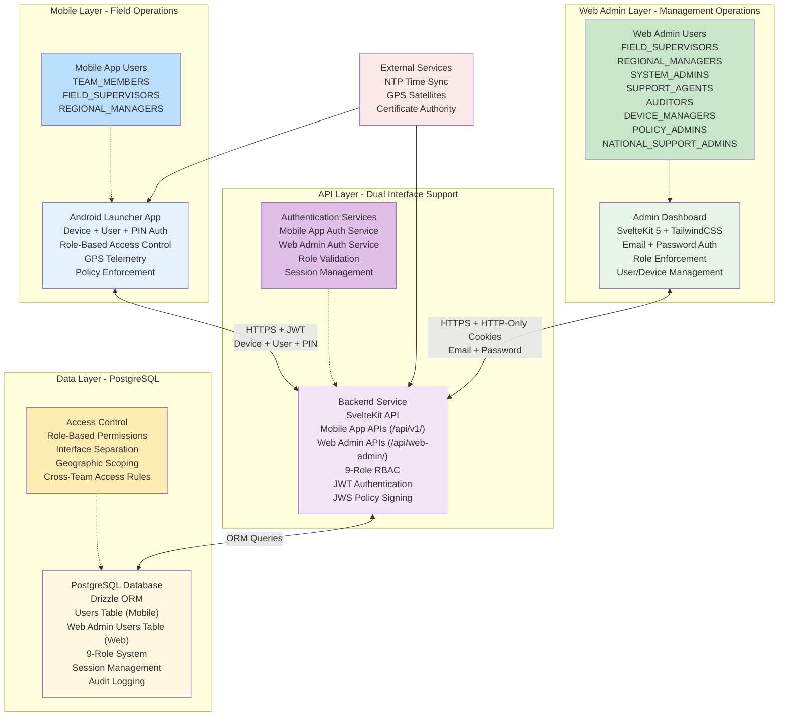
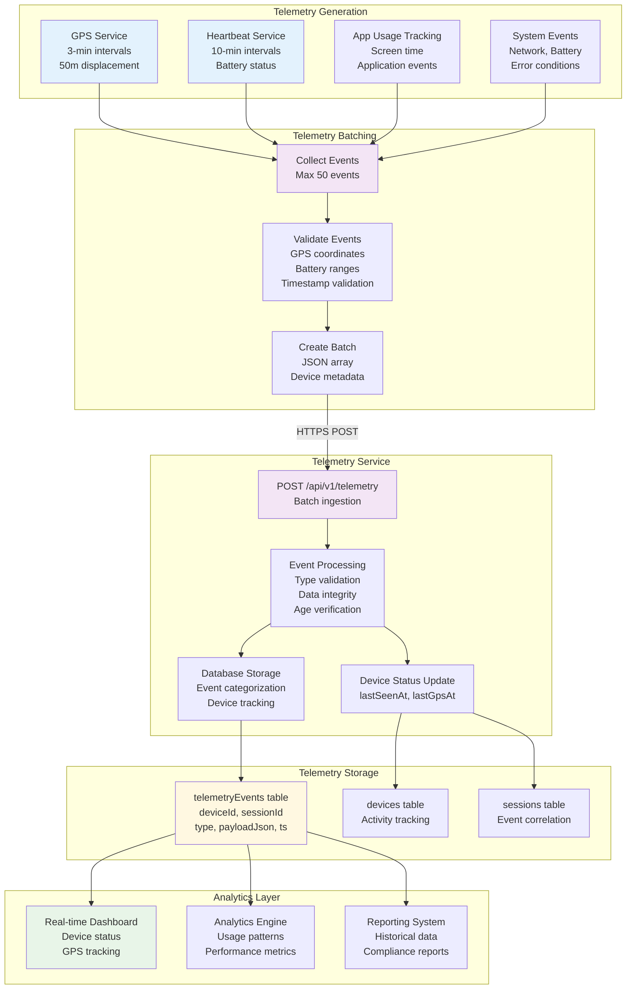
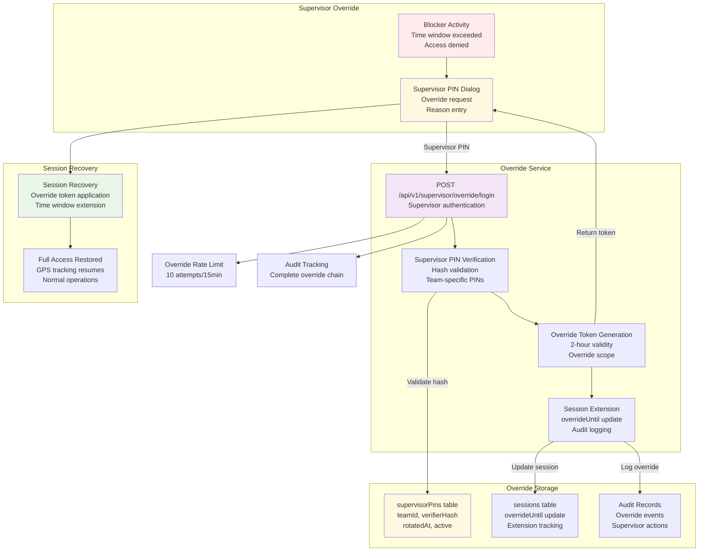
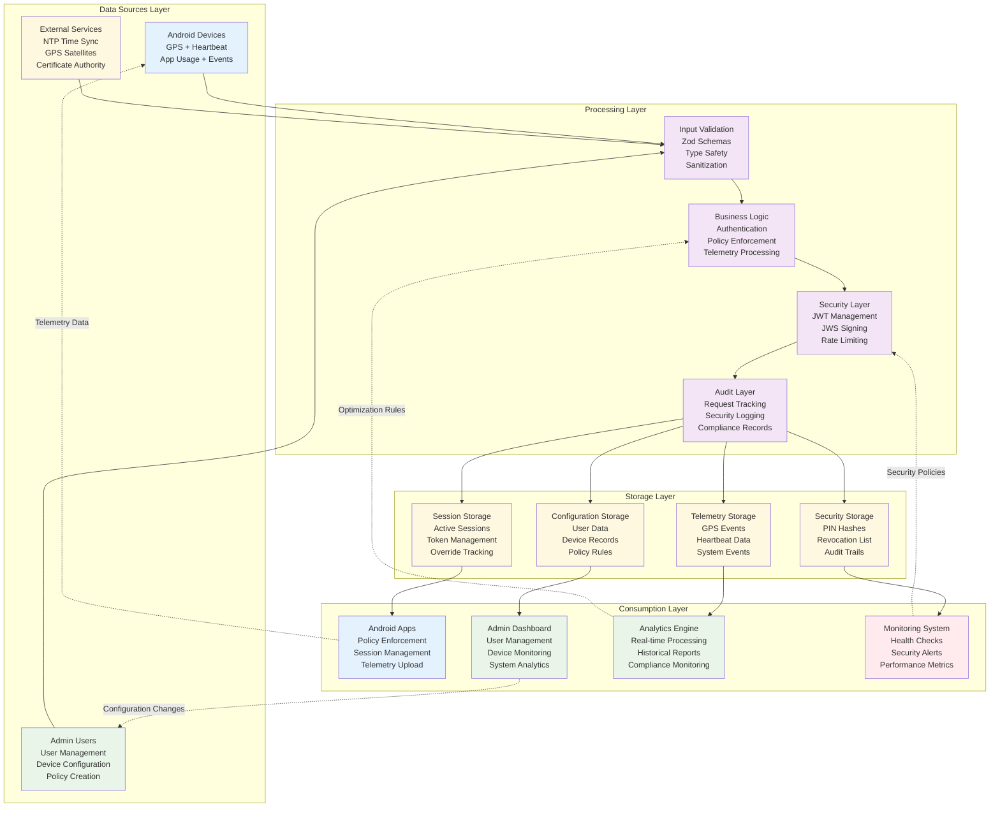

# SurveyLauncher - Complete Mobile Device Management System

## High-Level Functionality

SurveyLauncher is an enterprise-grade mobile device management (MDM) platform designed for field operations with comprehensive authentication, policy enforcement, and real-time telemetry collection.

### **🎯 Core Capabilities**

#### **📱 Mobile Application (Android)**
- **Kiosk Mode Launcher**: Custom Android launcher that controls device access
- **Multi-Factor Authentication**: Device ID + User Code + PIN verification
- **GPS Telemetry**: Real-time location tracking with configurable intervals
- **Policy Enforcement**: Time window controls and access restrictions
- **Offline Support**: Secure local caching with sync capabilities

#### **🌐 Web Admin Dashboard**
- **User Management**: Complete CRUD operations for users and devices
- **Team Organization**: Hierarchical team structure with geographic scoping
- **Real-time Monitoring**: Live GPS tracking and device status
- **Analytics & Reporting**: Comprehensive dashboards and compliance reports
- **Policy Configuration**: Visual management of access rules and schedules

#### **🔐 Enterprise Security**
- **9-Role RBAC System**: Granular access control with role-based permissions
- **Dual Interface Architecture**: Separate authentication for mobile and web
- **Cryptographic Security**: Ed25519 signed policies and Argon2id password hashing
- **Audit Logging**: Complete activity tracking and compliance monitoring

#### **📊 Data & Analytics**
- **Telemetry Pipeline**: Batch processing of GPS, heartbeat, and system events
- **Geographic Scope Management**: Local, regional, and national access levels
- **Performance Monitoring**: Device health metrics and usage analytics
- **Compliance Reporting**: Automated reporting for audit and regulatory requirements

## 📖 **User Documentation & Support**

### **🎯 Quick Start for Users**

**New to SurveyLauncher? Start here:**
- [**Getting Started Guide**](./docs/user-guide/getting-started.md) - Set up your account and log in for the first time
- [**Understanding Your Role**](./docs/understanding-your-role.md) - Learn what you can do based on your role

**Role-Specific Guides:**
- [**📱 Field Workers**](./docs/user-guide/field-worker-guide.md) - Using the mobile app for daily tasks
- [**👨‍💼 Field Supervisors**](./docs/user-guide/supervisor-guide.md) - Managing your team and operations
- [**🏢 Regional Managers**](./docs/user-guide/manager-guide.md) - Overseeing multiple teams and projects

**Help & Support:**
- [**🔧 Troubleshooting**](./docs/user-guide/troubleshooting.md) - Solutions to common problems
- [**❓ Frequently Asked Questions**](./docs/user-guide/faq.md) - Quick answers to popular questions
- [**🔒 Security Best Practices**](./docs/user-guide/security-best-practices.md) - Keeping your account secure

**💡 Pro Tip:** Bookmark the [**User Guide Hub**](./docs/user-guide/README.md) for easy access to all user documentation!

## 📚 Complete Documentation ecosystem

### 🔗 **Workflow Documentation**
For comprehensive implementation details, see the individual workflow files in the [`workflows/`](./workflows/) directory:

- [**Authentication Workflow**](./workflows/authentication-workflow.md) - Dual-interface authentication overview (Mobile App + Web Admin)
- [**Role-Based Access Control**](./workflows/role-based-access-control.md) - Complete 9-role RBAC system with permissions matrix
- [**Mobile App Authentication**](./workflows/mobile-app-authentication.md) - Device-based authentication with PIN verification
- [**Web Admin Authentication**](./workflows/web-admin-authentication.md) - Email/password authentication with role enforcement
- [**User & Device Registration**](./workflows/user-device-registration.md) - Admin setup, team creation, user registration, device binding
- [**Policy Distribution**](./workflows/policy-distribution.md) - JWS signing, time windows, device enforcement
- [**Telemetry Collection**](./workflows/telemetry-collection.md) - GPS tracking, heartbeat, batch processing
- [**Supervisor Override**](./workflows/supervisor-override.md) - Emergency access, PIN verification, audit logging
- [**Data Flow Architecture**](./workflows/data-flow-architecture.md) - Vertical data flow, system optimization, feedback loops

### 👥 **User-Friendly Documentation**
- [**📖 User Guide Hub**](./docs/user-guide/README.md) - **Complete user guide for all SurveyLauncher users**
- [**🚀 Getting Started**](./docs/user-guide/getting-started.md) - First-time setup and login instructions
- [**🎯 Understanding Your Role**](./docs/understanding-your-role.md) - Simple guide explaining roles, permissions, and access patterns
- [**📱 Field Worker Guide**](./docs/user-guide/field-worker-guide.md) - Mobile app usage for field workers
- [**👨‍💼 Supervisor Guide**](./docs/user-guide/supervisor-guide.md) - Team management and oversight for supervisors
- [**🏢 Manager Guide**](./docs/user-guide/manager-guide.md) - Regional operations and multi-team management
- [**🔧 Troubleshooting Guide**](./docs/user-guide/troubleshooting.md) - Common problems and solutions for all users
- [**❓ Frequently Asked Questions**](./docs/user-guide/faq.md) - Quick answers to common questions
- [**🔒 Security Best Practices**](./docs/user-guide/security-best-practices.md) - User-friendly security and privacy guide

### 🛠️ **Technical Documentation**
- [**API Documentation**](./backend/docs/api.md) - Complete REST API specification with authentication flows
- [**Testing Status**](./backend/docs/testing-status.md) - Current test coverage and quality metrics
- [**Role-Based Access Control**](./backend/docs/role-differentiation.md) - Implementation details and security considerations

Each documentation file includes:
- **Complete Mermaid diagrams** with dark/light mode compatible colors
- **Step-by-step implementation** with detailed explanations
- **Code examples** in Kotlin, TypeScript, and SQL
- **API specifications** with request/response formats
- **Error handling** scenarios and recovery procedures
- **Security considerations** and compliance requirements
- **Performance metrics** and monitoring guidelines

# TECHINCAL

##  Backened Service

Complete Backend Functionality Overview

🔐 Authentication System (Full Implementation)

- Multi-factor auth: Device ID + User Code + PIN verification
- JWT Token management: Access (20min), Refresh (12hr), Override (2hr) tokens
- PIN Security: Scrypt hashing, lockout after 5 failed attempts (5min-1hr backoff)
- Session Management: Complete lifecycle with timeout and override support
- Rate Limiting: 5 login attempts/15min per device+IP

📋 Policy Management (Production Ready)

- JWS-signed policies: Ed25519 cryptographic signatures
- Time window enforcement: Mon-Fri 08:00-19:30, Sat 09:00-15:00 (Asia/Kolkata)
- Grace periods: 10-minute session grace
- Supervisor override: 120-minute extension capability
- GPS configuration: 3-min intervals, 50m displacement requirement
- Policy validation: Clock skew protection (±180 seconds)

📡 Telemetry Collection (Comprehensive)

- Event types: Heartbeat, GPS, app_usage, battery, network, errors
- Batch processing: Up to 50 events per batch
- Validation: GPS coordinates, battery ranges, timestamp validation
- Device tracking: Automatic lastSeen/lastGps updates
- 24-hour retention: Configurable data cleanup

👨‍💼 Supervisor Override System

- Separate PIN auth: Different from user PINs
- Override tokens: 2-hour validity
- Audit logging: Complete override tracking
- Team-specific: Supervisor access per team

🗄️ Database Schema (Complete - PostgreSQL)

- **Dual User Tables**: `users` (Mobile App) + `web_admin_users` (Web Admin Interface)
- **9-Role System**: TEAM_MEMBER, FIELD_SUPERVISOR, REGIONAL_MANAGER, SYSTEM_ADMIN, SUPPORT_AGENT, AUDITOR, DEVICE_MANAGER, POLICY_ADMIN, NATIONAL_SUPPORT_ADMIN
- **Complete Relations**: Teams, Devices, User PINs, Supervisor PINs, Sessions, Telemetry Events, Policy Issues, JWT Revocations
- **Role-Based Access Control**: Interface separation, geographic scoping, cross-team access rules
- **Performance Optimized**: Comprehensive indexes for role validation and authentication queries
- **Version Control**: Drizzle ORM migrations with full history

🛡️ Security Features (Enterprise Grade)

- Rate limiting: Multi-tier (general, login, PIN, supervisor, telemetry)
- Request tracking: UUID-based request IDs
- Audit logging: RFC-5424 structured logging
- Token revocation: JTI-based revocation list
- CORS support: Configurable origins
- Input validation: Zod schemas throughout

🔧 Development Features

- Mock API: Complete mock implementation for development
- Seeding scripts: Sample data generation
- Environment validation: Zod-based config validation
- Health endpoints: Service status monitoring
- Type safety: Full TypeScript implementation

API Endpoints (Dual Interface Architecture)

### Mobile App APIs (/api/v1/) - Device + User + PIN Authentication
1. POST /api/v1/auth/login - Multi-factor device authentication
2. GET /api/v1/auth/whoami - Current session & user info
3. POST /api/v1/auth/logout - Session termination
4. POST /api/v1/auth/refresh - JWT token refresh
5. POST /api/v1/auth/session/end - Force session end
6. GET /api/v1/policy/:deviceId - JWS-signed policy distribution
7. POST /api/v1/supervisor/override/login - Supervisor PIN override
8. POST /api/v1/telemetry - Batch telemetry ingestion

### Web Admin APIs (/api/web-admin/) - Email + Password Authentication
1. POST /api/web-admin/auth/login - Web admin authentication
2. GET /api/web-admin/auth/whoami - Current admin session info
3. POST /api/web-admin/auth/logout - Admin session termination
4. POST /api/web-admin/users/create - Create new admin users
5. GET /api/web-admin/users/list - List admin users with roles
6. PUT /api/web-admin/users/:id/update - Update admin user details
7. DELETE /api/web-admin/users/:id/delete - Delete admin users
8. POST /api/web-admin/auth/reset-password - Password reset functionality

Sample Credentials (for testing)

### Mobile App Authentication
- Device: dev-mock-001
- User: Code u001, PIN 123456
- Supervisor: PIN 789012

### Web Admin Authentication
- Admin Email: admin@example.com
- Admin Password: adminPassword123
- Roles: SYSTEM_ADMIN, FIELD_SUPERVISOR, REGIONAL_MANAGER, etc.

### System Architecture & Workflow

## SurveyLauncher High-Level System Overview

## Detailed Process Flows

### 1. User & Device Registration Flow

### 2. Dual-Interface Authentication Flow

```mermaid
flowchart TD
    subgraph "Mobile App Authentication" ["Mobile App Interface - Field Operations"]
        MobileLogin["Android Login<br/>Device ID + User Code + PIN"]
        MobileAuth["Mobile App Auth Service<br/>/api/v1/auth/login"]
        MobileRoles["Allowed Roles:<br/>• TEAM_MEMBER<br/>• FIELD_SUPERVISOR<br/>• REGIONAL_MANAGER"]
        MobileSession["Mobile Session<br/>JWT Tokens + Device Binding"]
    end

    subgraph "Web Admin Authentication" ["Web Admin Interface - Management Operations"]
        WebLogin["Web Login<br/>Email + Password"]
        WebAuth["Web Admin Auth Service<br/>/api/web-admin/auth/login"]
        WebRoles["Valid Roles:<br/>• FIELD_SUPERVISOR<br/>• REGIONAL_MANAGER<br/>• SYSTEM_ADMIN<br/>• SUPPORT_AGENT<br/>• AUDITOR<br/>• DEVICE_MANAGER<br/>• POLICY_ADMIN<br/>• NATIONAL_SUPPORT_ADMIN"]
        WebSession["Web Session<br/>HTTP-Only Cookies + Role Validation"]
    end

    subgraph "Backend Security Layer" ["Authentication & Authorization"]
        RoleValidation["Role-Based Access Control<br/>9-Role System Validation"]
        InterfaceSeparation["Interface Access Enforcement<br/>Mobile vs Web Admin Routes"]
        HybridSupport["Hybrid Role Support<br/>FIELD_SUPERVISOR + REGIONAL_MANAGER"]
        TeamBlocking["TEAM_MEMBER Blocking<br/>Web Access Denied"]
    end

    subgraph "Database Layer" ["Session & User Management"]
        UsersTable["users Table<br/>Mobile App Users<br/>• 9 Roles<br/>• Team Assignments<br/>• Device Binding"]
        WebUsersTable["web_admin_users Table<br/>Web Interface Users<br/>• 8 Roles (excl. TEAM_MEMBER)<br/>• Email Authentication<br/>• Account Lockout"]
        SessionTable["sessions Table<br/>Unified Session Tracking<br/>• Interface Type<br/>• Role Context<br/>• Access Scoping"]
    end

    %% Mobile Authentication Flow
    MobileLogin --> |"Device + User + PIN"| MobileAuth
    MobileAuth --> |"Role Check"| RoleValidation
    RoleValidation --> |"Validate Hybrid Role"| MobileRoles
    MobileRoles --> |"Create Session"| MobileSession
    MobileSession --> |"Store"| UsersTable
    MobileSession --> |"Update"| SessionTable

    %% Web Authentication Flow
    WebLogin --> |"Email + Password"| WebAuth
    WebAuth --> |"Role Check"| RoleValidation
    RoleValidation --> |"Block TEAM_MEMBER"| TeamBlocking
    RoleValidation --> |"Validate Web Role"| WebRoles
    WebRoles --> |"Support Hybrid Roles"| HybridSupport
    HybridSupport --> |"Create Session"| WebSession
    WebSession --> |"Store"| WebUsersTable
    WebSession --> |"Update"| SessionTable

    %% Security Enforcement
    RoleValidation --> |"Interface Separation"| InterfaceSeparation

    %% Styling
    style MobileLogin fill:#e3f2fd
    style WebLogin fill:#e8f5e8
    style RoleValidation fill:#f3e5f5
    style TeamBlocking fill:#ffebee
    style HybridSupport fill:#fff8e1
    style UsersTable fill:#e3f2fd
    style WebUsersTable fill:#e8f5e8
    style SessionTable fill:#f3e5f5
```

### 3. Policy Creation & Distribution Flow

```mermaid
flowchart TD
    subgraph "Policy Configuration" ["Policy Management"]
        AdminPolicy["Admin: Configure Policy<br/>Time Windows<br/>GPS Settings<br/>Grace Periods"]
        PolicyAPI["GET /api/v1/policy/:deviceId<br/>Policy Generation"]
    end

    subgraph "Policy Service" ["Policy Processing"]
        PolicyGen["Generate Policy JSON<br/>Device-specific rules<br/>Team configurations<br/>Time constraints"]
        JWS_Sign["JWS Signing<br/>Ed25519 Private Key<br/>Cryptographic Signature"]
        PolicyValidation["Policy Validation<br/>Time anchor check<br/>Clock skew ±180s<br/>Expiry validation"]
    end

    subgraph "Device Integration" ["Android Policy Integration"]
        PolicyFetch["Device: Fetch Policy<br/>HTTPS + Device JWT"]
        PolicyVerify["Verify JWS Signature<br/>Ed25519 Public Key"]
        PolicyEnforce["Enforce Policy<br/>Time window checks<br/>GPS requirements<br/>Supervisor overrides"]
    end

    subgraph "Database" ["Policy Storage"]
        PolicyTable["policyIssues table<br/>deviceId, version<br/>jwsKid, issuedAt, expiresAt"]
        DeviceTable["devices table<br/>Policy tracking"]
    end

    %% Policy Flow
    AdminPolicy --> PolicyAPI
    PolicyAPI --> PolicyGen
    PolicyGen --> JWS_Sign
    JWS_Sign --> PolicyValidation
    PolicyValidation --> |"Store issue"| PolicyTable
    PolicyValidation --> |"Update device"| DeviceTable

    %% Device Flow
    PolicyFetch --> PolicyAPI
    PolicyAPI --> |"Return signed policy"| PolicyFetch
    PolicyFetch --> PolicyVerify
    PolicyVerify --> PolicyEnforce

    %% External Services
    TimeService["NTP Time Service"] --> PolicyValidation
    CertAuth["Certificate Authority"] --> JWS_Sign

    style AdminPolicy fill:#e8f5e8
    style PolicyAPI fill:#f3e5f5
    style PolicyGen fill:#f3e5f5
    style PolicyFetch fill:#e3f2fd
    style PolicyVerify fill:#e3f2fd
    style PolicyTable fill:#fff8e1
```

### 4. Telemetry Collection & Processing Flow

### 5. Supervisor Override Flow

### 6. Data Flow Architecture (Vertical)

## Key Integration Points

### 🔐 Dual-Interface Authentication Integration
- **Mobile App Authentication**: Device ID + User Code + PIN verification
- **Web Admin Authentication**: Email + Password with HTTP-only cookies
- **Role-Based Access Control**: 9-role system with interface separation
- **Hybrid Role Support**: FIELD_SUPERVISOR and REGIONAL_MANAGER access both interfaces
- **Security Features**: Rate limiting, account lockout, audit logging, TEAM_MEMBER web blocking

### 📋 Policy Distribution
- **JWS Signing**: Ed25519 cryptographic signatures
- **Time Windows**: Configurable access periods (Mon-Fri 08:00-19:30, Sat 09:00-15:00)
- **Override System**: Supervisor PIN extensions (120 minutes)
- **Validation**: Clock skew protection (±180 seconds)

### 📡 Telemetry Pipeline
- **Real-time GPS**: 3-minute intervals, 50m displacement requirement
- **Batch Processing**: Up to 50 events per batch, HTTP efficient transfer
- **Event Validation**: GPS coordinates, battery ranges, timestamp verification
- **Data Storage**: Optimized schema with 24-hour retention and cleanup

### 🖥️ Admin Operations
- **User Management**: Complete CRUD with search and filtering capabilities
- **Device Monitoring**: Real-time GPS tracking, activity status, health metrics
- **Analytics Dashboard**: Historical data, usage patterns, compliance reports
- **Policy Configuration**: Visual management of time windows and access rules

This architecture provides a complete, enterprise-ready solution for mobile device management with secure authentication, policy enforcement, and comprehensive telemetry collection.
