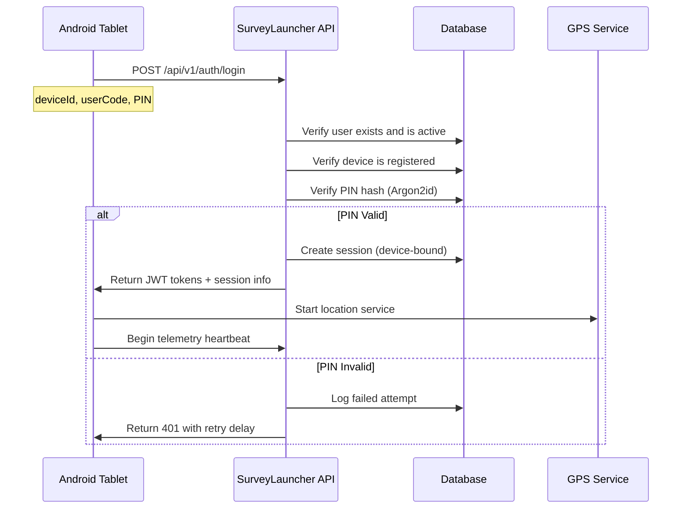
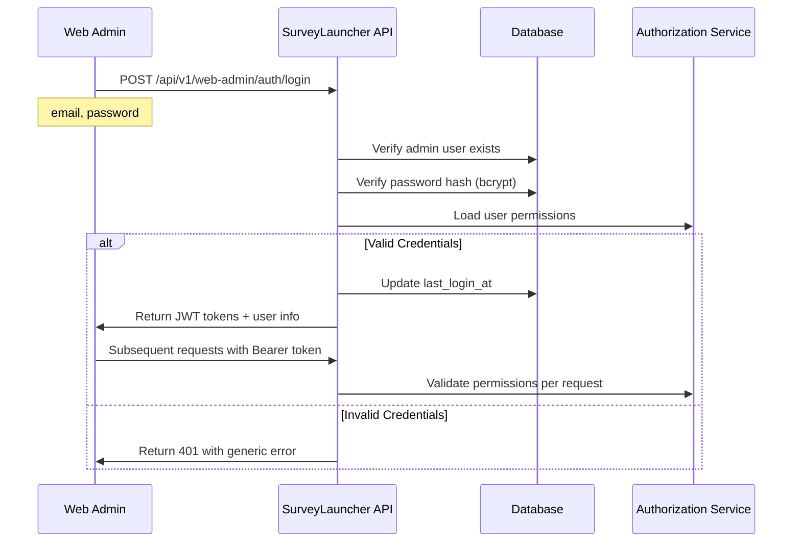

# SurveyLauncher Authentication System

This document provides comprehensive details about the SurveyLauncher authentication architecture, covering both mobile device authentication and web-based administrative access within the enterprise project management system.

## 🏗️ Authentication Architecture Overview

SurveyLauncher implements a **dual authentication system** with **9-role RBAC integration** designed to serve enterprise field operations:

1. **Mobile Device Authentication** - For field workers using Android tablets
2. **Web Admin Authentication** - For system administrators, managers, and specialized roles

### **Enterprise Architecture Integration**
- **Geographic Team Model**: Teams represent operational regions (North, West, South, East)
- **Project Scoping**: Authentication includes project assignment context
- **Role-Based Interface Access**: Specific roles can access mobile, web, or both interfaces
- **Geographic Boundaries**: Access control enforces regional operational boundaries

```
┌─────────────────────────────────────────────────────────────┐
│                    SurveyLauncher Auth System              │
├─────────────────────────────────────────────────────────────┤
│                                                             │
│  ┌─────────────────────┐    ┌─────────────────────────────┐ │
│  │  Mobile Auth        │    │  Web Admin Auth              │ │
│  │                     │    │                             │ │
│  │  • deviceId         │    │  • email + password          │ │
│  │  • userCode         │    │  • RBAC-based               │ │
│  │  • PIN              │    │  • Session management        │ │
│  │  • Device-bound     │    │  • Role-based access         │ │
│  │                     │    │                             │ │
│  └─────────────────────┘    └─────────────────────────────┘ │
│                                                             │
└─────────────────────────────────────────────────────────────┘
```

## 👥 Enterprise Role-Based Access Control (RBAC)

### **9-Role System with Interface Access Matrix**

| Role | Mobile Access | Web Admin Access | Primary Function | Geographic Scope |
|------|---------------|------------------|------------------|------------------|
| **TEAM_MEMBER** | ✅ Primary | ❌ Blocked | Field data collection | Assigned project regions |
| **FIELD_SUPERVISOR** | ✅ Primary | ✅ Secondary | Team supervision | Assigned project regions |
| **REGIONAL_MANAGER** | ✅ Limited | ✅ Primary | Multi-team oversight | Regional project scope |
| **SYSTEM_ADMIN** | ❌ | ✅ Primary | Full system administration | All regions (NATIONAL) |
| **SUPPORT_AGENT** | ❌ | ✅ Primary | User assistance & troubleshooting | Assigned project regions |
| **AUDITOR** | ❌ | ✅ Primary | Compliance monitoring | All regions (read-only) |
| **DEVICE_MANAGER** | ❌ | ✅ Primary | Android device management | Assigned project regions |
| **POLICY_ADMIN** | ❌ | ✅ Primary | Policy configuration | All regions (NATIONAL) |
| **NATIONAL_SUPPORT_ADMIN** | ✅ Limited | ✅ Primary | Cross-regional oversight | All regions (NATIONAL) |

### **Interface Access Rules**

#### **Mobile Interface Authentication**
- **Primary Access**: TEAM_MEMBER, FIELD_SUPERVISOR
- **Limited Access**: REGIONAL_MANAGER (supervision functions), NATIONAL_SUPPORT_ADMIN (cross-regional support)
- **Blocked Access**: SYSTEM_ADMIN, SUPPORT_AGENT, AUDITOR, DEVICE_MANAGER, POLICY_ADMIN

#### **Web Admin Interface Authentication**
- **Primary Access**: All roles except TEAM_MEMBER
- **Hybrid Roles**: FIELD_SUPERVISOR, REGIONAL_MANAGER, NATIONAL_SUPPORT_ADMIN (access both interfaces)
- **Full Administrative**: SYSTEM_ADMIN (complete system control)

### **Geographic Boundary Enforcement**
- **Team-Based Access**: Users restricted to assigned team geographic regions
- **Regional Manager Scope**: Oversight limited to teams within regional boundaries
- **National Access**: SYSTEM_ADMIN, POLICY_ADMIN, AUDITOR have national scope
- **Cross-Regional Authorization**: NATIONAL_SUPPORT_ADMIN can access all regions

### **Project Context Integration**
- **Project Assignments**: Authentication includes current project context
- **Multi-Project Access**: Users can be assigned to multiple projects via SYSTEM_ADMIN
- **Project Scoping**: Permissions scoped to assigned project boundaries
- **Cross-Team Collaboration**: Enabled through project assignments when authorized

---

## 📱 Mobile Device Authentication

### Purpose
Field workers using Android tablets in kiosk mode for survey data collection.

### Authentication Flow


### API Endpoints

#### **POST /api/v1/auth/login**
Authenticates mobile device users.

**Request:**
```json
{
  "deviceId": "android_12345abcdef",
  "userCode": "emp001",
  "pin": "123456"
}
```

**Response (Success):**
```json
{
  "ok": true,
  "session": {
    "sessionId": "session-uuid-123",
    "userId": "user-uuid-456",
    "deviceId": "android-123",
    "startedAt": "2025-01-15T10:30:00Z",
    "expiresAt": "2025-01-15T18:30:00Z",
    "overrideUntil": null
  },
  "accessToken": "eyJhbGciOiJIUzI1NiIs...",
  "refreshToken": "eyJhbGciOiJIUzI1NiIs...",
  "policyVersion": 3
}
```

**Response (Error):**
```json
{
  "ok": false,
  "error": {
    "code": "INVALID_CREDENTIALS",
    "message": "Invalid user code or PIN",
    "request_id": "req-uuid-789"
  }
}
```

#### **GET /api/v1/auth/whoami**
Returns current user and session information.

**Response:**
```json
{
  "ok": true,
  "user": {
    "id": "user-uuid-456",
    "code": "emp001",
    "teamId": "team-uuid-789",
    "displayName": "Rahul Sharma",
    "role": "TEAM_MEMBER"
  },
  "session": {
    "sessionId": "session-uuid-123",
    "deviceId": "android-123",
    "expiresAt": "2025-01-15T18:30:00Z",
    "overrideUntil": null
  }
}
```

#### **POST /api/v1/auth/logout**
Ends the current session and stops GPS tracking.

#### **POST /api/v1/auth/refresh**
Refreshes JWT tokens using refresh token.

#### **POST /api/v1/auth/heartbeat**
Periodic heartbeat to maintain session and report device status.

### Security Features

#### **Device Binding**
- Sessions are bound to specific Android devices
- Tokens cannot be used from other devices
- Automatic session invalidation on device change

#### **Rate Limiting**
- PIN attempts: 10 per 10 minutes per device/IP
- Login attempts: 10 per 10 minutes per device/IP
- Exponential backoff on failed attempts

#### **PIN Security**
- Argon2id hashing with memory-hard parameters
- 6-digit minimum PIN length
- Failed attempt lockout (configurable duration)
- Supervisor PIN override capability

#### **Session Management**
- Configurable session timeout (default: 8 hours)
- Automatic GPS telemetry during active sessions
- Policy enforcement via time windows
- Supervisor override extensions

### Database Schema

```sql
-- Mobile users table
CREATE TABLE users (
  id UUID PRIMARY KEY DEFAULT gen_random_uuid(),
  code VARCHAR(32) NOT NULL,           -- Employee code (emp001)
  team_id UUID REFERENCES teams(id),
  display_name VARCHAR(120) NOT NULL,
  role VARCHAR(24) NOT NULL DEFAULT 'TEAM_MEMBER',
  is_active BOOLEAN DEFAULT true,
  created_at TIMESTAMP DEFAULT NOW()
);

-- Device registration
CREATE TABLE devices (
  id UUID PRIMARY KEY DEFAULT gen_random_uuid(),
  android_id VARCHAR(64) UNIQUE NOT NULL,
  team_id UUID REFERENCES teams(id),
  name VARCHAR(200) NOT NULL,
  app_version VARCHAR(32),
  is_active BOOLEAN DEFAULT true
);

-- Session management with project context
CREATE TABLE sessions (
  id UUID PRIMARY KEY DEFAULT gen_random_uuid(),
  user_id UUID REFERENCES users(id),
  device_id UUID REFERENCES devices(id),
  team_id UUID REFERENCES teams(id),
  current_project_id UUID REFERENCES projects(id), -- Active project context
  started_at TIMESTAMP DEFAULT NOW(),
  expires_at TIMESTAMP NOT NULL,
  status VARCHAR(16) DEFAULT 'open',
  override_until TIMESTAMP,
  token_jti VARCHAR(64) UNIQUE,
  interface_type VARCHAR(16) NOT NULL, -- MOBILE, WEB_ADMIN, HYBRID
  geographic_scope VARCHAR(16), -- NATIONAL, REGIONAL, LOCAL
  created_ip_address INET,
  last_activity_at TIMESTAMP DEFAULT NOW()
);

-- PIN storage (Argon2id)
CREATE TABLE user_pins (
  user_id UUID PRIMARY KEY REFERENCES users(id),
  pin_hash VARCHAR(255) NOT NULL, -- Argon2id hash
  salt VARCHAR(255) NOT NULL,
  is_active BOOLEAN DEFAULT true,
  rotated_at TIMESTAMP WITH TIME ZONE DEFAULT NOW(),
  created_at TIMESTAMP WITH TIME ZONE DEFAULT NOW(),
  updated_at TIMESTAMP WITH TIME ZONE DEFAULT NOW()
);
```

## 🖥️ Web Admin Authentication

### Purpose
System administrators, managers, and supervisors accessing the web-based management interface.

### Authentication Flow


### API Endpoints

#### **POST /api/v1/web-admin/auth/login**
Authenticates web administrative users.

**Request:**
```json
{
  "email": "admin@surveylauncher.aiims",
  "password": "admin123456"
}
```

**Response (Success):**
```json
{
  "ok": true,
  "user": {
    "id": "admin-uuid-123",
    "email": "admin@surveylauncher.aiims",
    "firstName": "System",
    "lastName": "Administrator",
    "role": "SYSTEM_ADMIN",
    "fullName": "System Administrator"
  },
  "accessToken": "eyJhbGciOiJIUzI1NiIs...",
  "refreshToken": "eyJhbGciOiJIUzI1NiIs..."
}
```

#### **GET /api/v1/web-admin/auth/whoami**
Returns current admin user and role information.

**Response:**
```json
{
  "ok": true,
  "user": {
    "id": "admin-uuid-123",
    "email": "admin@surveylauncher.aiims",
    "firstName": "System",
    "lastName": "Administrator",
    "role": "SYSTEM_ADMIN",
    "fullName": "System Administrator",
    "lastLoginAt": "2025-01-15T10:30:00Z"
  }
}
```

#### **POST /api/v1/web-admin/auth/logout**
Ends the current admin session.

#### **POST /api/v1/web-admin/auth/refresh**
Refreshes admin JWT tokens.

#### **GET /api/v1/web-admin/auth/users**
List all admin users (SYSTEM_ADMIN only).

#### **POST /api/v1/web-admin/auth/users**
Create new admin user (authorized roles only).

### Security Features

#### **Role-Based Access Control (RBAC)**
- 9 hierarchical roles with granular permissions
- Permission inheritance based on hierarchy level
- Context-aware access control (team boundaries)
- Real-time permission validation

#### **Password Security**
- bcrypt hashing with adaptive work factor
- 8-character minimum password length
- No password reuse restrictions
- Secure password reset flow

#### **Session Management**
- JWT-based stateless authentication
- Configurable token TTL (15min access, 7d refresh)
- Token revocation capability
- Secure cookie options for web interface

#### **Account Security**
- Account lockout on failed attempts
- Last login tracking
- Activity logging and audit trails
- Multi-factor authentication readiness

### Database Schema

```sql
-- Web admin users table
CREATE TABLE web_admin_users (
  id UUID PRIMARY KEY DEFAULT gen_random_uuid(),
  email VARCHAR(255) UNIQUE NOT NULL,
  password VARCHAR(255) NOT NULL, -- Argon2id hash
  first_name VARCHAR(255) NOT NULL,
  last_name VARCHAR(255) NOT NULL,
  role VARCHAR(50) NOT NULL DEFAULT 'SYSTEM_ADMIN',
  is_active BOOLEAN DEFAULT true,
  last_login_at TIMESTAMP WITH TIME ZONE,
  login_attempts INTEGER DEFAULT 0,
  locked_at TIMESTAMP WITH TIME ZONE,
  password_changed_at TIMESTAMP WITH TIME ZONE DEFAULT NOW(),
  created_at TIMESTAMP WITH TIME ZONE DEFAULT NOW(),
  updated_at TIMESTAMP WITH TIME ZONE DEFAULT NOW()
);

-- Note: Role assignments handled by user_role_assignments table
```

## 🔐 JWT Token Structure

### Mobile Authentication Tokens
```json
{
  "sub": "user-uuid-456",
  "type": "mobile",
  "deviceId": "android-123",
  "sessionId": "session-uuid-789",
  "role": "TEAM_MEMBER",
  "teamId": "team-uuid-abc",
  "teamName": "AIIMS Delhi Survey Team",
  "organizationId": "org-uuid-aiims",
  "currentProjectId": "project-uuid-national",
  "currentProjectName": "National Health Survey 2025",
  "geographicScope": "REGIONAL",
  "assignedRegions": ["NORTH_REGION"],
  "interfaceAccess": ["MOBILE"],
  "jti": "token-uuid-xyz",
  "iat": 1642248600,
  "exp": 1642250400,
  "iss": "surveylauncher-api"
}
```

### Web Admin Authentication Tokens
```json
{
  "sub": "admin-uuid-123",
  "type": "web-admin",
  "email": "admin@surveylauncher.aiims",
  "role": "SYSTEM_ADMIN",
  "organizationId": "org-uuid-aiims",
  "teamId": "team-uuid-admin",
  "currentProjectId": null,
  "geographicScope": "NATIONAL",
  "assignedRegions": ["NORTH_REGION", "WEST_REGION", "SOUTH_REGION", "EAST_REGION"],
  "interfaceAccess": ["WEB_ADMIN"],
  "permissions": [
    "USERS.MANAGE", "DEVICES.MANAGE", "PROJECTS.MANAGE",
    "TEAMS.MANAGE", "ROLES.MANAGE", "POLICY.CONFIGURE"
  ],
  "jti": "token-uuid-xyz",
  "iat": 1642248600,
  "exp": 1642250400,
  "iss": "surveylauncher-api"
}
```

### Hybrid Role Authentication Tokens (FIELD_SUPERVISOR, REGIONAL_MANAGER)
```json
{
  "sub": "supervisor-uuid-456",
  "type": "hybrid",
  "deviceId": null,
  "sessionId": "session-uuid-web-789",
  "role": "FIELD_SUPERVISOR",
  "teamId": "team-uuid-delhi",
  "teamName": "AIIMS Delhi Survey Team",
  "organizationId": "org-uuid-aiims",
  "currentProjectId": "project-uuid-diabetes",
  "geographicScope": "REGIONAL",
  "assignedRegions": ["NORTH_REGION"],
  "interfaceAccess": ["MOBILE", "WEB_ADMIN"],
  "supervisedTeams": ["team-uuid-delhi", "team-uuid-north"],
  "supervisionScope": "FIELD_OPERATIONS",
  "jti": "token-uuid-xyz",
  "iat": 1642248600,
  "exp": 1642250400,
  "iss": "surveylauncher-api"
}
```

## 🛡️ Security Controls

### Rate Limiting Configuration
```env
# Rate limits per 10-minute window
RATE_LIMIT_WINDOW_MS=900000
RATE_LIMIT_MAX_REQUESTS=100
LOGIN_RATE_LIMIT_MAX=50
PIN_RATE_LIMIT_MAX=10
```

### Token Configuration
```env
# JWT Settings
JWT_ACCESS_SECRET=hAhTFFkFba+qnf66Q4JmKztZi8znEKBWEDKU5O+Ie2E=
JWT_REFRESH_SECRET=4eI2SmKHWz+seWXFe0UCiV1EGnGte7y8MUe1AFo+mNg=
JWT_ACCESS_TTL=15m
JWT_REFRESH_TTL=7d
```

### CORS Configuration
```env
CORS_ALLOWED_ORIGINS=http://localhost:3000,http://localhost:5173,http://localhost:8080
```

## 🔄 Authentication Integration

### Middleware Usage

**Note:** Comprehensive RBAC authorization details are covered in [**@backend/docs/authorize.md**](./authorize.md)

## 📊 Authentication Analytics

### Key Metrics
- **Login Success Rate**: Percentage of successful authentication attempts
- **Failed Login Rate**: Authentication failure rate by user type
- **Session Duration**: Average session length by role
- **Device Registration**: New device registrations over time
- **Geographic Distribution**: Login locations by team/region

### Security Monitoring
- **Brute Force Attempts**: Detect and block credential stuffing
- **Unusual Activity**: Flag logins from unexpected locations/devices
- **Token Abuse**: Monitor for stolen/compromised tokens
- **Role Escalation**: Detect unauthorized permission attempts
 

**Architecture Alignment**: ✅ Complete integration with [Enterprise Architecture Guide](../architecture-guide.md) and [Authorization System](./authorize.md)