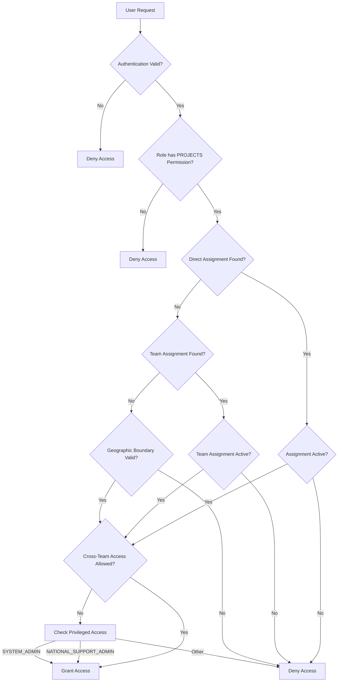

# Enterprise Project Management System Architecture

**Last Updated:** November 17, 2025
**System Status:** Backend Production Ready (100% Complete) | Frontend Integration Ready
**Version:** 1.0 - Enterprise Grade

---

## 🎯 Executive Summary

SurveyLauncher implements a comprehensive **enterprise project management system** that provides operational context for field work management through geographic team-based organization. The system enables precise supervision scoping for FIELD_SUPERVISOR and REGIONAL_MANAGER roles while maintaining clean RBAC boundaries.

### **Key Features:**
- ✅ **Complete RBAC Integration** -  9 system roles with project permissions
- ✅ **Geographic Team Model** - Teams represent operational regions
- ✅ **Operational Project Scoping** - Projects provide management boundaries


## 👥 Enterprise Role-Based Access Control (RBAC)

### **9-Role System Matrix with Interface Access**

| Role | Mobile Access | Web Admin Access | Geographic Scope | Project Management | Key Permissions |
|------|---------------|------------------|------------------|-------------------|-----------------|
| **TEAM_MEMBER** | ✅ Primary | ❌ Blocked | Assigned project regions | View assigned projects | TELEMETRY.CREATE, DEVICES.READ (own) |
| **FIELD_SUPERVISOR** | ✅ Primary | ✅ Secondary | Assigned project regions | Manage team projects | USERS.READ_TEAM, DEVICES.MANAGE_TEAM, SUPERVISOR_PINS.EXECUTE |
| **REGIONAL_MANAGER** | ✅ Limited | ✅ Primary | Regional project scope | Regional project oversight | USERS.MANAGE_REGIONAL, TEAMS.MANAGE_REGIONAL, PROJECTS.MANAGE_REGIONAL |
| **SYSTEM_ADMIN** | ❌ | ✅ Primary | All regions (NATIONAL) | Full system control | ALL_PERMISSIONS, SYSTEM_SETTINGS.MANAGE, ROLES.ASSIGN |
| **SUPPORT_AGENT** | ❌ | ✅ Primary | Assigned project regions | User assistance | USERS.READ_ASSIGNED, DEVICES.READ_ASSIGNED, SUPPORT_TICKETS.MANAGE |
| **AUDITOR** | ❌ | ✅ Primary | All regions (read-only) | Compliance monitoring | ALL_RESOURCES.READ, AUDIT_LOGS.READ, REPORTS.GENERATE |
| **DEVICE_MANAGER** | ❌ | ✅ Primary | Assigned project regions | Device lifecycle | DEVICES.MANAGE, POLICY.ISSUE, TELEMETRY.READ |
| **POLICY_ADMIN** | ❌ | ✅ Primary | All regions (NATIONAL) | Policy configuration | POLICY.CONFIGURE, POLICY.ISSUE, POLICY.TEMPLATES |
| **NATIONAL_SUPPORT_ADMIN** | ✅ Limited | ✅ Primary | All regions (NATIONAL) | Cross-regional oversight | ALL_REGIONS.ACCESS, CROSS_TEAM_SUPPORT, EMERGENCY.OVERRIDE |


## 📋 System Roles & Project Permissions

### **Field Operations Roles**
| Role | Project Scope | Supervision Capability | Geographic Limits |
|------|---------------|---------------------|------------------|
| `TEAM_MEMBER` | Multi-project, multi-region (via SYSTEM_ADMIN assignment) | None | System-assigned project access |
| `FIELD_SUPERVISOR` | Multi-project, multi-region (via SYSTEM_ADMIN assignment) | TEAM_MEMBERS in shared projects | System-assigned project access |
| `REGIONAL_MANAGER` | Multi-project, multi-region (via SYSTEM_ADMIN assignment) | All field roles in assigned projects, project-level user/device/team management | System-assigned project access |

### **Technical & Support Roles**
| Role | Project Scope | Management Capability | System Access |
|------|---------------|---------------------|--------------|
| `SYSTEM_ADMIN` | All projects (full control) | Full system configuration, project assignment authority | Complete access |
| `SUPPORT_AGENT` | Multi-project, multi-region (via SYSTEM_ADMIN assignment) | Project scoping for users/devices/teams, user assistance | System-assigned project access |
| `AUDITOR` | All projects (read-only) | Compliance monitoring | System-assigned project access |
| `DEVICE_MANAGER` | Multi-project, multi-region (via SYSTEM_ADMIN assignment) | Project scoping for users/devices/teams, device management | System-assigned project access |
| `POLICY_ADMIN` | All projects (via SYSTEM_ADMIN assignment) | Policy configuration | System-assigned project access |
| `NATIONAL_SUPPORT_ADMIN` | Multi-project, multi-region (via SYSTEM_ADMIN assignment) | Project scoping for users/devices/teams, cross-regional oversight | System-assigned project access |

---

## 🏗️ Core Architecture Principles

### **1. Projects as Operational Context**
Projects are **NOT** organizational complexity - they are **operational containers** for field work management that enable:
- Team grouping across organizational boundaries
- Geographic scope enforcement
- Supervision boundary definition
- Cross-team collaboration when needed

### **2. Teams as Geographic Regions**
Teams represent **geographic operational zones**, not just work groups:
```
TEAMS = Geographic Operations Units
├── AIIMS Delhi Survey Team = NORTH REGION
├── Mumbai Field Operations Team = WEST_REGION
└── [Future Teams] = SOUTH/EAST REGIONS
```

### **3. System Roles Drive All Permissions**
No complex "role-in-project" logic needed:
- **System roles** provide complete permission matrix
- **Project assignments** provide operational scoping
- **Geographic relationships** provide regional boundaries

---

## 📊 Data Model Architecture

## 📊 Database Schema Reference

**All field names reference the actual schema implementation in `backend/src/lib/db/schema.ts`**

### **Table Naming Convention**
- **Plural table names**: `teams`, `users`, `devices`, `organizations`
- **CamelCase in TypeScript code**: `teamId`, `userId`, `deviceId`
- **snake_case in database**: `team_id`, `user_id`, `device_id`

### **Level 1: Foundation (Master Data)**
```sql
organizations  -- Funding/Administrative entities
├── AIIMS India (National)
├── NDDTC  
└── CDER  

roles -- 9-system role hierarchy
├── Field Operations: TEAM_MEMBER, FIELD_SUPERVISOR, REGIONAL_MANAGER
├── Technical: SYSTEM_ADMIN, SUPPORT_AGENT, AUDITOR
└── Specialized: DEVICE_MANAGER, POLICY_ADMIN, NATIONAL_SUPPORT_ADMIN
```

### **Level 2: Geographic Operations**
```sql
teams -- Geographic operational regions
├── AIIMS Delhi Survey Team (NORTH_REGION)
│   ├── stateId: DL07 (Delhi)
│   ├── organizationId: AIIMS India
│   ├── operationalCoverage: [Delhi, NCR, Haryana, Punjab, Rajasthan]
│   ├── fieldSupervisors: [test002, test015] (app-level: minimum 1, can be multiple)
│   ├── supervisorRoles: test002=lead, test015=support (app-level assignment)
│   └── projectAssignments: [National Health Survey, Delhi Diabetes Study, NOHS] (multi-project)
├── Mumbai Field Operations Team (WEST_REGION)
│   ├── stateId: MH01 (Maharashtra)
│   ├── organizationId: AIIMS India
│   ├── operationalCoverage: [Maharashtra, Goa, Gujarat]
│   ├── fieldSupervisors: [test016, test002] (app-level: minimum 1, can be multiple)
│   ├── supervisorRoles: test016=lead, test002=support (app-level assignment)
│   └── projectAssignments: [National Health Survey, NDUS, NOHS] (multi-project)
└── [Future regional teams...]

-- FIELD_SUPERVISOR Team Assignment Model (App-Level):
-- Each team MUST have at least 1 FIELD_SUPERVISOR (business rule)
-- Each FIELD_SUPERVISOR can supervise multiple teams
-- App enforces minimum supervisor requirement during team creation/updates

```

### **Level 3: Project Scoping for User & Device Management**
```sql
projects -- Operational scoping containers
├── National Health Survey 2025
│   ├── organizationId: National Health Mission
│   ├── regionId: NULL (All regions participate)
│   ├── geographicScope: NATIONAL
│   └── Scoping: All teams nationwide
├── Delhi Diabetes Prevalence Study
│   ├── organizationId: State Health Authority Delhi
│   ├── regionId: AIIMS Delhi Team (North region leads)
│   ├── geographicScope: REGIONAL
│   └── Scoping: North region teams
├── NDUS (National Drug Use Survey)
│   ├── organizationId: NDDTC (National Drug Dependence Treatment Center)
│   ├── regionId: NULL (National scope)
│   ├── geographicScope: NATIONAL
│   └── Scoping: Cross-regional specialized teams
└── NOHS (National Oral Health Survey)
    ├── organizationId: CDER (Center for Dental Education and Research)
    ├── regionId: NULL (National scope)
    ├── geographicScope: NATIONAL
    └── Scoping: Cross-regional dental research teams
```

### **Level 4: Assignments & Access**
```sql
-- Individual user assignments (cross-team collaboration)
projectAssignments:
├── projectId → projects.id
├── userId → users.id
├── assignedBy → who made assignment
└── assignedAt → when assigned

-- Team assignments (bulk team participation)
projectTeamAssignments:
├── projectId → projects.id
├── teamId → teams.id (all team members get access)
├── assignedBy → who made assignment
└── assignedAt → when assigned

-- No roleInProject needed - system roles provide permissions
```

---

## 🎯 Operational Management Workflows

### **FIELD_SUPERVISOR Supervision Scope**
```sql
-- "Which TEAM_MEMBERS can I supervise?"
SELECT DISTINCT u.*
FROM users u
JOIN projectAssignments pa_user ON u.id = pa_user.userId
JOIN projectAssignments pa_me ON pa_user.projectId = pa_me.projectId
WHERE pa_me.userId = :myUserId        -- My project assignments
  AND u.role = 'TEAM_MEMBER'           -- Only supervise team members
  AND pa_user.isActive = true
  AND pa_me.isActive = true;
```

**Example Result:**
- FIELD_SUPERVISOR `test002` can supervise TEAM_MEMBERs `test001`, `test012`, `test013`
- Because they share project assignments on "National Health Survey 2025"
- Cannot supervise users in different geographic regions unless assigned to same project

### **REGIONAL_MANAGER Regional Oversight**
```sql
-- "Who do I oversee in my geographic region?"
SELECT u.*
FROM users u
JOIN teams t ON u.teamId = t.id
WHERE t.regionId = :myRegionId        -- Same geographic region
  AND u.role IN ('TEAM_MEMBER', 'FIELD_SUPERVISOR')
  AND u.isActive = true;
```

**Example Result:**
- REGIONAL_MANAGER `test003` (North region) oversees all users in AIIMS Delhi Team
- Cannot supervise Mumbai Field Operations Team users (different geographic region)
- Unless cross-regional project assignments exist

### **Cross-Regional Project Collaboration**
```sql
-- NATIONAL_SUPPORT_ADMIN cross-regional access
SELECT p.*, u.*, t.*
FROM projects p
LEFT JOIN projectAssignments pa ON p.id = pa.projectId
LEFT JOIN users u ON pa.userId = u.id
LEFT JOIN teams t ON u.teamId = t.id
WHERE p.geographicScope = 'NATIONAL'
   OR p.regionId IN (SELECT teamId FROM userRoleAssignments
                    WHERE userId = :nationalAdminUserId)
   OR :nationalAdminUserId IN (SELECT grantedBy FROM projects WHERE createdBy = :nationalAdminUserId);
```

---

## 🔐 Security & Access Control Model

### **Multi-Layer Permission Validation**

1. **Authentication Layer**
   - JWT token validation
   - User status verification
   - Session management

2. **RBAC Permission Matrix**
   - 9 specialized roles with project permissions
   - Role hierarchy enforcement
   - System-level vs operational permissions

3. **Project Assignment Validation**
   - Direct user project assignments
   - Team-based project access
   - Active/inactive status enforcement

4. **Geographic Boundary Enforcement**
   - Regional scope validation through team relationships
   - Cross-regional access for privileged roles only
   - Project geographic scope compliance

### **Permission Resolution Flow**


---


## 🚀 Implementation Status

### **✅ BACKEND: Production Ready (100% Complete)**
**Delivered Components:**
- **Database Schema:** 3 project tables with proper relationships
- **ProjectService:** 20+ methods with complete CRUD operations
- **ProjectPermissionService:** Comprehensive permission matrix for all 9 roles
- **AuthorizationService Integration:** PROJECTS resource handling with geographic boundaries
- **Test Coverage:** 54/54 tests passing (100% success rate)
  - 20 ProjectService unit tests
  - 15 ProjectPermissionService unit tests
  - 19 AuthorizationService integration tests

**Seeding System:**
- **Organizations:** 3 master organizations (AIIMS India, NHM, State Health Authority)
- **Teams:** 2 geographic teams (AIIMS Delhi = North, Mumbai = West)
- **Users:** 24 users across all 9 roles with realistic team assignments
- **Projects:** 2 sample projects (National + Regional) demonstrating all patterns
- **RBAC:** Complete role-permission matrix with 54 unique permissions

### **🔄 FRONTEND: Ready for Integration (0% Complete)**
**Backend APIs Ready:**
- **14 Project Management Endpoints** fully tested
- **Complete CRUD operations** for projects and assignments
- **Role-based access control** with geographic enforcement
- **Comprehensive error handling** and validation

**Frontend Integration Tasks:**
- **Phase 1:** Create 14 API remote functions (2-3 hours)
- **Phase 2:** Build UI components with shadcn-svelte (4-5 hours)
- **Phase 3:** Implement project routes and pages (3-4 hours)
- **Phase 4:** Dashboard integration (1-2 hours)
- **Phase 5:** Real data integration and testing (2-3 hours)

---

## 💡 Key Design Decisions & Rationale

### **1. regionId → teams.id Relationship**
**Design Choice:** `projects.regionId` references `teams.id`
**Rationale:** Teams represent geographic operational regions in the field
**Benefits:**
- Real-world mapping to operational structure
- Simple geographic boundary enforcement
- Easy regional manager scoping
- Clear project ownership patterns

### **2. No roleInProject Field**
**Design Choice:** System roles drive all permissions
**Rationale:** Avoids complex role-in-project logic while maintaining flexibility
**Benefits:**
- Simple permission model
- Consistent with existing RBAC system
- Easy to maintain and extend
- Clear audit trails

### **3. Individual + Team Assignment Model**
**Design Choice:** Both individual user and team project assignments
**Rationale:** Supports both specialized expert assignment and bulk team participation
**Benefits:**
- Flexible project staffing
- Cross-team collaboration when needed
- Efficient team-based assignments
- Individual expert specialization

### **4. Geographic Scope Hierarchy**
**Design Choice:** NATIONAL → REGIONAL → LOCAL project scopes
**Rationale:** Matches Indian administrative and operational realities
**Benefits:**
- Realistic project boundaries
- Regional autonomy with national oversight
- Scalable to complex federal structures
- Clear permission escalation paths

---

## 📈 Success Metrics & Validation

### **Performance Targets**
- **Project Permission Checks:** <50ms
- **Supervision Scope Queries:** <75ms
- **Project CRUD Operations:** <200ms
- **Geographic Boundary Validation:** <25ms

### **Security Validation**
- **Access Control:** 100% role-based boundary enforcement
- **Geographic Compliance:** 100% regional boundary validation
- **Audit Trail:** Complete access decision logging
- **Cross-Team Access:** Limited to privileged roles only

### **Operational Effectiveness**
- **Supervision Clarity:** Clear manager→team member relationships
- **Project Flexibility:** Support for both local and national initiatives
- **Regional Autonomy:** Regional managers oversee defined geographic areas
- **Cross-Regional Collaboration:** When project assignments require it

---

## 🔮 Future Enhancement Roadmap

### **Phase 1: Frontend Integration (Next 2-3 weeks)**
- Complete API remote functions implementation
- Build comprehensive UI components
- Implement project management pages
- Integrate with existing SvelteKit admin interface

### **Phase 2: Advanced Features (Following quarter)**
- Project templates and rapid deployment
- Advanced geographic boundary definitions
- Project performance analytics and reporting
- Mobile field app project awareness

### **Phase 3: Enterprise Scale (Following year)**
- Multi-country support
- Complex project hierarchies
- Advanced resource scheduling
- Project financial management integration

---

## 📚 Field Reference Guide

### **Database Field Naming Conventions**

**Schema Reference:** All field names match `backend/src/lib/db/schema.ts`

| TypeScript Code | Database Column | Example Usage |
|----------------|----------------|--------------|
| `userId` | `user_id` | `users.id` references |
| `teamId` | `team_id` | `teams.id` references |
| `deviceId` | `device_id` | `devices.id` references |
| `organizationId` | `organization_id` | `organizations.id` references |
| `projectId` | `project_id` | `projects.id` references |
| `pinHash` | `pin_hash` | Argon2id PIN hash storage |
| `createdAt` | `created_at` | Record creation timestamp |
| `updatedAt` | `updated_at` | Record modification timestamp |

### **Key Authentication Fields**
- **PIN Storage:** `user_pins.pin_hash` (not `verifier_hash`)
- **Password Storage:** `web_admin_users.password` (not `password_hash`)
- **Session Tokens:** `sessions.tokenJti` for JWT revocation
- **Device Binding:** `sessions.deviceId` for mobile device association

### **Project Assignment Fields**
- **Individual Assignments:** `projectAssignments` table with `userId` and `projectId`
- **Team Assignments:** `projectTeamAssignments` table with `teamId` and `projectId`
- **Geographic Scope:** `projects.geographicScope` (NATIONAL/REGIONAL)
- **Regional Projects:** `projects.regionId` references `teams.id`

### **RBAC System Fields**
- **Role Definitions:** `roles` table with `name`, `hierarchyLevel`
- **Permissions:** `permissions` table with `resource`, `action`, `scope`
- **User Roles:** `userRoleAssignments` linking `users` to `roles`
- **Permission Cache:** `permissionCache` for performance optimization

---

## 🏆 Conclusion

The SurveyLauncher Enterprise Project Management System represents a **complete, production-ready solution** for operational field work management. The system successfully:

1. **Provides operational context** for field teams through geographic team organization
2. **Enables precise supervision scoping** for FIELD_SUPERVISOR and REGIONAL_MANAGER roles
3. **Maintains clean RBAC boundaries** with a 9-role permission matrix
4. **Supports both national and regional initiatives** through flexible project scoping
5. **Delivers enterprise-grade security** with comprehensive access control

---
## TESTS-STATUS
- see testing-table.md


**System Status:** ✅ **PRODUCTION READY**
**Next Milestone:** 🚀 **Frontend Integration Phase**
**Contact:** Backend development team for API access and integration support