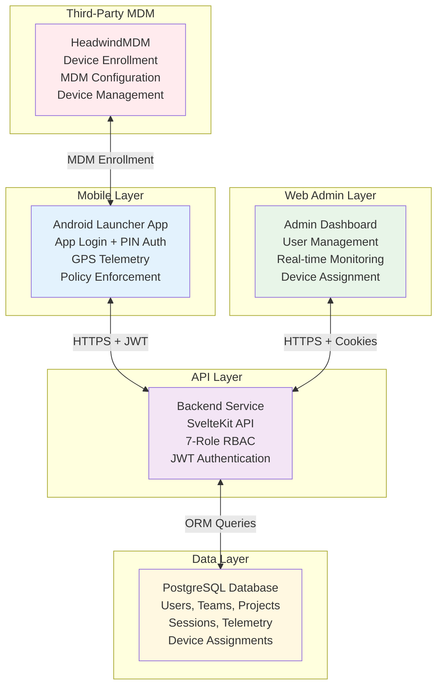

# SurveyLauncher Architecture Guide

**Last Updated:** November 17, 2025
**System Status:** Backend ✅ Production Ready | Frontend 🔄 Integration Ready

---

## 🎯 System Overview

SurveyLauncher is a **field operations platform** that integrates with third-party MDM solutions for comprehensive mobile device management. The system has three main components:

1. **Android Launcher App** - Kiosk mode app with login, GPS tracking, and policy enforcement
2. **Web Admin Dashboard** - User management and real-time monitoring
3. **Backend API Service** - Authentication, policy distribution, and telemetry processing

### **Third-Party MDM Integration**
- **HeadwindMDM** handles device enrollment and MDM configuration
- **SurveyLauncher** provides app-level authentication, policy enforcement, and telemetry
- **Seamless integration** between MDM device management and SurveyLauncher app functionality

### High-Level Architecture



---

## 👥 User Roles & Permissions

### Simplified Role System

| Role | Mobile Access | Web Admin Access | Primary Function |
|------|---------------|------------------|------------------|
| **TEAM_MEMBER** | ✅ Primary | ❌ Blocked | Field data collection |
| **TEAM_SUPERVISOR** | ✅ Primary | ✅ Secondary | Team supervision |
| **PROJECT_ADMIN** | ❌ | ✅ Primary | Project management |
| **PROJECT_PARTNER_ADMIN** | ❌ | ✅ Primary | Partner project coordination |
| **ORGANIZATION_MANAGER** | ❌ | ✅ Primary | Cross-project oversight |
| **ORGANIZATION_IT_SUPPORT** | ❌ | ✅ Primary | Device provisioning & technical support |
| **SYSTEM_ADMIN** | ❌ | ✅ Primary | Full system control |

### Role Tasks & Responsibilities

#### 🏃‍♂️ **Field Operations**

**TEAM_MEMBER**
- **CAN:**
  - Collect and submit field data
  - Use assigned Android device
  - Submit GPS telemetry
  - View assigned project information
  - Request supervisor override when needed
- **CANNOT:**
  - Manage other users
  - Access projects they're not assigned to
  - Provision devices
  - View other teams' data
- **SCOPE:** Assigned team and project only

**TEAM_SUPERVISOR**
- **CAN:**
  - Supervise assigned team members
  - Approve supervisor override requests
  - Monitor team GPS tracking
  - Manage team devices (restart, configure)
  - View team performance reports
  - Add/remove members from their team
- **CANNOT:**
  - Access other teams without permission
  - Move users between projects
  - Provision new devices
  - Access partner organization data
- **SCOPE:** Assigned team and project only

#### 🔧 **Project & Organization Management**

**PROJECT_ADMIN**
- **CAN:**
  - Create and manage projects within department
  - Provision devices for central_project_team
  - Assign TEAM_MEMBERs and TEAM_SUPERVISORs
  - Designate project_partner_admin
  - Manage project timelines and milestones
  - View all project data and reports
  - Monitor team performance
- **CANNOT:**
  - Access other department projects
  - Modify partner organization internal structure
  - Move users to other organization's projects
- **SCOPE:** All projects within their department

**PROJECT_PARTNER_ADMIN**
- **CAN:**
  - Provision devices for partner_project_team
  - Assign TEAM_MEMBERs and TEAM_SUPERVISORs from their organization
  - View project data relevant to their team
  - Manage partner team performance
  - Coordinate with project_admin
- **CANNOT:**
  - Access central_project_team internal data
  - Modify project structure
  - Move users from other organizations
  - Reassign project_admin
- **SCOPE:** Partner team within assigned project

**ORGANIZATION_MANAGER**
- **CAN:**
  - Work across ALL projects within organization (as lead or partner)
  - Move users between projects within same organization
  - Create and manage departments
  - Assign PROJECT_ADMINs to departments
  - View organization-wide analytics
  - Manage cross-project resource allocation
  - Coordinate partner relationships
- **CANNOT:**
  - Access other organizations' internal data
  - Modify system-level configurations
  - Move users between different organizations
- **SCOPE:** All departments and projects within their organization

**ORGANIZATION_IT_SUPPORT**
- **CAN:**
  - Assign SurveyLauncher users to HeadwindMDM-enrolled devices
  - Configure SurveyLauncher launcher settings and policies
  - Manage SurveyLauncher app lifecycle (install, update, retire)
  - Technical troubleshooting for SurveyLauncher app issues
  - Monitor SurveyLauncher app performance and telemetry
  - Manage SurveyLauncher device assignments within organization
  - Support SurveyLauncher app security and compliance
  - Coordinate with project admins for app deployment
  - Integrate with HeadwindMDM for device management coordination
- **CANNOT:**
  - Access device MDM settings or enrollment (handled by HeadwindMDM)
  - Access project data or user information beyond technical needs
  - Move users between projects
  - Modify project structure or assignments
  - Assign roles or manage organizational hierarchy
- **SCOPE:** SurveyLauncher app management and device assignments within their organization

**SYSTEM_ADMIN**
- **CAN:**
  - Full system administration
  - Manage all organizations
  - Configure system settings
  - Create and manage parent organizations
  - Assign ORGANIZATION_MANAGERs and ORGANIZATION_IT_SUPPORT
  - System-wide analytics and reporting
- **CANNOT:**
  - Limited only by business rules and compliance
- **SCOPE:** Entire system

---

## 🏗️ Core Architecture Principles

### 1. **Organizations → Departments → Multiple Projects Structure**

```
AIIMS New Delhi (Parent Organization)
├── NDDTC Department (Can create multiple projects)
│   ├── Project: National Drug Use Survey
│   │   ├── project_admin: Dr. Atul Ambekar
│   │   ├── central_project_team: NDDTC coordinators
│   │   └── partner_organization: NIMHANS
│   │       ├── project_partner_admin: NIMHANS Director
│   │       └── partner_project_team: NIMHANS coordinators
│   └── Project: [Future Drug-Related Projects...]
│       ├── project_admin: [To be assigned by ORGANIZATION_MANAGER]
│       ├── central_project_team: NDDTC staff
│       └── [Future partner organizations...]
└── CDER Department (Can create multiple projects)
    ├── Project: National Oral Health Survey
    │   ├── project_admin: Dr. Rita Duggal
    │   ├── central_project_team: CDER coordinators
    │   └── partner_organization: AIIMS Jodhpur
    │       ├── project_partner_admin: AIIMS Jodhpur Coordinator
    │       └── partner_project_team: AIIMS Jodhpur coordinators
    └── Project: [Future Dental Health Projects...]
        ├── project_admin: [To be assigned by ORGANIZATION_MANAGER]
        ├── central_project_team: CDER staff
        └── [Future partner organizations...]
```

### **Department Flexibility**
- Each department can create **multiple projects**
- PROJECT_ADMINs are assigned by **ORGANIZATION_MANAGER**
- Departments can partner with different organizations for different projects
- Users can be moved between projects within same department by ORGANIZATION_MANAGER

### 2. **Project Administration Model**

**Each Project Has:**
- **Lead Department** - Department within parent organization (e.g., NDDTC, CDER)
- **project_admin** - Assigned by ORGANIZATION_MANAGER, has device provisioning for central team
- **central_project_team** - Default team from lead department
- **partner_organization** (optional) - External collaborating institution
- **project_partner_admin** - **Designated by project_admin** from partner organization staff
- **partner_project_team** - Partner institution's team for collaboration

**Key Administrative Rules:**
- **PROJECT_ADMIN allocation:** Assigned by ORGANIZATION_MANAGER
- **PROJECT_PARTNER_ADMIN allocation:** **Designated by project_admin** from partner organization
- **Departments:** Can create multiple projects
- **Project boundaries:** Strict - users must be explicitly moved between projects
- **User mobility:** Only ORGANIZATION_MANAGER can move users between projects within same organization

### 3. **Team Structure & Device Management**

**Teams Contain:**
- **Team Members** - Field workers collecting data
- **Supervisors** - Team oversight and management
- **Device Assignments** - HeadwindMDM-enrolled devices assigned to users

**Device Assignment & App Management:**
- **HeadwindMDM** handles device enrollment and MDM configuration (third-party)
- **PROJECT_ADMIN** can assign users to HeadwindMDM-enrolled devices for central_project_team
- **PROJECT_PARTNER_ADMIN** can assign users to HeadwindMDM-enrolled devices for partner_project_team
- **ORGANIZATION_IT_SUPPORT** can assign users to ANY HeadwindMDM-enrolled devices within organization
- All three roles can configure SurveyLauncher launcher settings and policies
- SurveyLauncher handles app-level authentication and policy enforcement

**App & Device Coordination:**
- Project admins coordinate with IT support for large-scale app deployments
- IT support manages SurveyLauncher app lifecycle and integrates with HeadwindMDM
- Partner admins coordinate with both project admin and IT support for partner team app deployment
- HeadwindMDM provides device management, SurveyLauncher provides app functionality

### 4. **Geographic Scoping at Team Level**

**Team-Based Geographic Management:**
- **Each team is responsible for specific geographic areas** (1+ areas per team)
- **Geographic boundaries are automatically handled through team assignments**
- **Users inherit geographic scope from their team** - no separate geographic configuration needed
- **Projects can span multiple geographic areas** through multiple team assignments
- **Partner organizations enable cross-organizational collaboration** within defined team areas

**Example Geographic Distribution:**
- **NDDTC North Team** - Delhi, NCR, Punjab, Haryana
- **NDDTC South Team** - Karnataka, Tamil Nadu, Kerala, Andhra Pradesh
- **NDDTC East Team** - West Bengal, Odisha, Jharkhand
- **CDER West Team** - Maharashtra, Gujarat, Rajasthan
- **CDER Central Team** - MP, Chhattisgarh, Uttarakhand

**As long as we identify teams, geographic boundaries are automatically enforced**

---

## 📊 Database Schema (Simplified)

### Core Tables
- **parentOrganizations** - Main institutions (e.g., AIIMS New Delhi)
- **departments** - Departments within parent org (e.g., NDDTC, CDER)
- **partnerOrganizations** - External collaborating institutions (e.g., NIMHANS, AIIMS Jodhpur)
- **projects** - National surveys led by departments
- **teams** - Geographic teams with area assignments
- **users** - TEAM_MEMBERs, TEAM_SUPERVISORs, PROJECT_ADMINs, etc.
- **deviceAssignments** - User-to-HeadwindMDM device mappings
- **headwindDevices** - HeadwindMDM-enrolled device registry (read-only)
- **sessions** - User login sessions
- **telemetryEvents** - GPS, heartbeat, system events

### Simplified Role System
- **TEAM_MEMBER** - Field data collection
- **TEAM_SUPERVISOR** - Team supervision
- **PROJECT_ADMIN** - Project management (department level)
- **PROJECT_PARTNER_ADMIN** - Partner project coordination
- **ORGANIZATION_MANAGER** - Cross-project oversight (organization level)
- **ORGANIZATION_IT_SUPPORT** - Device provisioning & technical support
- **SYSTEM_ADMIN** - Full system control

### Key Relationships
- **ParentOrg → Departments** (Administrative hierarchy)
- **Departments → Projects** (Departments can create multiple projects)
- **Projects → Teams** (central_project_team + partner_project_team)
- **Teams → Geographic Areas** (1+ areas per team for automatic geographic scoping)
- **PartnerOrgs → Projects** (External collaboration relationships)
- **Teams → Users** (team members and supervisors)
- **Projects → Users** (project_admin assigned by ORGANIZATION_MANAGER)
- **Projects → Users** (project_partner_admin designated by project_admin)
- **deviceAssignments → Users** (Device-to-user assignments by PROJECT_ADMIN, PROJECT_PARTNER_ADMIN, ORGANIZATION_IT_SUPPORT)
- **headwindDevices → deviceAssignments** (MDM device registry integration)
- **Users → Projects** (Strict boundaries, moved only by ORGANIZATION_MANAGER)
- **ORGANIZATION_IT_SUPPORT → deviceAssignments** (Can assign devices for ANY team within organization)
- **HeadwindMDM → headwindDevices** (Third-party MDM system manages device enrollment)

### Project Administration Flow
```
1. Parent Organization exists (AIIMS New Delhi)
2. Department creates Project (NDDTC leads Drug Survey, CDER leads Oral Health Survey)
3. ORGANIZATION_MANAGER assigns project_admin (department director)
4. central_project_team auto-created from department
5. Optional: Partner Organization added (NIMHANS for Drug Survey, AIIMS Jodhpur for Oral Health Survey)
6. project_admin designates project_partner_admin from partner institution
7. partner_project_team auto-created from partner institution
8. Device Management:
   - HeadwindMDM enrolls and configures Android devices (third-party)
   - project_admin assigns users to HeadwindMDM devices for central_project_team
   - project_partner_admin assigns users to HeadwindMDM devices for partner_project_team
   - ORGANIZATION_IT_SUPPORT can assign users to ANY HeadwindMDM device within organization
9. App Deployment:
   - SurveyLauncher launcher app installed on HeadwindMDM-enrolled devices
   - All three roles configure SurveyLauncher app settings and policies
   - App handles login, GPS tracking, and policy enforcement
10. Ongoing coordination:
    - Project admins coordinate with IT support for app deployments
    - IT support manages SurveyLauncher app lifecycle and HeadwindMDM integration
    - All roles manage app-level policies and user-device assignments
```

---

## 🔒 Security Model

### Multi-Layer Access Control

1. **Authentication** - Login with proper credentials
2. **Role Permissions** - 9-role RBAC system
3. **Project Assignments** - Access to specific projects
4. **Geographic Boundaries** - Regional scope enforcement

### Dual-Interface Authentication

**Mobile App** (Device + User + PIN)
- Used by field workers
- Device-specific authentication
- Role: TEAM_MEMBER, FIELD_SUPERVISOR, REGIONAL_MANAGER

**Web Admin** (Email + Password)
- Used by managers and staff
- Traditional web authentication
- Role: All except TEAM_MEMBER

---

## 📱 Key Workflows

### 1. Project Creation & Setup
```
Lead Org creates Project → project_admin assigned → central_project_team created →
Optional: Add Partner Org → project_partner_admin assigned → partner_project_team created
```

### 2. Team & Device Provisioning
```
project_admin provisions devices → Assigns to central_team members →
project_partner_admin provisions devices → Assigns to partner_team members →
Supervisors assigned to oversee teams
```

### 3. Daily Field Operations
```
Team member logs into Android app → Gets project-specific policy → Works within allowed hours → GPS tracking → Supervisor oversight
```

### 4. Cross-Organizational Collaboration
```
Central team and partner team work on same project → Different device provisioning → Shared project goals → Coordinated supervision
```

### 5. Real-time Monitoring
```
All devices send GPS/telemetry → project_admin monitors all teams → project_partner_admin monitors partner team → Central dashboard shows complete project status
```

---

## 🚀 Implementation Status

### ✅ **Backend: Production Ready (100%)**
- **Authentication:** Multi-factor auth with JWT tokens
- **Policy Management:** JWS-signed policies with time windows
- **Telemetry:** GPS tracking and event processing
- **Database:** Complete schema with proper relationships
- **Security:** Rate limiting, audit logging, encryption
- **Testing:** 54/54 tests passing

### 🔄 **Frontend: Ready for Integration (0%)**
- **API Endpoints:** 14 project management endpoints ready
- **Documentation:** Complete API specifications
- **Integration:** SvelteKit admin interface needed

---

## 📈 Success Metrics

### Performance Targets
- **Authentication:** <200ms
- **Policy Distribution:** <500ms
- **Telemetry Processing:** <100ms per batch
- **GPS Updates:** 3-minute intervals

### Security Goals
- **Access Control:** 100% role-based enforcement
- **Geographic Compliance:** Regional boundary validation
- **Audit Trail:** Complete activity logging

---

## 🔮 Next Steps

### Phase 1: Frontend Integration (2-3 weeks)
- Build admin dashboard components
- Implement user management pages
- Add real-time monitoring views
- Integrate with existing SvelteKit app

### Phase 2: Advanced Features (Following quarter)
- Project templates and rapid deployment
- Advanced geographic boundaries
- Mobile app project awareness
- Analytics and reporting dashboard

---

## 📚 Related Documentation

- **[API Documentation](../backend/docs/api.md)** - Complete REST API reference
- **[User Guide](./user-guide/README.md)** - End-user documentation
- **[Workflows](../workflows/)** - Detailed implementation guides
- **[Testing Status](../backend/docs/testing-status.md)** - Test coverage and quality

---

## 🏆 Conclusion

SurveyLauncher provides a **complete, production-ready MDM solution** for field operations:

1. **Enterprise Security** - 9-role RBAC with geographic boundaries
2. **Mobile-First Design** - Android kiosk app with GPS tracking
3. **Real-Time Operations** - Live monitoring and telemetry processing
4. **Scalable Architecture** - Supports national and regional deployments

**System Status:** ✅ **PRODUCTION READY**
**Next Milestone:** 🚀 **Frontend Integration**