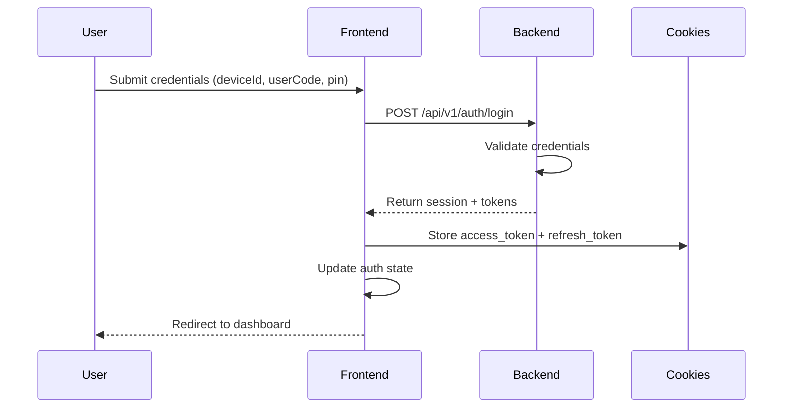
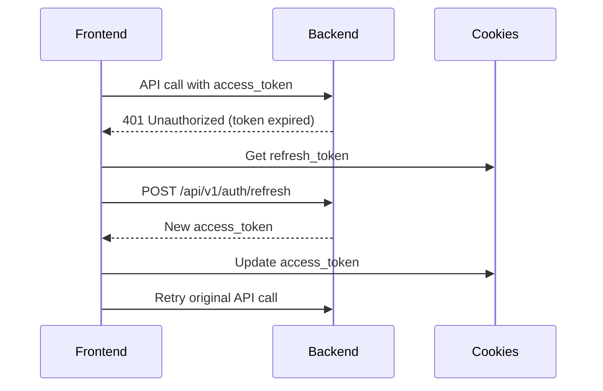

# SurveyLauncher Authentication System Documentation

## Overview

This document provides comprehensive documentation for the SurveyLauncher Admin Frontend authentication system, which handles user authentication, session management, and secure access to admin features.

## Table of Contents

1. [Authentication Flow](#authentication-flow)
2. [State Management](#state-management)
3. [Session Management](#session-management)
4. [Protected Routes](#protected-routes)
5. [Security Features](#security-features)
6. [Implementation Guide](#implementation-guide)
7. [Testing Authentication](#testing-authentication)

---

## Authentication Flow

### **User Login Process**



### **Token Refresh Process**



---

## State Management

### **Auth State Structure**

```typescript
interface AuthState {
  isAuthenticated: boolean;    // User is logged in
  isLoading: boolean;         // Authentication in progress
  user: User | null;          // Current user information
  session: Session | null;    // Current session details
  access_token: string | null; // JWT access token
  refresh_token: string | null; // JWT refresh token
  error: string | null;       // Authentication error message
}
```

### **Using the Auth Store**

```typescript
import { auth } from '$lib/stores/auth';

// Reactive state access
console.log(auth.state.isAuthenticated);  // boolean
console.log(auth.state.user);            // User object or null
console.log(auth.state.error);           // Error message or null

// Authentication actions
const success = await auth.login({
  deviceId: 'dev-mock-001',
  userCode: 'u001',
  pin: '123456'
});

await auth.logout();
await auth.initialize();
auth.clearError();
```

### **Reactive UI Updates**

```svelte
<!-- Example: Auth-aware component -->
<script>
  import { auth } from '$lib/stores/auth';

  $: isLoggedIn = auth.state.isAuthenticated;
  $: currentUser = auth.state.user;
  $: isLoading = auth.state.isLoading;
  $: authError = auth.state.error;
</script>

{#if isLoading}
  <div class="loading">Authenticating...</div>
{:else if isLoggedIn}
  <div class="welcome">Welcome, {currentUser?.display_name}!</div>
{:else}
  <div class="login-prompt">Please log in</div>
{/if}

{#if authError}
  <div class="error">{authError}</div>
{/if}
```

---

## Session Management

### **Cookie Configuration**

```typescript
// Access Token Cookie
{
  path: '/',
  httpOnly: true,
  secure: true,        // HTTPS only in production
  sameSite: 'lax',
  maxAge: 3600          // 1 hour
}

// Refresh Token Cookie
{
  path: '/',
  httpOnly: true,
  secure: true,        // HTTPS only in production
  sameSite: 'lax',
  maxAge: 604800        // 7 days
}
```

### **Session Lifecycle**

```typescript
// 1. Login - Create session and tokens
await auth.login(credentials);

// 2. Initialize - Restore session from cookies
await auth.initialize();

// 3. Refresh - Automatically handle token refresh
// Handled transparently in API calls

// 4. Logout - Terminate session
await auth.logout();

// 5. End Session - Force session end
await auth.endSession();
```

### **Session Security Features**

- **HTTP-Only Cookies**: Tokens not accessible via JavaScript
- **Secure Flag**: HTTPS-only in production
- **SameSite Policy**: CSRF protection
- **Short Access Token TTL**: 1 hour reduces risk exposure
- **Long Refresh Token TTL**: 7 days for user convenience

---

## Protected Routes

### **Route Protection Strategy**

```typescript
// src/routes/(admin)/+layout.server.ts
import { auth } from '$lib/stores/auth';
import { redirect } from '@sveltejs/kit';

export async function load({ cookies }) {
  // Initialize auth state
  await auth.initialize();

  // Redirect to login if not authenticated
  if (!auth.state.isAuthenticated) {
    throw redirect(302, '/auth/login');
  }

  // Return user data to protected routes
  return {
    user: auth.state.user,
    session: auth.state.session
  };
}
```

### **Authentication Context**

```typescript
// src/routes/+layout.svelte
<script>
  import { setAuthContext } from '$lib/stores/auth';
  import { onMount } from 'svelte';

  // Set auth context for child components
  setAuthContext();

  // Initialize auth state on app startup
  onMount(async () => {
    await auth.initialize();
  });
</script>

<slot />
```

### **Route Guard Components**

```svelte
<!-- src/lib/components/guards/AuthGuard.svelte -->
<script>
  import { auth } from '$lib/stores/auth';
  import { onMount } from 'svelte';

  let { children, redirectTo = '/auth/login' } = $props();

  onMount(() => {
    if (!auth.state.isAuthenticated && !auth.state.isLoading) {
      window.location.href = redirectTo;
    }
  });

  $: shouldRender = auth.state.isAuthenticated && !auth.state.isLoading;
</script>

{#if auth.state.isLoading}
  <div class="loading">Checking authentication...</div>
{:else if shouldRender}
  {@render children()}
{/if}
```

---

## Security Features

### **Multi-Factor Security**

1. **Device-Based Authentication**
   - Unique device ID required
   - Device registration tracking

2. **User Code + PIN System**
   - User code identifies the user
   - 6-digit PIN provides verification
   - Rate limiting prevents brute force attacks

3. **Session Time Windows**
   - Configurable access windows
   - Time-based policy enforcement
   - Supervisor override capabilities

### **Rate Limiting**

```typescript
// Backend enforces rate limiting:
// - Login attempts: 5 per 15 minutes per IP
// - Supervisor override: 3 per hour per device
// - PIN attempts: Limited with cooldown periods
```

### **Secure Token Handling**

```typescript
// Automatic token refresh
const apiCall = async (url: string) => {
  try {
    const response = await fetch(url, {
      headers: getAuthHeaders()
    });
    return handleApiResponse(response);
  } catch (error) {
    if (error.status === 401) {
      // Token expired, attempt refresh
      const refreshed = await auth.refreshAccessToken();
      if (refreshed) {
        // Retry original request
        return fetch(url, { headers: getAuthHeaders() });
      }
    }
    throw error;
  }
};
```

### **CSRF Protection**

- SameSite cookie policy prevents CSRF
- Request ID tracking for audit trails
- Automatic token rotation on refresh

---

## Implementation Guide

### **Setting Up Authentication**

1. **Environment Configuration**
   ```bash
   # .env
   PUBLIC_SURVEY_LAUNCHER_API_URL=http://localhost:3000
   ```

2. **Root Layout Setup**
   ```svelte
   <!-- src/routes/+layout.svelte -->
   <script>
     import { setAuthContext, auth } from '$lib/stores/auth';
     import { onMount } from 'svelte';

     setAuthContext();

     onMount(async () => {
       await auth.initialize();
     });
   </script>

   <slot />
   ```

3. **Protected Routes Layout**
   ```svelte
   <!-- src/routes/(admin)/+layout.server.ts -->
   import { auth } from '$lib/stores/auth';
   import { redirect } from '@sveltejs/kit';

   export async function load() {
     await auth.initialize();

     if (!auth.state.isAuthenticated) {
       throw redirect(302, '/auth/login');
     }

     return {
       user: auth.state.user,
       session: auth.state.session
     };
   }
   ```

### **Creating Login Page**

```svelte
<!-- src/routes/auth/login/+page.svelte -->
<script>
  import { auth } from '$lib/stores/auth';
  import { Button } from '$lib/components/ui/button';
  import { Input } from '$lib/components/ui/input';
  import { Card } from '$lib/components/ui/card';

  let deviceId = '';
  let userCode = '';
  let pin = '';
  let loginError = '';

  async function handleLogin() {
    const success = await auth.login({
      deviceId,
      userCode,
      pin
    });

    if (success) {
      // Redirect handled by auth state change
      window.location.href = '/dashboard';
    } else {
      loginError = auth.state.error || 'Login failed';
    }
  }

  $: canSubmit = deviceId && userCode && pin.length >= 6;
</script>

<Card class="w-full max-w-md mx-auto p-6">
  <h2 class="text-2xl font-bold mb-6">SurveyLauncher Admin</h2>

  <form on:submit|preventDefault={handleLogin} class="space-y-4">
    <div>
      <Input
        id="deviceId"
        type="text"
        bind:value={deviceId}
        placeholder="Device ID"
        required
      />
    </div>

    <div>
      <Input
        id="userCode"
        type="text"
        bind:value={userCode}
        placeholder="User Code"
        required
      />
    </div>

    <div>
      <Input
        id="pin"
        type="password"
        bind:value={pin}
        placeholder="PIN"
        minlength="6"
        required
      />
    </div>

    {#if loginError}
      <div class="text-error-600 text-sm">{loginError}</div>
    {/if}

    <Button
      type="submit"
      class="w-full"
      disabled={!canSubmit || auth.state.isLoading}
    >
      {auth.state.isLoading ? 'Logging in...' : 'Login'}
    </Button>
  </form>
</Card>
```

### **User Information Display**

```svelte
<!-- src/lib/components/auth/UserInfo.svelte -->
<script>
  import { auth } from '$lib/stores/auth';
  import { Button } from '$lib/components/ui/button';

  async function handleLogout() {
    await auth.logout();
    window.location.href = '/auth/login';
  }
</script>

{#if auth.state.isAuthenticated && auth.state.user}
  <div class="flex items-center justify-between p-4 border-b">
    <div class="flex items-center space-x-4">
      <div class="text-sm">
        <div class="font-medium">{auth.state.user.display_name}</div>
        <div class="text-muted-foreground">
          {auth.state.user.code} • {auth.state.user.team_id}
        </div>
      </div>
    </div>

    <Button variant="outline" size="sm" onclick={handleLogout}>
      Logout
    </Button>
  </div>
{/if}
```

---

## Testing Authentication

### **Unit Testing Auth Store**

```typescript
// src/lib/stores/__tests__/auth.test.ts
import { describe, it, expect, vi, beforeEach } from 'vitest';
import { auth } from '../auth';

describe('Authentication Store', () => {
  beforeEach(() => {
    // Reset auth state
    await auth.logout();
    vi.clearAllMocks();
  });

  it('should authenticate successfully', async () => {
    const mockCredentials = {
      deviceId: 'test-device',
      userCode: 'test-user',
      pin: '123456'
    };

    // Mock successful API call
    global.fetch = vi.fn().mockResolvedValueOnce({
      ok: true,
      json: async () => ({
        ok: true,
        session: {
          session_id: 'test-session',
          user_id: 'test-user',
          started_at: new Date().toISOString(),
          expires_at: new Date(Date.now() + 3600000).toISOString(),
          override_until: null
        },
        access_token: 'test-access-token',
        refresh_token: 'test-refresh-token',
        policy_version: 3
      })
    });

    const result = await auth.login(mockCredentials);

    expect(result).toBe(true);
    expect(auth.state.isAuthenticated).toBe(true);
    expect(auth.state.access_token).toBe('test-access-token');
    expect(auth.state.refresh_token).toBe('test-refresh-token');
  });

  it('should handle authentication failure', async () => {
    const mockCredentials = {
      deviceId: 'test-device',
      userCode: 'test-user',
      pin: 'wrong-pin'
    };

    // Mock failed API call
    global.fetch = vi.fn().mockResolvedValueOnce({
      ok: false,
      status: 401,
      json: async () => ({
        ok: false,
        error: {
          code: 'LOGIN_FAILED',
          message: 'Invalid credentials',
          request_id: 'test-request-id'
        }
      })
    });

    const result = await auth.login(mockCredentials);

    expect(result).toBe(false);
    expect(auth.state.isAuthenticated).toBe(false);
    expect(auth.state.error).toBe('Invalid credentials');
  });

  it('should logout successfully', async () => {
    // First log in
    global.fetch = vi.fn().mockResolvedValueOnce({
      ok: true,
      json: async () => ({
        ok: true,
        session: {},
        access_token: 'test-token',
        refresh_token: 'test-refresh',
        policy_version: 3
      })
    });

    await auth.login({
      deviceId: 'test-device',
      userCode: 'test-user',
      pin: '123456'
    });

    expect(auth.state.isAuthenticated).toBe(true);

    // Mock logout call
    global.fetch = vi.fn().mockResolvedValueOnce({
      ok: true,
      json: async () => ({
        ok: true,
        message: 'Logged out successfully'
      })
    });

    await auth.logout();

    expect(auth.state.isAuthenticated).toBe(false);
    expect(auth.state.user).toBeNull();
    expect(auth.state.session).toBeNull();
    expect(auth.state.access_token).toBeNull();
    expect(auth.state.refresh_token).toBeNull();
  });
});
```

### **Component Testing**

```typescript
// src/lib/components/__tests__/UserInfo.test.ts
import { render, screen, fireEvent, waitFor } from '@testing-library/svelte';
import { describe, it, expect, vi } from 'vitest';
import UserInfo from '../auth/UserInfo';

describe('UserInfo Component', () => {
  it('should display user information when authenticated', async () => {
    const mockUser = {
      id: 'test-user',
      code: 'TEST001',
      team_id: 'team-123',
      display_name: 'Test User'
    };

    // Mock auth state
    vi.mock('$lib/stores/auth', () => ({
      auth: {
        state: {
          isAuthenticated: true,
          user: mockUser,
          session: null,
          isLoading: false,
          error: null
        },
        logout: vi.fn()
      }
    }));

    render(UserInfo);

    expect(screen.getByText('Test User')).toBeInTheDocument();
    expect(screen.getByText('TEST001 • team-123')).toBeInTheDocument();
    expect(screen.getByRole('button', { name: 'Logout' })).toBeInTheDocument();
  });

  it('should not display when not authenticated', () => {
    vi.mock('$lib/stores/auth', () => ({
      auth: {
        state: {
          isAuthenticated: false,
          user: null,
          session: null,
          isLoading: false,
          error: null
        }
      }
    }));

    render(UserInfo);

    expect(screen.queryByText('Logout')).not.toBeInTheDocument();
  });
});
```

### **Integration Testing**

```typescript
// tests/auth.integration.test.ts
import { describe, it, expect, test } from 'vitest';
import { setup, $fetch } from '@nuxt/test-utils';

describe('Authentication Integration', () => {
  it('should complete full authentication flow', async () => {
    // Test login page loads
    const loginPage = await $fetch('/auth/login');
    expect(loginPage.status).toBe(200);

    // Test login endpoint
    const loginResponse = await $fetch('/api/v1/auth/login', {
      method: 'POST',
      body: JSON.stringify({
        deviceId: 'dev-mock-001',
        userCode: 'u001',
        pin: '123456'
      })
    });

    expect(loginResponse.ok).toBe(true);
    const loginData = await loginResponse.json();
    expect(loginData.access_token).toBeDefined();
    expect(loginData.refresh_token).toBeDefined();

    // Test protected route
    const dashboardResponse = await $fetch('/dashboard');
    expect(dashboardResponse.status).toBe(200);

    // Test logout
    const logoutResponse = await $fetch('/api/v1/auth/logout', {
      method: 'POST'
    });
    expect(logoutResponse.ok).toBe(true);
  });
});
```

---

## Performance Considerations

### **Efficient State Management**

- **Svelte 5 Runes**: Optimized reactivity system
- **Minimal Re-renders**: State changes only affect dependent components
- **Lazy Loading**: Auth state initialized only when needed

### **Token Management Optimization**

- **Automatic Refresh**: Transparent to user, reduces re-authentication
- **Cookie Storage**: Faster than localStorage, no client-side encryption overhead
- **Short TTL**: Reduces risk exposure period

### **Network Optimization**

- **Request Deduplication**: Prevent multiple simultaneous auth checks
- **Retry Logic**: Automatic retry with exponential backoff
- **Connection Reuse**: HTTP/2 and keep-alive support

---

## Troubleshooting

### **Common Authentication Issues**

1. **Login Failures**
   ```typescript
   // Check error details
   console.log(auth.state.error);

   // Verify backend API is running
   fetch('http://localhost:3000/health');
   ```

2. **Token Not Persisting**
   ```typescript
   // Check cookie settings in dev tools
   // Verify secure flag is false for localhost
   ```

3. **Protected Routes Not Working**
   ```typescript
   // Check route hierarchy
   // Ensure (admin) folder exists
   // Verify +layout.server.ts in protected routes
   ```

### **Debug Mode**

Enable authentication debugging:

```typescript
// In development only
if (import.meta.env.DEV) {
  console.log('Auth state:', auth.state);

  // Log all API calls
  const originalFetch = global.fetch;
  global.fetch = async (...args) => {
    console.log('API Call:', args[0], args[1]);
    const response = await originalFetch(...args);
    console.log('API Response:', response.status);
    return response;
  };
}
```

### **Testing with Sample Data**

Use backend sample credentials for testing:

```typescript
const testCredentials = {
  deviceId: 'dev-mock-001',
  userCode: 'u001',
  pin: '123456'
};

const testSupervisor = {
  supervisor_pin: '789012',
  deviceId: 'dev-mock-001'
};
```

This authentication system provides a secure, robust foundation for the SurveyLauncher Admin Frontend with comprehensive session management and user protection features.