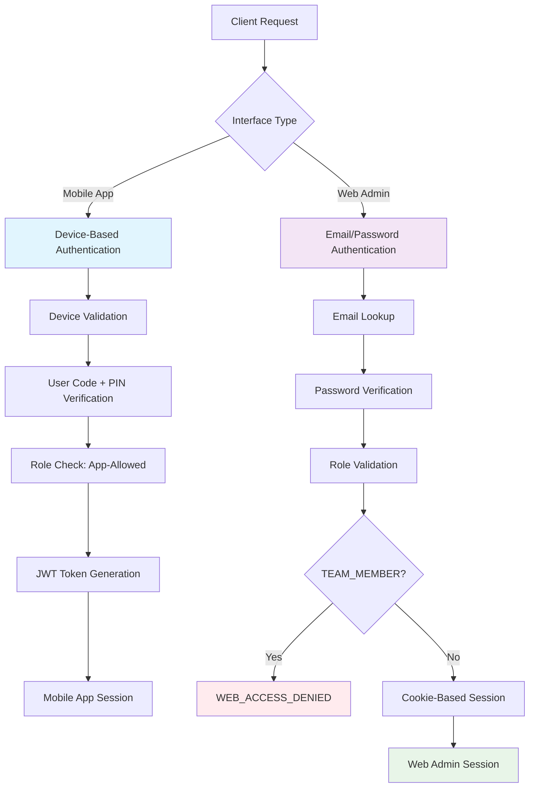
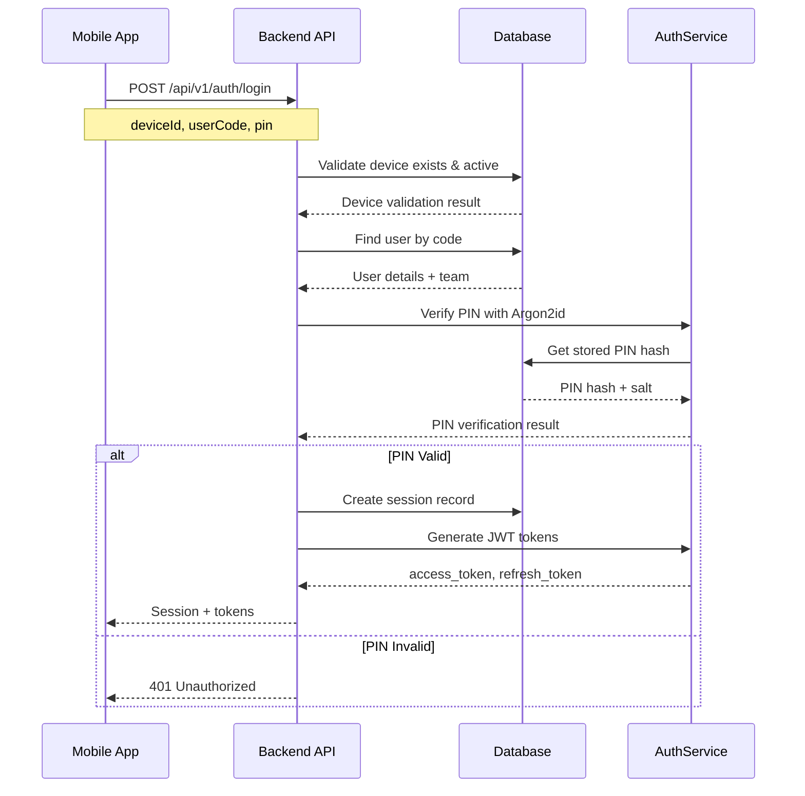
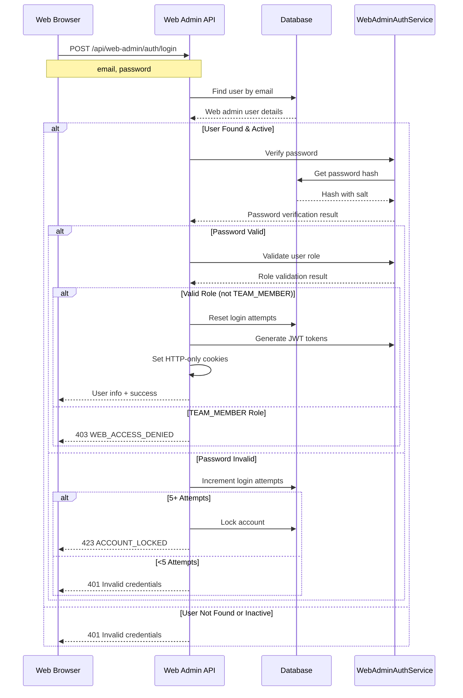
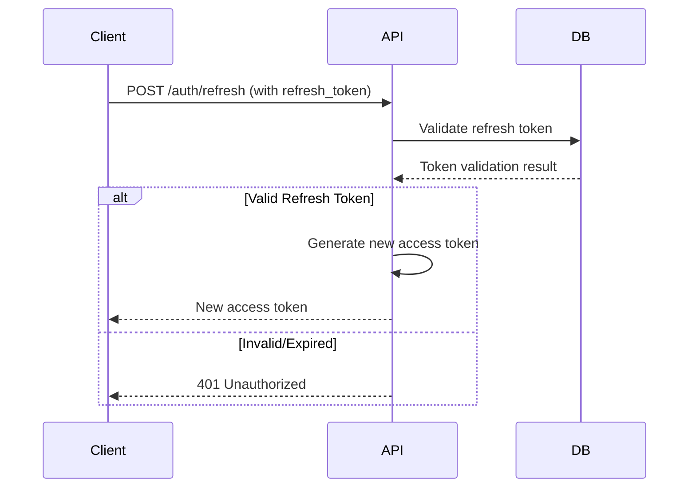

# SurveyLauncher Authentication Workflow

**Purpose**: Multi-layered authentication system supporting both mobile app and web admin interfaces with role-based access control.

Last updated: November 15, 2025

## Authentication Architecture Overview



## Mobile App Authentication Flow

### 1. Device-Based Authentication

**Endpoint**: `POST /api/v1/auth/login`

**Process Flow**:


**Key Features**:
- **Device Binding**: Authentication tied to specific device
- **PIN Security**: Argon2id hashing with per-user salts
- **Session Management**: Database-tracked sessions with expiration
- **Rate Limiting**: Protection against brute force attacks

### 2. Allowed Mobile App Roles

**Valid Roles for Mobile App Access**:
- `TEAM_MEMBER` - Field operators
- `FIELD_SUPERVISOR` - On-site supervisors
- `REGIONAL_MANAGER` - Regional leadership

**Access Control**: All roles can access mobile app, but permissions vary by role level.

## Web Admin Authentication Flow

### 1. Email/Password Authentication

**Endpoint**: `POST /api/web-admin/auth/login`

**Process Flow**:


### 2. Role-Based Access Enforcement

**Role Validation Logic**:
```typescript
// Valid Web Admin Roles (excludes TEAM_MEMBER)
const VALID_WEB_ADMIN_ROLES = [
  'SYSTEM_ADMIN',
  'SUPPORT_AGENT',
  'AUDITOR',
  'DEVICE_MANAGER',
  'POLICY_ADMIN',
  'NATIONAL_SUPPORT_ADMIN',
  // Hybrid roles (can access both)
  'FIELD_SUPERVISOR',
  'REGIONAL_MANAGER'
];

// Role validation in WebAdminAuthService
if (user.role === 'TEAM_MEMBER') {
  return {
    success: false,
    error: {
      code: 'WEB_ACCESS_DENIED',
      message: 'TEAM_MEMBER role cannot access web admin interface'
    }
  };
}
```

### 3. Security Features

**Account Security**:
- **Account Lockout**: After 5 failed attempts
- **Login Attempt Tracking**: Database-tracked with timestamps
- **Password Security**: Argon2id hashing with per-user salts
- **Session Management**: HTTP-only cookies with secure flags

**Cookie Configuration**:
```javascript
// HTTP-only security cookies
res.cookie('access_token', token, {
  httpOnly: true,
  secure: process.env.NODE_ENV === 'production',
  sameSite: 'strict',
  path: '/',
  maxAge: 20 * 60 // 20 minutes
});

res.cookie('refresh_token', refreshToken, {
  httpOnly: true,
  secure: process.env.NODE_ENV === 'production',
  sameSite: 'strict',
  path: '/',
  maxAge: 12 * 60 * 60 // 12 hours
});
```

## Role-Based Access Control Matrix

### Interface Access Rules

| Role | Mobile App | Web Admin | Description |
|------|------------|-----------|-------------|
| **TEAM_MEMBER** | ✅ | ❌ | Field workers (app only) |
| **FIELD_SUPERVISOR** | ✅ | ✅ | Field management (hybrid) |
| **REGIONAL_MANAGER** | ✅ | ✅ | Regional oversight (hybrid) |
| **SYSTEM_ADMIN** | ❌ | ✅ | Full system admin |
| **SUPPORT_AGENT** | ❌ | ✅ | Customer support |
| **AUDITOR** | ❌ | ✅ | Compliance auditing |
| **DEVICE_MANAGER** | ❌ | ✅ | Device management |
| **POLICY_ADMIN** | ❌ | ✅ | Policy administration |
| **NATIONAL_SUPPORT_ADMIN** | ❌ | ✅ | National oversight |

### Permission Enforcement

**Mobile App Permissions**:
- Device-based authentication required
- Role-specific feature access
- Team and geographic boundaries enforced

**Web Admin Permissions**:
- Email/password authentication required
- Role-based feature access
- Administrative functions based on role level

## Token Management

### JWT Token Structure

**Mobile App Tokens**:
```json
{
  "sub": "user_id",
  "deviceId": "device_uuid",
  "sessionId": "session_uuid",
  "type": "mobile",
  "exp": 1234567890,
  "iat": 1234567800
}
```

**Web Admin Tokens**:
```json
{
  "sub": "user_id",
  "deviceId": "web-admin-user_id",
  "sessionId": "web_session_uuid",
  "type": "web_admin",
  "exp": 1234567890,
  "iat": 1234567800
}
```

### Token Refresh Flow



## Security Architecture

### Cryptographic Security

1. **PIN Hashing**: Argon2id with per-user salts
2. **Password Hashing**: Argon2id with per-user salts
3. **JWT Tokens**: Secure signing with expiration
4. **Random Generation**: Cryptographically secure values

### Protection Mechanisms

1. **Rate Limiting**: Per device/IP and per user
2. **Account Lockout**: Automatic after failed attempts
3. **Session Management**: Secure token tracking
4. **Input Validation**: Comprehensive sanitization
5. **Audit Logging**: Complete security event tracking

## Error Handling

### Authentication Error Codes

**Mobile App Errors**:
- `DEVICE_NOT_FOUND` - Device doesn't exist
- `USER_NOT_FOUND` - User code invalid
- `INVALID_CREDENTIALS` - PIN incorrect
- `RATE_LIMITED` - Too many attempts

**Web Admin Errors**:
- `WEB_ACCESS_DENIED` - TEAM_MEMBER role blocked
- `ACCOUNT_LOCKED` - Too many failed attempts
- `ACCOUNT_INACTIVE` - Account deactivated
- `INVALID_ROLE` - Invalid role for web admin

### Standard Error Response

```json
{
  "ok": false,
  "error": {
    "code": "ERROR_CODE",
    "message": "Human-readable description"
  }
}
```

## Monitoring and Auditing

### Security Events Logged

1. **Authentication Attempts**: Success/failure with context
2. **Account Lockouts**: Automatic lockout events
3. **Role Violations**: Blocked access attempts
4. **Token Operations**: Issuance, refresh, revocation
5. **Session Events**: Creation, expiration, termination

### Performance Metrics

1. **Authentication Latency**: Login response times
2. **Success Rates**: Authentication success percentages
3. **Security Events**: Failed attempts and lockouts
4. **Token Performance**: JWT generation and validation times

## Implementation Notes

### Key Services

- `AuthService`: Mobile app authentication logic
- `WebAdminAuthService`: Web admin authentication logic
- `JWTService`: Token generation and validation
- Database: Users, devices, sessions, web_admin_users tables

### Security Best Practices

1. **Least Privilege**: Users get minimum required access
2. **Defense in Depth**: Multiple security layers
3. **Fail Secure**: Default to secure operation
4. **Audit Everything**: Complete security event logging
5. **Regular Updates**: Keep dependencies and security practices current

---

**Related Documentation**:
- [Role Differentiation Guide](../backend/docs/role-differentiation.md)
- [API Documentation](../backend/docs/api.md)
- [Security Best Practices](../backend/docs/security.md)