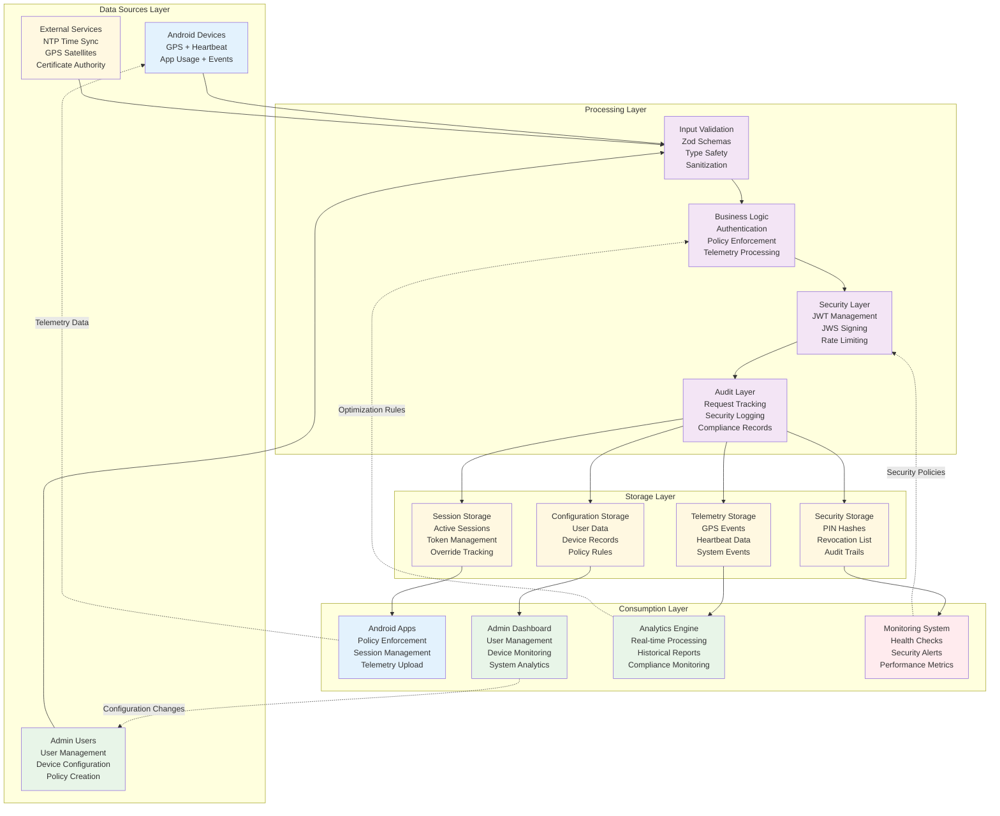
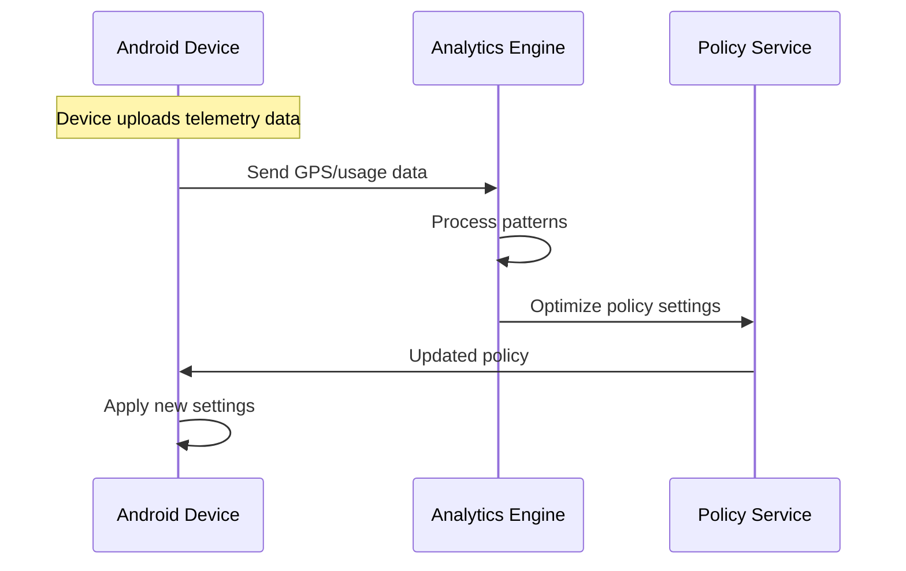

# Data Flow Architecture (Vertical)

## Overview
This document describes the comprehensive vertical data flow architecture of the SurveyLauncher system, showing how data moves through multiple processing layers from sources to consumption, with feedback loops enabling system optimization and adaptation.

## Vertical Data Flow Diagram



## Layer-by-Layer Architecture

### 1. Data Sources Layer

#### Android Device Data Sources
```typescript
interface DeviceDataSources {
  gps: {
    location: GPSCoordinate;
    accuracy: number;
    timestamp: ISO8601;
    provider: 'gps' | 'network';
  };
  heartbeat: {
    battery: number; // 0-1
    charging: boolean;
    network: NetworkInfo;
    memory: MemoryInfo;
  };
  appUsage: {
    packageName: string;
    duration: number;
    timestamp: ISO8601;
  };
  systemEvents: {
    type: 'network' | 'battery' | 'error';
    details: Record<string, any>;
    timestamp: ISO8601;
  };
}
```

#### Admin User Data Sources
```typescript
interface AdminDataSources {
  userManagement: {
    createUser: UserCreationRequest;
    updateUser: UserUpdateRequest;
    deactivateUser: string;
  };
  deviceConfiguration: {
    registerDevice: DeviceRegistration;
    updatePolicy: PolicyUpdate;
    teamAssignment: TeamChange;
  };
  policyCreation: {
    timeWindows: TimeWindow[];
    gpsSettings: GPSConfiguration;
    securitySettings: SecurityPolicy;
  };
}
```

#### External Service Data Sources
```typescript
interface ExternalDataSources {
  ntp: {
    serverTime: ISO8601;
    clockSkew: number;
    reliability: number;
  };
  gps: {
    satelliteCount: number;
    signalStrength: number;
    accuracy: number;
  };
  certificate: {
    publicKey: string;
    keyId: string;
    validity: DateRange;
  };
}
```

### 2. Processing Layer

#### Input Validation (PL1)
```typescript
class InputValidationProcessor {
  async validateGPSData(data: any): Promise<ValidatedGPSData> {
    const schema = z.object({
      lat: z.number().min(-90).max(90),
      lon: z.number().min(-180).max(180),
      acc_m: z.number().min(0).max(1000),
      ts: z.string().datetime(),
      provider: z.enum(['gps', 'network'])
    });

    return await schema.parseAsync(data);
  }

  async validateTelemetryBatch(batch: any): Promise<ValidatedBatch> {
    const batchSchema = z.object({
      device_id: z.string().uuid(),
      session_id: z.string().uuid().optional(),
      events: z.array(z.any()).max(50),
      ts: z.string().datetime()
    });

    const validated = await batchSchema.parseAsync(batch);

    // Individual event validation
    validated.events = await Promise.all(
      validated.events.map(event => this.validateEvent(event))
    );

    return validated;
  }

  sanitizeInput(input: string): string {
    return input
      .replace(/[<>]/g, '') // Remove HTML tags
      .trim()
      .substring(0, 10000); // Limit length
  }
}
```

#### Business Logic (PL2)
```typescript
class BusinessLogicProcessor {
  async processAuthentication(credentials: LoginCredentials): Promise<AuthResult> {
    // Multi-factor authentication logic
    const device = await this.validateDevice(credentials.deviceId);
    const user = await this.validateUser(credentials.userCode, device.teamId);
    const pinValid = await this.verifyPin(user.id, credentials.pin);

    if (!pinValid) {
      await this.recordFailedAttempt(device.id);
      throw new AuthenticationError('Invalid credentials');
    }

    return await this.createSession(device, user);
  }

  async processPolicyEnforcement(deviceId: string, currentTime: Date): Promise<PolicyResult> {
    const policy = await this.getCurrentPolicy(deviceId);
    const timeWindow = this.evaluateTimeWindow(policy, currentTime);

    if (!timeWindow.allowed) {
      return {
        allowed: false,
        reason: 'outside_working_hours',
        supervisorOverrideAvailable: true
      };
    }

    return { allowed: true, policy };
  }

  async processTelemetryEvent(event: TelemetryEvent): Promise<ProcessingResult> {
    switch (event.type) {
      case 'gps':
        return await this.processGPSLocation(event);
      case 'heartbeat':
        return await this.processHeartbeat(event);
      case 'app_usage':
        return await this.processAppUsage(event);
      default:
        return await this.processGenericEvent(event);
    }
  }
}
```

#### Security Layer (PL3)
```typescript
class SecurityProcessor {
  async processJWTToken(token: string): Promise<TokenValidation> {
    try {
      const decoded = await this.verifyJWT(token);

      // Check revocation list
      const isRevoked = await this.checkRevocation(decoded.jti);
      if (isRevoked) {
        throw new SecurityError('Token has been revoked');
      }

      // Validate token claims
      await this.validateClaims(decoded);

      return {
        valid: true,
        payload: decoded,
        deviceId: decoded.sub
      };

    } catch (error) {
      logger.warn('jwt.validation.failed', { error: error.message });
      return { valid: false, error: error.message };
    }
  }

  async processRateLimit(
    identifier: string,
    type: 'login' | 'pin' | 'telemetry'
  ): Promise<RateLimitResult> {
    const key = `rate_limit:${type}:${identifier}`;
    const current = await this.getCounter(key);
    const limit = this.getRateLimit(type);

    if (current >= limit) {
      return {
        allowed: false,
        remaining: 0,
        resetTime: await this.getResetTime(key)
      };
    }

    await this.incrementCounter(key);
    return { allowed: true, remaining: limit - current };
  }

  async processJWSSignature(payload: any, keyId: string): Promise<string> {
    const privateKey = await this.loadSigningKey(keyId);
    return await new jose.CompactSign(
      new TextEncoder().encode(JSON.stringify(payload))
    )
    .setProtectedHeader({ alg: 'EdDSA', kid: keyId })
    .sign(privateKey);
  }
}
```

#### Audit Layer (PL4)
```typescript
class AuditProcessor {
  async processRequest(requestId: string, context: RequestContext): Promise<void> {
    const auditRecord = {
      requestId,
      timestamp: new Date().toISOString(),
      method: context.method,
      endpoint: context.endpoint,
      userId: context.userId,
      deviceId: context.deviceId,
      clientIp: context.clientIp,
      userAgent: context.userAgent,
      duration: context.duration,
      status: context.status
    };

    await this.storeAuditRecord(auditRecord);

    // Check for security events
    await this.analyzeForSecurityAnomalies(auditRecord);
  }

  async processSecurityEvent(event: SecurityEvent): Promise<void> {
    const securityRecord = {
      ...event,
      timestamp: new Date().toISOString(),
      severity: this.calculateSeverity(event),
      requiresAttention: this.requiresAttention(event)
    };

    await this.storeSecurityRecord(securityRecord);

    if (securityRecord.requiresAttention) {
      await this.triggerSecurityAlert(securityRecord);
    }
  }

  async processComplianceCheck(resource: ComplianceResource): Promise<ComplianceResult> {
    const rules = await this.loadComplianceRules(resource.type);
    const violations = await this.evaluateCompliance(resource, rules);

    return {
      compliant: violations.length === 0,
      violations,
      lastChecked: new Date().toISOString()
    };
  }
}
```

### 3. Storage Layer

#### Session Storage (SL1)
```typescript
class SessionStorage {
  async storeSession(session: Session): Promise<void> {
    await this.db.insert(sessions).values({
      id: session.id,
      userId: session.userId,
      deviceId: session.deviceId,
      teamId: session.teamId,
      startedAt: session.startedAt,
      expiresAt: session.expiresAt,
      overrideUntil: session.overrideUntil,
      tokenJti: session.tokenJti,
      status: 'active'
    });

    // Cache for fast lookup
    await this.cache.set(`session:${session.id}`, session, {
      ttl: session.expiresAt.getTime() - Date.now()
    });
  }

  async getSession(sessionId: string): Promise<Session | null> {
    // Try cache first
    const cached = await this.cache.get(`session:${sessionId}`);
    if (cached) return cached;

    // Fallback to database
    const session = await this.db.query.sessions.findFirst({
      where: eq(sessions.id, sessionId)
    });

    if (session) {
      await this.cache.set(`session:${sessionId}`, session, {
        ttl: 300 // 5 minutes cache
      });
    }

    return session;
  }

  async revokeSession(sessionId: string, reason: string): Promise<void> {
    await this.db.update(sessions)
      .set({
        status: 'revoked',
        endedAt: new Date(),
        endReason: reason
      })
      .where(eq(sessions.id, sessionId));

    await this.cache.del(`session:${sessionId}`);
  }
}
```

#### Telemetry Storage (SL2)
```typescript
class TelemetryStorage {
  async storeEventBatch(events: TelemetryEvent[]): Promise<void> {
    // Batch insert for performance
    const records = events.map(event => ({
      id: generateUUID(),
      deviceId: event.deviceId,
      sessionId: event.sessionId,
      type: event.type,
      payloadJson: JSON.stringify(event.payload),
      ts: event.timestamp,
      createdAt: new Date()
    }));

    await this.db.insert(telemetryEvents).values(records);

    // Update device last seen
    const deviceId = events[0].deviceId;
    await this.updateDeviceLastSeen(deviceId);

    // Publish to analytics queue
    await this.publishToAnalytics(events);
  }

  async getDeviceTelemetry(
    deviceId: string,
    startDate: Date,
    endDate: Date
  ): Promise<TelemetryEvent[]> {
    return await this.db.query.telemetryEvents.findMany({
      where: and(
        eq(telemetryEvents.deviceId, deviceId),
        gte(telemetryEvents.ts, startDate),
        lte(telemetryEvents.ts, endDate)
      ),
      orderBy: desc(telemetryEvents.ts),
      limit: 1000
    });
  }

  async getGPSHistory(
    deviceId: string,
    hours: number = 24
  ): Promise<GPSLocation[]> {
    const startTime = new Date(Date.now() - hours * 60 * 60 * 1000);

    return await this.db.query.telemetryEvents.findMany({
      where: and(
        eq(telemetryEvents.deviceId, deviceId),
        eq(telemetryEvents.type, 'gps'),
        gte(telemetryEvents.ts, startTime)
      ),
      orderBy: desc(telemetryEvents.ts)
    }).map(event => JSON.parse(event.payloadJson as string));
  }
}
```

### 4. Consumption Layer

#### Android App Consumption (CL1)
```typescript
class AndroidAppConsumer {
  async applyPolicy(policy: SignedPolicy): Promise<void> {
    const verifiedPolicy = await this.verifyPolicySignature(policy);

    // Apply time window enforcement
    this.timeWindowManager.setPolicy(verifiedPolicy);

    // Configure GPS service
    this.gpsService.configure(verifiedPolicy.gps);

    // Update PIN requirements
    this.pinManager.updatePolicy(verifiedPolicy.pin);

    // Configure telemetry settings
    this.telemetryService.configure(verifiedPolicy.telemetry);
  }

  async handleSessionExtension(overrideToken: string): Promise<void> {
    const override = await this.verifyOverrideToken(overrideToken);

    if (override.valid) {
      this.sessionManager.extendSession(override.expiresAt);
      this.blockerManager.disable();
      this.showNotification("Supervisor override granted");

      // Schedule override expiry
      this.scheduleOverrideExpiry(override.expiresAt);
    }
  }

  async uploadTelemetry(): Promise<void> {
    const batch = this.telemetryCollector.getBatch();

    if (batch.length > 0) {
      try {
        const response = await this.apiClient.post('/api/v1/telemetry', batch);

        if (response.ok) {
          this.telemetryCollector.clearBatch();
        }
      } catch (error) {
        // Store locally for retry
        this.localStorage.storeBatch(batch);
      }
    }
  }
}
```

#### Admin Dashboard Consumption (CL2)
```typescript
class AdminDashboardConsumer {
  async loadUserData(): Promise<UserManagementData> {
    const users = await this.apiClient.get('/api/v1/users');
    const devices = await this.apiClient.get('/api/v1/devices');
    const teams = await this.apiClient.get('/api/v1/teams');

    return {
      users: users.data,
      devices: devices.data,
      teams: teams.data,
      statistics: this.calculateStatistics(users.data, devices.data)
    };
  }

  async handleUserCreation(userData: UserCreationRequest): Promise<void> {
    try {
      const response = await this.apiClient.post('/api/v1/users', userData);

      if (response.ok) {
        this.showSuccessNotification('User created successfully');
        await this.refreshUserList();
      }
    } catch (error) {
      this.showErrorNotification('Failed to create user: ' + error.message);
    }
  }

  async monitorDeviceStatus(deviceId: string): Promise<DeviceStatus> {
    const [device, telemetry, session] = await Promise.all([
      this.apiClient.get(`/api/v1/devices/${deviceId}`),
      this.apiClient.get(`/api/v1/telemetry/${deviceId}/latest`),
      this.apiClient.get(`/api/v1/sessions/device/${deviceId}`)
    ]);

    return {
      device: device.data,
      lastTelemetry: telemetry.data,
      activeSession: session.data,
      status: this.calculateDeviceStatus(device.data, telemetry.data)
    };
  }
}
```

## Data Flow Examples

### Complete Authentication Flow
```typescript
// 1. Data Source (Android Device)
const credentials = {
  deviceId: "device-123",
  userCode: "u456",
  pin: "123456"
};

// 2. Processing Layer
const validated = await inputValidator.validate(credentials);
const authResult = await businessLogic.processAuthentication(validated);
const secureTokens = await securityLayer.processJWTGeneration(authResult);
await auditLayer.processAuthAttempt(credentials, authResult);

// 3. Storage Layer
await sessionStorage.storeSession(authResult.session);
await securityStorage.storeRevocationList(secureTokens.jti);

// 4. Consumption Layer
await androidApp.applyTokens(secureTokens);
await adminDashboard.updateActiveUsers();
```

### Telemetry Processing Flow
```typescript
// 1. Data Source (Android Device)
const gpsEvent = {
  t: "gps",
  ts: "2025-01-01T10:03:00Z",
  lat: 28.5642,
  lon: 77.2019,
  acc_m: 6.8
};

// 2. Processing Layer
const validatedEvent = await inputValidator.validateGPSEvent(gpsEvent);
const processedEvent = await businessLogic.processTelemetryEvent(validatedEvent);
await auditLayer.processTelemetryEvent(processedEvent);

// 3. Storage Layer
await telemetryStorage.storeEvent([processedEvent]);
await deviceStorage.updateLastGPS(processedEvent.deviceId, processedEvent);

// 4. Consumption Layer
await analyticsEngine.processRealTimeData(processedEvent);
await monitoringSystem.checkDeviceHealth(processedEvent.deviceId);
```

## Feedback Loops and Optimization

### System Adaptation Flow


### Performance Monitoring Feedback
```typescript
class FeedbackProcessor {
  async analyzePerformance(): Promise<OptimizationRecommendations> {
    const metrics = await this.gatherMetrics();

    const recommendations = {
      telemetry: this.analyzeTelemetryPerformance(metrics),
      authentication: this.analyzeAuthPerformance(metrics),
      storage: this.analyzeStoragePerformance(metrics)
    };

    // Apply optimizations
    await this.applyOptimizations(recommendations);

    return recommendations;
  }

  private async analyzeTelemetryPerformance(metrics: Metrics): Promise<TelemetryOptimization> {
    if (metrics.averageBatchSize < 10) {
      return {
        recommendation: 'increase_batch_size',
        currentSize: metrics.averageBatchSize,
        suggestedSize: 25,
        expectedImprovement: '40% reduction in API calls'
      };
    }

    return { recommendation: 'no_change_needed' };
  }
}
```

## Performance Considerations

### Processing Throughput
- **Input Validation**: <10ms per request
- **Business Logic**: <50ms per operation
- **Security Processing**: <100ms for cryptographic operations
- **Audit Logging**: <5ms per event

### Storage Performance
- **Session Storage**: <25ms lookup with cache
- **Telemetry Storage**: Batch processing 1000 events/second
- **Query Performance**: <100ms for indexed queries
- **Cache Hit Rate**: >85% target

### Network Optimization
- **Compression**: Gzip for all API responses
- **Batching**: 50-event maximum for telemetry
- **Caching**: CDN for static assets
- **Connection Pooling**: Database connection reuse

---

**Performance Targets**:
- End-to-end latency: <200ms P95
- System availability: 99.9%
- Data consistency: Strong consistency for critical operations
- Scalability: Horizontal scaling supported