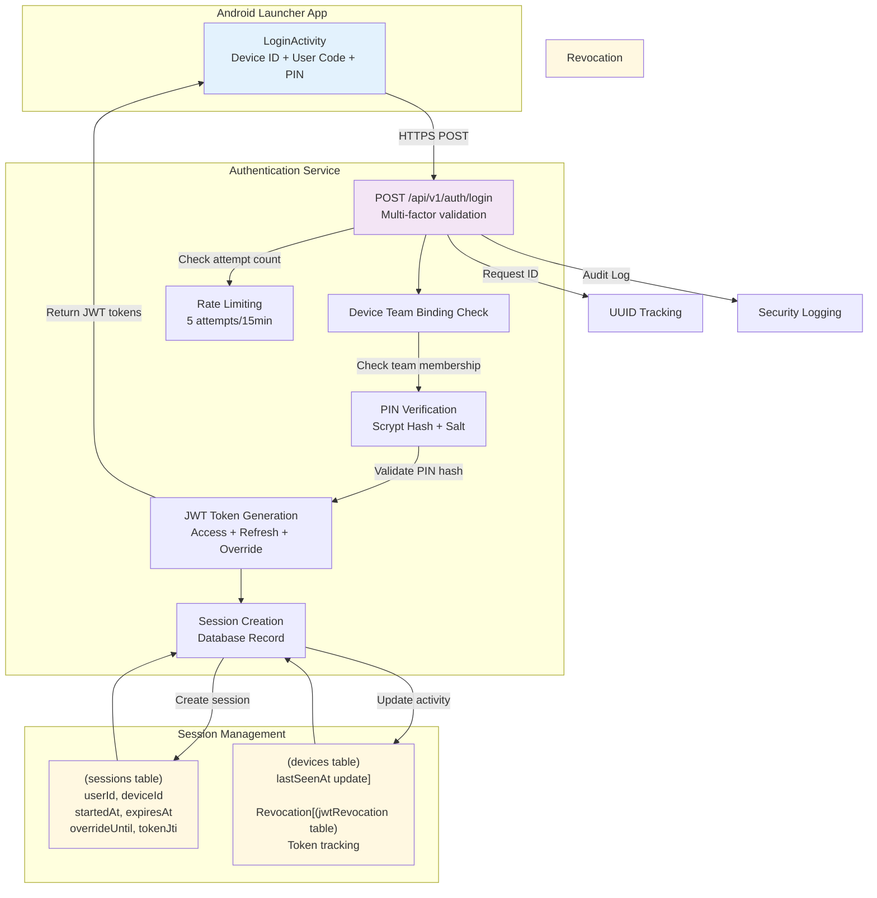
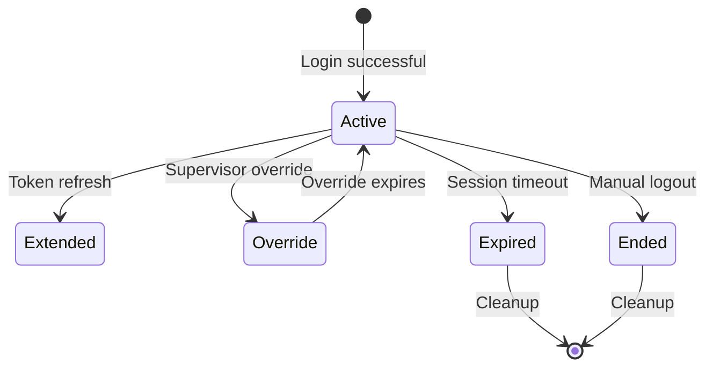

# Device Authentication & Login Flow

## Overview
This workflow covers the complete device authentication process in SurveyLauncher, including multi-factor authentication (Device ID + User Code + PIN), JWT token generation, session management, and security controls.

## Workflow Diagram



## Detailed Process Steps

### 1. User Input Collection
1. **Launch Authentication**: User opens LoginActivity on Android device
2. **Input Collection**:
   - Device ID: Automatically retrieved from Android device
   - User Code: Short alphanumeric code (e.g., "u123")
   - PIN: 6-digit numeric PIN (e.g., "123456")

### 2. Request Validation
1. **Input Sanitization**: Remove whitespace and validate formats
2. **Rate Limiting Check**: Verify device hasn't exceeded 5 attempts in 15 minutes
3. **Request ID Generation**: Generate UUID for request tracking

### 3. Authentication Flow
1. **API Call**:
   ```http
   POST /api/v1/auth/login
   Content-Type: application/json

   {
     "deviceId": "android-device-uuid",
     "userCode": "u123",
     "pin": "123456",
     "appVersion": "1.0.0"
   }
   ```

2. **Device Validation**:
   - Verify device exists in database
   - Check device is active and not disabled
   - Validate device-team binding

3. **User Verification**:
   - Find user by code within device's team
   - Verify user is active
   - Check user has device access permissions

4. **PIN Authentication**:
   ```typescript
   // PIN verification process
   const userPin = await getUserPin(userId);
   const isValid = await scryptVerify(inputPin, userPin.verifierHash);
   if (!isValid) {
     await recordFailedAttempt(deviceId, userIp);
     throw new AuthenticationError('Invalid credentials');
   }
   ```

### 4. Token Generation
1. **JWT Access Token** (20 minutes):
   ```json
   {
     "sub": "user-uuid",
     "deviceId": "device-uuid",
     "teamId": "team-uuid",
     "type": "access",
     "jti": "token-uuid",
     "iat": 1640995200,
     "exp": 1640996400
   }
   ```

2. **JWT Refresh Token** (12 hours):
   ```json
   {
     "sub": "user-uuid",
     "deviceId": "device-uuid",
     "type": "refresh",
     "jti": "refresh-token-uuid",
     "iat": 1640995200,
     "exp": 1641038400
   }
   ```

3. **Override Token** (2 hours, issued on request):
   ```json
   {
     "sub": "user-uuid",
     "deviceId": "device-uuid",
     "type": "override",
     "jti": "override-token-uuid",
     "iat": 1640995200,
     "exp": 1641002400
   }
   ```

### 5. Session Management
1. **Session Creation**:
   ```sql
   INSERT INTO sessions (
     id, userId, deviceId, teamId,
     startedAt, expiresAt,
     tokenJti, status
   ) VALUES (
     ?, ?, ?, ?,
     NOW(), DATE_ADD(NOW(), INTERVAL 1 HOUR),
     ?, 'open'
   );
   ```

2. **Device Activity Update**:
   ```sql
   UPDATE devices
   SET lastSeenAt = NOW()
   WHERE id = ?;
   ```

### 6. Response to Client
1. **Success Response**:
   ```json
   {
     "ok": true,
     "session": {
       "sessionId": "session-uuid",
       "userId": "user-uuid",
       "startedAt": "2025-01-01T10:00:00Z",
       "expiresAt": "2025-01-01T11:00:00Z",
       "overrideUntil": null
     },
     "accessToken": "eyJ...",
     "refreshToken": "eyJ...",
     "policyVersion": 3
   }
   ```

2. **Error Response**:
   ```json
   {
     "ok": false,
     "error": {
       "code": "invalid_credentials",
       "message": "Invalid device ID, user code, or PIN",
       "request_id": "req-123456"
     }
   }
   ```

## Security Controls

### Rate Limiting
- **Login Attempts**: Maximum 5 attempts per device/IP per 15 minutes
- **PIN Lockout**: Exponential backoff (5min → 15min → 1hr → 4hr)
- **Global Limits**: 1000 requests per minute across all endpoints

### Cryptographic Security
- **PIN Storage**: Scrypt with per-user salt (N=32768, r=8, p=1)
- **JWT Signing**: HS256 with 256-bit secret key
- **Token Rotation**: Automatic refresh before expiry
- **Secure Transmission**: HTTPS/TLS 1.3 required

### Audit Logging
```typescript
// Example audit log entry
logger.info('user.login', {
  userId: user.id,
  deviceId: device.id,
  teamId: team.id,
  userAgent: req.headers['user-agent'],
  clientIp: req.ip,
  requestId: req.id,
  result: 'success',
  sessionId: session.id
});
```

## Token Management

### Access Token Flow
1. **Issuance**: Generated on successful authentication
2. **Validation**: Verified on each API call
3. **Refresh**: Automatically refreshed 5 minutes before expiry
4. **Revocation**: Immediate revocation on logout or security event

### Refresh Token Flow
1. **Storage**: Securely stored on device (encrypted)
2. **Usage**: Used to obtain new access tokens
3. **Expiration**: 12-hour validity with one-time use
4. **Rotation**: New refresh token issued on each refresh

### Session Lifecycle


## Error Scenarios

### Authentication Failures
1. **Invalid Device ID**:
   - Response: 401 Unauthorized
   - Log: Security alert for unknown device

2. **Invalid User Code**:
   - Response: 401 Unauthorized
   - Log: Failed attempt tracking

3. **Invalid PIN**:
   - Response: 401 Unauthorized
   - Log: Increment failure counter, apply lockout if needed

4. **Rate Limited**:
   - Response: 429 Too Many Requests
   - Header: `Retry-After: 300` (5 minutes)

### System Errors
1. **Database Connection**:
   - Response: 503 Service Unavailable
   - Log: Critical system error

2. **JWT Generation Failure**:
   - Response: 500 Internal Server Error
   - Log: Security system failure

## Performance Considerations

### Response Times
- **Target**: <200ms for successful authentication
- **PIN Verification**: ~100ms (Scrypt with optimized parameters)
- **Database Queries**: <50ms with proper indexing

### Scalability
- **Session Storage**: In-memory cache with database persistence
- **Token Validation**: JWT verification (stateless)
- **Rate Limiting**: Distributed counter storage

### Optimization
- **PIN Hash Caching**: Cache recent verifications for performance
- **Connection Pooling**: Database connection reuse
- **CDN**: Static asset delivery for login UI

## Testing Scenarios

### Happy Path Tests
1. Valid credentials → Successful login
2. Token refresh before expiry → Seamless session
3. Automatic token refresh → Background operation

### Security Tests
1. Invalid PIN attempts → Rate limiting activation
2. Token tampering → Rejection and logging
3. Replay attacks → Timestamp validation

### Edge Cases
1. Database connection loss → Graceful error handling
2. Clock skew → Token validation tolerance
3. Concurrent sessions → Session conflict resolution

## Monitoring

### Key Metrics
- **Authentication Success Rate**: Target >95%
- **Response Time**: P95 <300ms
- **Failed Login Rate**: Monitor for attack patterns
- **Session Duration**: Average and distribution

### Alerting
- **High Failure Rates**: Potential security attacks
- **Slow Response Times**: Performance degradation
- **Database Errors**: System availability issues

### Dashboard Metrics
- Active sessions by team
- Authentication attempts over time
- Geographic distribution of logins
- Device type and version statistics

---

**Dependencies**:
- Authentication database tables
- JWT secret key configuration
- Rate limiting service
- Audit logging system

**Configuration**:
- JWT secret keys (access/refresh)
- Scrypt parameters for PIN hashing
- Session timeout values
- Rate limiting thresholds