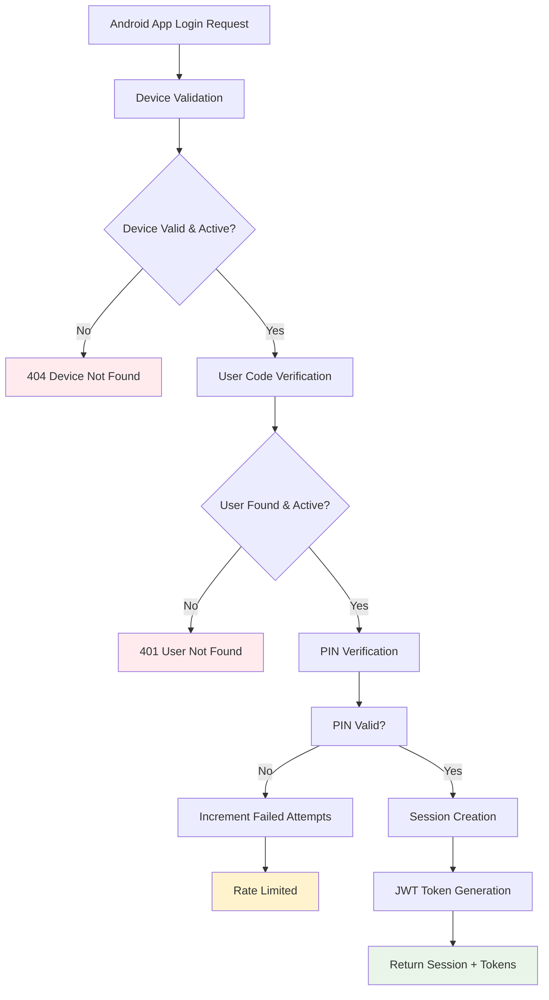
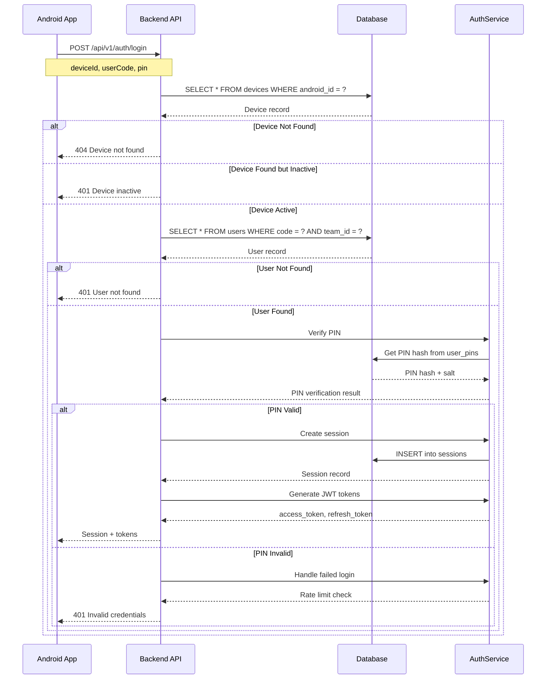
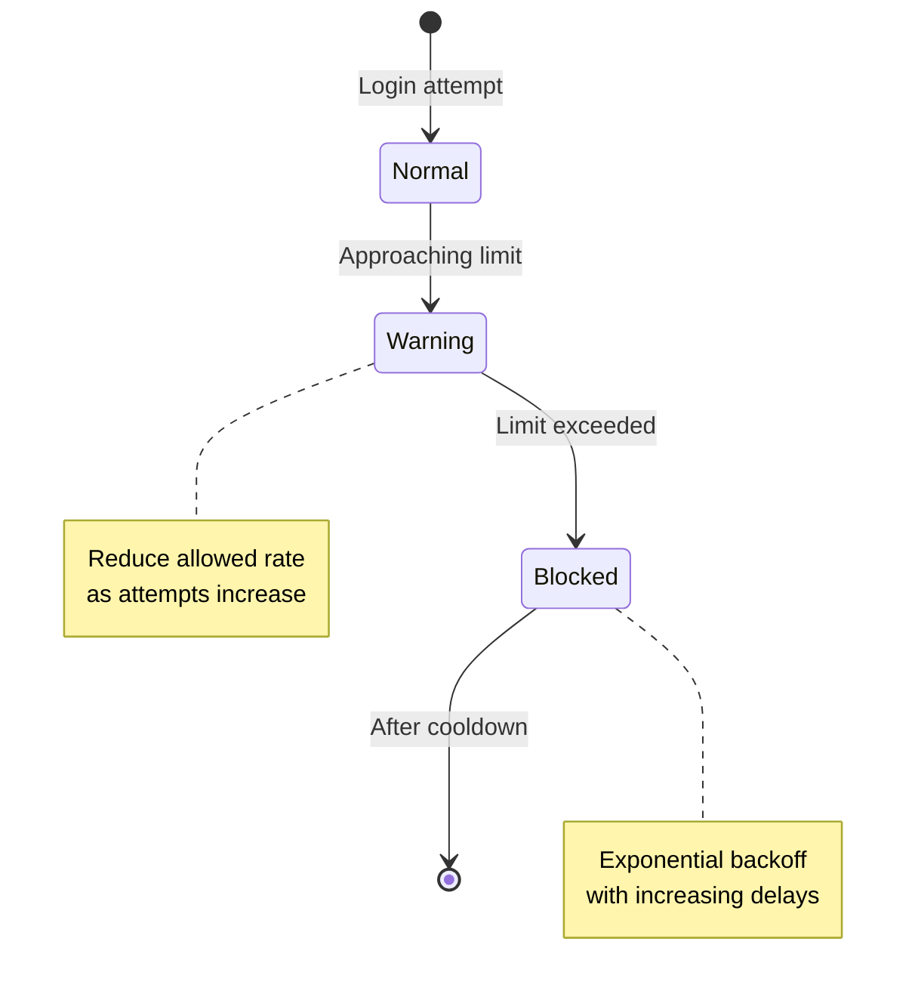

# Mobile App Authentication Workflow

**Purpose**: Device-based authentication for Android mobile app users with PIN verification and role-based access control.

Last updated: November 15, 2025

## Mobile App Authentication Overview



## Device-Based Authentication Process

### 1. Authentication Request

**Endpoint**: `POST /api/v1/auth/login`

**Request Format**:
```json
{
  "deviceId": "android_device_uuid_12345",
  "userCode": "USER001",
  "pin": "123456"
}
```

**Authentication Layers**:
1. **Device Layer**: Android device ID verification
2. **User Layer**: User code validation within team
3. **PIN Layer**: Secure PIN verification with Argon2id
4. **Session Layer**: Session creation and JWT token generation

### 2. Device Validation



### 3. Device Management

**Device Registration**:
```typescript
// Device registration process
async registerDevice(deviceData: DeviceRegistration) {
  const device = await db
    .insert(devices)
    .values({
      androidId: deviceData.androidId,
      teamId: deviceData.teamId,
      name: deviceData.name,
      appVersion: deviceData.appVersion,
      isActive: true,
      createdAt: new Date(),
      updatedAt: new Date()
    })
    .returning();

  return device[0];
}
```

**Device Status Tracking**:
- **Last Seen**: Updated on successful authentication
- **Last GPS**: Updated with telemetry data
- **App Version**: Tracked for compatibility
- **Active Status**: Can be deactivated remotely

### 4. PIN Security Implementation

**Argon2id PIN Hashing**:
```typescript
// PIN hashing with secure parameters
async hashPin(pin: string, salt: Buffer): Promise<string> {
  const hash = await argon2id.hash(pin, {
    salt: salt,
    type: argon2id.argon2id_type,
    memoryCost: 2 ** 16,    // 64MB - optimized for mobile
    timeCost: 3,            // 3 iterations
    parallelism: 1,         // Single thread
    hashLength: 32          // 32-byte hash
  });

  return hash.toString('hex');
}

// PIN verification with timing-safe comparison
async verifyPin(plainPin: string, storedHash: string, salt: string): Promise<boolean> {
  const inputHash = await this.hashPin(plainPin, Buffer.from(salt, 'hex'));

  return crypto.timingSafeEqual(
    Buffer.from(inputHash, 'hex'),
    Buffer.from(storedHash, 'hex')
  );
}
```

**PIN Storage Format**:
```sql
CREATE TABLE user_pins (
  user_id UUID PRIMARY KEY REFERENCES users(id),
  verifier_hash VARCHAR(255) NOT NULL,  -- Argon2id hash
  salt VARCHAR(255) NOT NULL,           -- Salt used for hashing
  rotated_at TIMESTAMP DEFAULT NOW(),
  active BOOLEAN DEFAULT true
);
```

### 5. Session Management

**Session Creation**:
```typescript
async createSession(userId: string, deviceId: string): Promise<Session> {
  const sessionId = uuidv4();
  const now = new Date();

  // Calculate session expiration (24 hours or policy-defined)
  const expiresAt = new Date(now.getTime() + (24 * 60 * 60 * 1000));

  const session = await db
    .insert(sessions)
    .values({
      id: sessionId,
      userId: userId,
      deviceId: deviceId,
      startedAt: now,
      expiresAt: expiresAt,
      status: 'open',
      tokenJti: generateJTI(),
      lastActivityAt: now
    })
    .returning();

  return session[0];
}
```

**Session Features**:
- **Session ID**: Unique identifier for tracking
- **Expiration**: Automatic expiration after 24 hours
- **Device Binding**: Session tied to specific device
- **Activity Tracking**: Last activity timestamp
- **Override Support**: Supervisor override capabilities

### 6. JWT Token Generation

**Mobile App JWT Structure**:
```json
{
  "sub": "user_uuid_12345",
  "deviceId": "android_device_uuid_12345",
  "sessionId": "session_uuid_67890",
  "userCode": "USER001",
  "role": "TEAM_MEMBER",
  "teamId": "team_uuid_abcde",
  "type": "mobile_access",
  "iat": 1234567800,
  "exp": 1234567800,
  "iss": "surveylauncher",
  "aud": "mobile_app"
}
```

**Token Generation**:
```typescript
async generateMobileTokens(session: Session, user: User, device: Device) {
  const payload = {
    sub: user.id,
    deviceId: device.id,
    sessionId: session.id,
    userCode: user.code,
    role: user.role,
    teamId: user.teamId,
    type: 'mobile_access'
  };

  const accessToken = await JWTService.createToken({
    ...payload,
    type: 'access',
    expiresIn: '20m'
  });

  const refreshToken = await JWTService.createToken({
    ...payload,
    type: 'refresh',
    expiresIn: '12h'
  });

  return {
    accessToken: accessToken.token,
    refreshToken: refreshToken.token,
    expiresIn: accessToken.expiresAt
  };
}
```

## Success Response

**Successful Login Response**:
```json
{
  "success": true,
  "session": {
    "sessionId": "session-uuid-12345",
    "userId": "user-uuid-67890",
    "deviceId": "device-uuid-abcdef",
    "startedAt": "2025-11-15T10:30:00Z",
    "expiresAt": "2025-11-16T10:30:00Z",
    "overrideUntil": null
  },
  "accessToken": "eyJhbGciOiJIUzI1NiIs...",
  "refreshToken": "eyJhbGciOiJIUzI1NiIs...",
  "policyVersion": 3
}
```

## Rate Limiting and Security

### Login Rate Limiting

**Rate Limiting Strategy**:


**Implementation**:
```typescript
// Rate limiting per device and IP
async checkLoginRateLimit(deviceId: string, ipAddress: string): Promise<boolean> {
  const windowStart = new Date(Date.now() - 15 * 60 * 1000); // 15 minutes

  const recentAttempts = await db
    .select({ count: count() })
    .from(login_attempts)
    .where(
      and(
        eq(login_attempts.deviceId, deviceId),
        gte(login_attempts.createdAt, windowStart)
      )
    );

  // Allow 5 attempts per 15 minutes
  return recentAttempts[0].count < 5;
}
```

### Failed Attempt Tracking

**Failed Login Handling**:
```typescript
async handleFailedLogin(deviceId: string, userCode: string, reason: string) {
  await db
    .insert(login_attempts)
    .values({
      deviceId: deviceId,
      userCode: userCode,
      success: false,
      reason: reason,
      ipAddress: this.getClientIP(),
      attemptedAt: new Date()
    });

  // Increment user failed attempts
  await this.incrementUserFailedAttempts(userCode);
}
```

## Mobile App Role Access Control

### Allowed Mobile App Roles

**Role Validation**:
```typescript
// Roles allowed for mobile app access
const ALLOWED_MOBILE_ROLES = [
  'TEAM_MEMBER',
  'FIELD_SUPERVISOR',
  'REGIONAL_MANAGER'
];

async validateMobileRole(user: User): Promise<boolean> {
  return ALLOWED_MOBILE_ROLES.includes(user.role);
}
```

**Role-Based Features**:
- **TEAM_MEMBER**: Basic field operations
- **FIELD_SUPERVISOR**: Team management + override capabilities
- **REGIONAL_MANAGER**: Regional oversight + cross-team access

### Role Permissions Matrix

| Feature | TEAM_MEMBER | FIELD_SUPERVISOR | REGIONAL_MANAGER |
|---------|-------------|------------------|------------------|
| **Daily Login** | ✅ | ✅ | ✅ |
| **GPS Tracking** | ✅ | ✅ | ✅ |
| **Supervisor Override** | ❌ | ✅ | ✅ |
| **Team Management** | ❌ | ✅ | ❌ |
| **Regional Access** | ❌ | ❌ | ✅ |
| **Device Configuration** | ❌ | ✅ | ✅ |

## Error Handling

### Authentication Errors

**Device Not Found**:
```json
{
  "success": false,
  "error": {
    "code": "DEVICE_NOT_FOUND",
    "message": "Device not found or inactive",
    "requestId": "req-uuid-12345"
  }
}
```

**Invalid Credentials**:
```json
{
  "success": false,
  "error": {
    "code": "INVALID_CREDENTIALS",
    "message": "Invalid user code or PIN",
    "requestId": "req-uuid-12345"
  }
}
```

**Rate Limited**:
```json
{
  "success": false,
  "error": {
    "code": "RATE_LIMITED",
    "message": "Too many login attempts. Please try again later.",
    "retryAfter": 300,
    "requestId": "req-uuid-12345"
  }
}
```

**Account Locked**:
```json
{
  "success": false,
  "error": {
    "code": "ACCOUNT_LOCKED",
    "message": "Account temporarily locked due to failed attempts",
    "requestId": "req-uuid-12345"
  }
}
```

## Security Features

### 1. Cryptographic Security
- **Argon2id PIN Hashing**: Memory-hard algorithm for PIN security
- **Per-User Salts**: Unique salt for each PIN
- **Secure Random Values**: Cryptographically secure session IDs and tokens

### 2. Device Security
- **Device Binding**: Authentication tied to specific Android device
- **Device Validation**: Check device status and team association
- **Remote Deactivation**: Ability to deactivate devices remotely

### 3. Session Security
- **Secure Session Management**: Database-tracked sessions
- **Token-Based Authentication**: JWT with proper expiration
- **Session Invalidation**: Immediate session termination capabilities

### 4. Attack Prevention
- **Rate Limiting**: Protection against brute force attacks
- **Timing-Safe Comparison**: Prevent timing attacks
- **Input Validation**: Comprehensive input sanitization

## Performance Optimization

### Database Optimization
```sql
-- Performance indexes
CREATE INDEX idx_devices_android_id ON devices(android_id);
CREATE INDEX idx_users_code_team ON users(code, team_id);
CREATE INDEX idx_sessions_device_user ON sessions(device_id, user_id);
CREATE INDEX idx_sessions_expires_at ON sessions(expires_at);
```

### Caching Strategy
- **Session Caching**: In-memory session data for frequently accessed users
- **Device Caching**: Cache device status for performance
- **PIN Hash Caching**: Temporary caching of verified PIN hashes

## Monitoring and Auditing

### Authentication Events Logged
```typescript
interface AuthLogEvent {
  timestamp: string;
  event: 'mobile_login_attempt' | 'mobile_login_success' | 'mobile_login_failed';
  deviceId: string;
  userCode?: string;
  userId?: string;
  role?: string;
  ipAddress: string;
  userAgent: string;
  result: 'success' | 'failed' | 'blocked';
  reason?: string;
  sessionId?: string;
  requestId: string;
}
```

### Security Metrics
1. **Authentication Success Rate**: Percentage of successful logins
2. **Failed Login Attempts**: Tracking of authentication failures
3. **Rate Limit Violations**: Count of blocked attempts
4. **Device Registration**: New device registration tracking
5. **Session Duration**: Average session length metrics

## Testing Coverage

### Unit Tests
- PIN hashing and verification (✅ 19/19 passing)
- JWT token generation and validation (✅ 20/20 passing)
- Authentication service logic (✅ 25/25 passing)

### Integration Tests
- End-to-end mobile authentication flow
- Device binding verification
- Role-based access control
- Rate limiting enforcement
- Session management

## Configuration

### Environment Variables
```bash
# Mobile App Authentication Settings
MOBILE_SESSION_TIMEOUT=86400000      # 24 hours in ms
MOBILE_RATE_LIMIT_WINDOW=900000      # 15 minutes in ms
MOBILE_RATE_LIMIT_MAX=5              # Max attempts per window
ARGON2ID_MOBILE_MEMORY_COST=65536    # 64MB for mobile devices
ARGON2ID_MOBILE_TIME_COST=3          # 3 iterations
```

### Android Integration

**Android App Implementation**:
```kotlin
// Android authentication example
class AuthService {
    suspend fun login(deviceId: String, userCode: String, pin: String): AuthResult {
        return try {
            val response = apiService.login(
                deviceId = deviceId,
                userCode = userCode,
                pin = pin
            )

            if (response.success) {
                // Store tokens securely
                tokenManager.storeTokens(
                    response.accessToken,
                    response.refreshToken
                )

                // Start background services
                gpsService.startSession(response.session)

                AuthResult.Success(response)
            } else {
                AuthResult.Error(response.error.message)
            }
        } catch (e: Exception) {
            AuthResult.Error("Network error: ${e.message}")
        }
    }
}
```

---

**Related Documentation**:
- [Authentication Workflow](./authentication-workflow.md)
- [Web Admin Authentication](./web-admin-authentication.md)
- [Role-Based Access Control](./role-based-access-control.md)
- [API Documentation](../backend/docs/api.md)