# Project Management Workflow

## Overview
This document describes the comprehensive project management workflow, showing how users, organizations, and teams are scoped within projects to maintain clear boundaries while enabling flexible collaboration.

## Project Management Architecture Diagram


## Project Access Control Flow Diagram


## Project Boundary Enforcement Diagram


## User-Project Assignment Matrix

```mermaid
graph TD
    subgraph "User Roles" [9-Role System]
        TM[TEAM_MEMBER<br/>👤 Basic field staff]
        FS[FIELD_SUPERVISOR<br/>👔 Team supervision]
        RM[REGIONAL_MANAGER<br/>🌍 Regional admin]
        SA[SYSTEM_ADMIN<br/>🔧 Platform admin]
        NSA[NATIONAL_SUPPORT_ADMIN<br/>🇮🇳 National support]
        SP[SUPPORT_AGENT<br/>📞 Help desk]
        AU[AUDITOR<br/>📊 Compliance]
        DM[DEVICE_MANAGER<br/>📱 Device operations]
        PA[POLICY_ADMIN<br/>📜 Policy management]
    end

    subgraph "Project Permissions" [Access Levels]
        READ[📖 READ<br/>View project data]
        LIST[📋 LIST<br/>Browse projects]
        CREATE[➕ CREATE<br/>New projects]
        UPDATE[✏️ UPDATE<br/>Modify projects]
        DELETE[🗑️ DELETE<br/>Remove projects]
        ASSIGN[👥 ASSIGN<br/>Manage assignments]
        EXECUTE[⚡ EXECUTE<br/>Run operations]
        AUDIT[🔍 AUDIT<br/>Review access]
    end

    subgraph "Geographic Scopes" [Boundary Levels]
        LOCAL[🏢 LOCAL<br/>Team/Location only]
        REGIONAL[🗺️ REGIONAL<br/>State/Region level]
        NATIONAL[🇮🇳 NATIONAL<br/>Country-wide]
    end

    %% Permission mappings with examples
    TM --> READ
    TM --> LIST
    TM --> EXECUTE
    TM -.-> |Within Team| LOCAL

    FS --> READ
    FS --> LIST
    FS --> CREATE
    FS --> UPDATE
    FS --> ASSIGN
    FS --> EXECUTE
    FS -.-> |Within Region| REGIONAL

    RM --> READ
    RM --> LIST
    RM --> CREATE
    RM --> UPDATE
    RM --> DELETE
    RM --> ASSIGN
    RM --> EXECUTE
    RM --> AUDIT
    RM -.-> |Region Level| REGIONAL

    SA --> READ
    SA --> LIST
    SA --> CREATE
    SA --> UPDATE
    SA --> DELETE
    SA --> ASSIGN
    SA --> EXECUTE
    SA --> AUDIT
    SA -.-> |All Scopes| NATIONAL

    NSA --> READ
    NSA --> LIST
    NSA --> CREATE
    NSA --> UPDATE
    NSA --> DELETE
    NSA --> ASSIGN
    NSA --> EXECUTE
    NSA --> AUDIT
    NSA -.-> |All Scopes| NATIONAL

    SP --> READ
    SP --> LIST
    SP --> AUDIT

    AU --> READ
    AU --> LIST
    AU --> AUDIT

    DM --> READ
    DM --> LIST
    DM --> AUDIT

    PA --> READ
    PA --> LIST
    PA --> AUDIT

    %% Styling
    style TM fill:#81c784
    style FS fill:#64b5f6
    style RM fill:#ffb74d
    style SA fill:#f06292
    style NSA fill:#ba68c8
    style SP fill:#4db6ac
    style AU fill:#ffd54f
    style DM fill:#9575cd
    style PA fill:#4fc3f7
```



## Project Lifecycle Workflow

```mermaid
stateDiagram-v2
    [*] --> Planning: Project Initiation
    Planning --> Validation: Scope Definition
    Validation --> Creation: Permission Check

    state Creation {
        [*] --> InputValidation
        InputValidation --> GeographicValidation: Scope Check
        GeographicValidation --> RoleValidation: RBAC Check
        RoleValidation --> ProjectCreation: Database Insert
        ProjectCreation --> AssignmentSetup: Initial Assignments
        AssignmentSetup --> [*]
    }

    Creation --> Active: Project Activated

    state Active {
        [*] --> AccessControl
        AccessControl --> UserAssignment: User Management
        AccessControl --> TeamAssignment: Team Management
        UserAssignment --> GeographicEnforcement: Boundary Check
        TeamAssignment --> GeographicEnforcement
        GeographicEnforcement --> AuditLogging: Decision Log
        AuditLogging --> [*]
    }

    Active --> Completion: Project Finished
    Active --> Paused: Temporary Hold
    Active --> Archived: Soft Delete

    Paused --> Active: Resume Project

    Completion --> Archived: Move to Archive
    Archived --> [*]: End of Lifecycle

    note right of Planning
        Business requirements
        Resource planning
        Timeline definition
        Stakeholder identification
    end

    note right of Validation
        Geographic scope validation
        Resource availability check
        Permission verification
        Risk assessment
    end

    note right of Active
        Ongoing operations
        Access management
        Boundary enforcement
        Performance monitoring
    end
```

## Implementation Details

### Project Creation Workflow

1. **Input Validation**
   - Project title and abbreviation validation
   - Geographic scope verification
   - Required metadata completeness

2. **Permission Verification**
   - User role validation against PROJECTS.CREATE
   - Geographic authority check
   - Organization boundary validation

3. **Geographic Scope Rules**
   - **TEAM_MEMBER**: LOCAL projects only (within team)
   - **FIELD_SUPERVISOR**: LOCAL + REGIONAL (within supervised teams)
   - **REGIONAL_MANAGER**: All scopes within region
   - **SYSTEM_ADMIN/NATIONAL_SUPPORT_ADMIN**: All scopes nationally

4. **Database Operations**
   - Unique abbreviation enforcement
   - Creator tracking and audit trail
   - Regional association if applicable

### Access Control Enforcement

1. **Multi-Layer Validation**
   - Authentication layer (JWT + session)
   - RBAC permission matrix
   - Direct assignment check
   - Team assignment verification
   - Geographic boundary validation
   - Cross-team privilege evaluation

2. **Permission Resolution**
   - Role-based base permissions
   - Assignment-specific overrides
   - Geographic scope constraints
   - Cross-team administrative access

3. **Audit and Logging**
   - Access decision logging
   - Boundary violation tracking
   - Assignment change history
   - Geographic access attempts

### Boundary Management

1. **Data Isolation**
   - Project-specific data separation
   - User assignment scoping
   - Team access boundaries

2. **Geographic Enforcement**
   - Regional boundary validation
   - Cross-region access control
   - Location-based project visibility

3. **Temporal Boundaries**
   - Assignment expiration
   - Project lifecycle management
   - Access revocation handling

## Security Considerations

1. **Principle of Least Privilege**
   - Minimum required access only
   - Role-based limitation enforcement
   - Scope-specific access control

2. **Audit Trail**
   - Complete access decision logging
   - Assignment change tracking
   - Boundary violation recording

3. **Dynamic Updates**
   - Real-time permission changes
   - Assignment impact propagation
   - Instant boundary enforcement

4. **Cross-Team Access**
   - Limited to privileged roles
   - Comprehensive audit logging
   - Organizational oversight

## API Integration

The workflow integrates with the following API endpoints:

- `POST /api/v1/projects` - Project creation with boundary validation
- `GET /api/v1/projects` - Project listing with scope filtering
- `POST /api/v1/projects/:id/users` - User assignment with boundary checks
- `POST /api/v1/projects/:id/teams` - Team assignment with geographic validation
- `GET /api/v1/users/:userId/projects` - User project scoping
- `GET /api/v1/teams/:teamId/projects` - Team project boundaries

---

**Last Updated:** November 15, 2025
**Version:** 1.0
**Status:** Production Ready with Complete Project Boundary Management