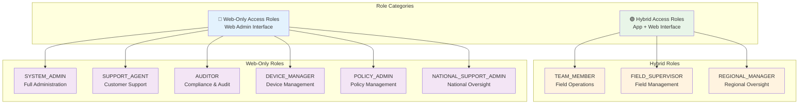
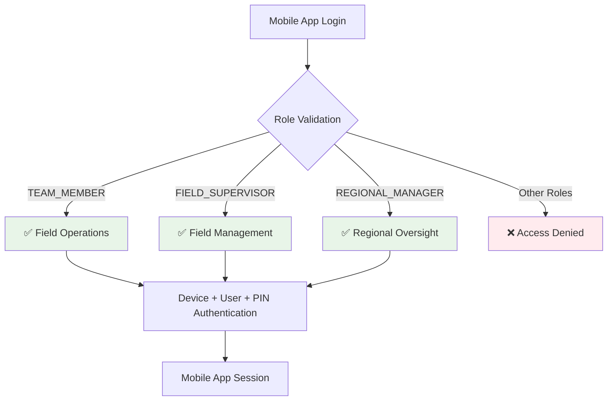
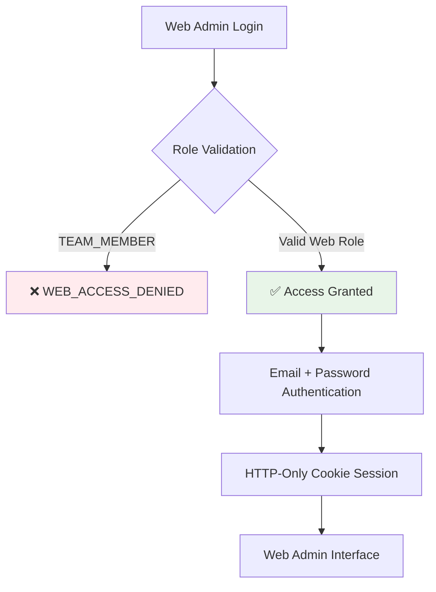

# SurveyLauncher Role-Based Access Control (RBAC)

**Purpose**: Enterprise-grade role-based access control system with nine specialized roles and clear access boundaries.

Last updated: November 15, 2025

## RBAC Architecture Overview



## Role Definitions and Access Patterns

### 🟢 Hybrid Access Roles (App + Web)

#### 1. TEAM_MEMBER
**Primary Purpose**: Field operations and mobile data collection
**Access Level**: Frontline operations
**Interfaces**: Mobile App Only

**Permissions**:
- ✅ Android app daily login and GPS tracking
- ✅ Basic reporting through mobile interface
- ✅ View assigned tasks and schedules
- ❌ Web admin interface access
- ❌ User management functions
- ❌ Device configuration access

**Use Cases**:
- Daily field data collection
- GPS tracking and telemetry
- Task completion and reporting
- Basic mobile app functions

#### 2. FIELD_SUPERVISOR
**Primary Purpose**: On-site supervision and team management
**Access Level**: Frontline management
**Interfaces**: Mobile App + Web Admin

**Permissions**:
- ✅ All TEAM_MEMBER mobile app functions
- ✅ Supervisor override capabilities
- ✅ Team member management via web
- ✅ Device supervision and monitoring
- ✅ Basic reporting and analytics
- ❌ System-level configuration
- ❌ Cross-team access (except same region)

**Use Cases**:
- Field team supervision
- Emergency override situations
- Team performance monitoring
- Device status management

#### 3. REGIONAL_MANAGER
**Primary Purpose**: Multi-team regional oversight and management
**Access Level**: Regional leadership
**Interfaces**: Mobile App + Web Admin

**Permissions**:
- ✅ All FIELD_SUPERVISOR capabilities
- ✅ Cross-team access within region
- ✅ Regional reporting and analytics
- ✅ User management for regional teams
- ✅ Device management across teams
- ❌ National-level system settings
- ❌ Cross-region access (except national roles)

**Use Cases**:
- Regional operations oversight
- Multi-team coordination
- Regional performance analysis
- Field visit support

### 🔵 Web-Only Access Roles (Web Admin Interface)

#### 4. SYSTEM_ADMIN
**Primary Purpose**: Complete system administration and configuration
**Access Level**: Full system control
**Interfaces**: Web Admin Only

**Permissions**:
- ✅ Complete system configuration
- ✅ User and role management
- ✅ Database administration
- ✅ System settings and policies
- ✅ Full audit and monitoring access
- ✅ Cross-organization access
- ❌ Mobile app field operations

**Use Cases**:
- System administration
- User account management
- System configuration
- Security and compliance

#### 5. SUPPORT_AGENT
**Primary Purpose**: Customer support and user assistance
**Access Level**: User support operations
**Interfaces**: Web Admin Only

**Permissions**:
- ✅ User support and troubleshooting
- ✅ User account assistance
- ✅ Basic reporting on user issues
- ✅ Device status viewing
- ❌ System configuration changes
- ❌ User deletion or role changes
- ❌ Sensitive system settings

**Use Cases**:
- Customer support operations
- User assistance and troubleshooting
- Help desk functions
- User issue resolution

#### 6. AUDITOR
**Primary Purpose**: Compliance monitoring and audit access
**Access Level**: Read-only compliance
**Interfaces**: Web Admin Only

**Permissions**:
- ✅ Read-only access to audit logs
- ✅ Compliance reporting
- ✅ User activity monitoring
- ✅ System access review
- ❌ Any system modifications
- ❌ User data changes
- ❌ Configuration adjustments

**Use Cases**:
- Compliance auditing
- Security monitoring
- Access control review
- Regulatory reporting

#### 7. DEVICE_MANAGER
**Primary Purpose**: Android device lifecycle management
**Access Level**: Device administration
**Interfaces**: Web Admin Only

**Permissions**:
- ✅ Device inventory management
- ✅ Device configuration and settings
- ✅ Remote device management
- ✅ Device monitoring and status
- ✅ Kiosk mode configuration
- ❌ User management functions
- ❌ System-level settings

**Use Cases**:
- Device deployment and management
- Remote device configuration
- Device inventory tracking
- Kiosk mode administration

#### 8. POLICY_ADMIN
**Primary Purpose**: Policy creation and distribution management
**Access Level**: Policy administration
**Interfaces**: Web Admin Only

**Permissions**:
- ✅ Policy creation and editing
- ✅ Policy distribution management
- ✅ Policy compliance monitoring
- ✅ Policy versioning and updates
- ❌ User management
- ❌ Device management
- ❌ System configuration

**Use Cases**:
- Policy creation and updates
- Compliance rule management
- Policy distribution monitoring
- Policy violation tracking

#### 9. NATIONAL_SUPPORT_ADMIN
**Primary Purpose**: Cross-regional oversight and national support
**Access Level**: National operations
**Interfaces**: Web Admin Only

**Permissions**:
- ✅ Cross-regional access and oversight
- ✅ National-level reporting
- ✅ Regional coordination support
- ✅ User management across regions
- ✅ Device management across regions
- ❌ System settings and configuration
- ❌ Database administration

**Use Cases**:
- National operations coordination
- Cross-regional support
- National reporting and analytics
- Multi-region issue resolution

## Interface Access Enforcement

### Mobile App Access Control



**Implementation**:
```typescript
// Mobile app authentication allows only hybrid roles
const allowedAppRoles = ['TEAM_MEMBER', 'FIELD_SUPERVISOR', 'REGIONAL_MANAGER'];

if (!allowedAppRoles.includes(user.role)) {
  return {
    success: false,
    error: {
      code: 'APP_ACCESS_DENIED',
      message: 'Role not authorized for mobile app access'
    }
  };
}
```

### Web Admin Access Control



**Implementation**:
```typescript
// Web admin authentication blocks TEAM_MEMBER role
const VALID_WEB_ADMIN_ROLES = [
  'SYSTEM_ADMIN', 'SUPPORT_AGENT', 'AUDITOR', 'DEVICE_MANAGER',
  'POLICY_ADMIN', 'NATIONAL_SUPPORT_ADMIN', 'FIELD_SUPERVISOR', 'REGIONAL_MANAGER'
];

if (user.role === 'TEAM_MEMBER') {
  return {
    success: false,
    error: {
      code: 'WEB_ACCESS_DENIED',
      message: 'TEAM_MEMBER role cannot access web admin interface'
    }
  };
}
```

## Permission Matrix

### Core System Permissions

| Resource | TEAM_MEMBER | FIELD_SUPERVISOR | REGIONAL_MANAGER | SYSTEM_ADMIN | SUPPORT_AGENT | AUDITOR | DEVICE_MANAGER | POLICY_ADMIN | NATIONAL_SUPPORT_ADMIN |
|----------|-------------|------------------|------------------|--------------|--------------|---------|----------------|--------------|------------------------|
| **Mobile App Access** | ✅ | ✅ | ✅ | ❌ | ❌ | ❌ | ❌ | ❌ | ❌ |
| **Web Admin Access** | ❌ | ✅ | ✅ | ✅ | ✅ | ✅ | ✅ | ✅ | ✅ |
| **User Management** | ❌ | Team-level | Regional | ✅ | View only | View only | ❌ | ❌ | ✅ |
| **Device Management** | Own device | Team devices | Regional devices | ✅ | View only | View only | ✅ | ❌ | ✅ |
| **Policy Management** | ❌ | View only | View only | ✅ | ❌ | View only | ❌ | ✅ | View only |
| **System Configuration** | ❌ | ❌ | ❌ | ✅ | ❌ | ❌ | ❌ | ❌ | ❌ |
| **Audit Access** | ❌ | ❌ | Regional | ✅ | ❌ | ✅ | View only | ❌ | ✅ |
| **Cross-Team Access** | ❌ | ❌ | ❌ | ✅ | ❌ | ✅ | ❌ | ❌ | ✅ |

### Geographic Scope Permissions

| Geographic Scope | TEAM_MEMBER | FIELD_SUPERVISOR | REGIONAL_MANAGER | SYSTEM_ADMIN | NATIONAL_SUPPORT_ADMIN |
|------------------|-------------|------------------|------------------|--------------|------------------------|
| **Local (Team)** | ✅ | ✅ | ✅ | ✅ | ✅ |
| **Regional** | ❌ | ❌ | ✅ | ✅ | ✅ |
| **National** | ❌ | ❌ | ❌ | ✅ | ✅ |
| **System** | ❌ | ❌ | ❌ | ✅ | ❌ |

## Implementation Architecture

### Database Schema

#### Users Table (Mobile App)
```sql
CREATE TABLE users (
  id UUID PRIMARY KEY,
  team_id UUID REFERENCES teams(id),
  code VARCHAR(32) NOT NULL,
  display_name VARCHAR(255) NOT NULL,
  email VARCHAR(255),
  role user_role_enum NOT NULL, -- 9 specialized roles
  is_active BOOLEAN DEFAULT true,
  created_at TIMESTAMP DEFAULT NOW(),
  updated_at TIMESTAMP DEFAULT NOW()
);
```

#### Web Admin Users Table (Web Interface)
```sql
CREATE TABLE web_admin_users (
  id UUID PRIMARY KEY,
  email VARCHAR(255) UNIQUE NOT NULL,
  password VARCHAR(255) NOT NULL, -- Argon2id hash:salt
  first_name VARCHAR(255) NOT NULL,
  last_name VARCHAR(255) NOT NULL,
  role user_role_enum NOT NULL, -- 8 roles (excludes TEAM_MEMBER)
  is_active BOOLEAN DEFAULT true,
  login_attempts INTEGER DEFAULT 0,
  locked_at TIMESTAMP,
  last_login_at TIMESTAMP,
  created_at TIMESTAMP DEFAULT NOW(),
  updated_at TIMESTAMP DEFAULT NOW()
);
```

### Role Validation Services

#### WebAdminAuthService
```typescript
export class WebAdminAuthService {
  async login(credentials: LoginRequest): Promise<LoginResult> {
    // 1. Validate email exists
    // 2. Check account status (active, not locked)
    // 3. Verify password with Argon2id
    // 4. **ROLE VALIDATION**: Reject TEAM_MEMBER
    // 5. Create web admin session
    // 6. Set HTTP-only cookies
  }

  async createWebAdminUser(userData: CreateUserData): Promise<CreateResult> {
    // 1. **ROLE VALIDATION**: Allow only 8 valid web admin roles
    // 2. Hash password with Argon2id
    // 3. Create web admin user record
  }
}
```

#### Access Control Middleware
```typescript
// Mobile app access control
if (request.path.startsWith('/api/v1/')) {
  // Allow only hybrid roles
  const allowedRoles = ['TEAM_MEMBER', 'FIELD_SUPERVISOR', 'REGIONAL_MANAGER'];
  if (!allowedRoles.includes(user.role)) {
    return res.status(403).json({ error: 'APP_ACCESS_DENIED' });
  }
}

// Web admin access control
if (request.path.startsWith('/api/web-admin/')) {
  // Block TEAM_MEMBER explicitly
  if (user.role === 'TEAM_MEMBER') {
    return res.status(403).json({ error: 'WEB_ACCESS_DENIED' });
  }
}
```

## Security Enforcement Points

### 1. Authentication Layer
- **Mobile App**: Device ID + User Code + PIN
- **Web Admin**: Email + Password
- **Role Validation**: Enforced during login

### 2. Authorization Layer
- **Permission Checks**: Resource-level access validation
- **Boundary Enforcement**: Geographic and team limitations
- **Cross-Team Access**: Special handling for privileged roles

### 3. Interface Layer
- **API Routes**: Separate routes for each interface
- **Token Types**: Different JWT token structures
- **Cookie Management**: HTTP-only for web admin

### 4. Database Layer
- **Schema Constraints**: Role enums with validation
- **Foreign Keys**: Proper relationship management
- **Audit Trails**: Complete access logging

## Migration Strategy

### Role Migration Complete
- ✅ **502 users migrated** from old 3-role system to new 9-role system
- ✅ **Role mapping**: 500 → TEAM_MEMBER, 1 → FIELD_SUPERVISOR, 1 → SYSTEM_ADMIN
- ✅ **Database tables**: Enhanced with new role constraints

### Dual User Tables
- ✅ **Users table**: Mobile app users with device authentication
- ✅ **Web_admin_users table**: Web interface users with email authentication
- ✅ **Hybrid support**: Field supervisors and regional managers in both tables

## Testing and Validation

### Comprehensive Test Coverage
- ✅ **Role Validation Tests**: 5/5 passing
- ✅ **Authentication Tests**: Mobile app and web admin
- ✅ **Access Control Tests**: Permission matrix validation
- ✅ **Security Tests**: Account lockout and rate limiting

### Test Scenarios
1. **TEAM_MEMBER Web Access**: Correctly rejected with WEB_ACCESS_DENIED
2. **Valid Role Creation**: All 8 web admin roles accepted
3. **Invalid Role Rejection**: Invalid roles properly blocked
4. **Hybrid Role Support**: Field supervisors access both interfaces
5. **Cross-Team Access**: Proper enforcement based on role

## Monitoring and Auditing

### Access Control Events
1. **Authentication Attempts**: Success/failure with role validation
2. **Access Denials**: Role-based rejection events
3. **Permission Changes**: Role assignments and modifications
4. **Interface Access**: Mobile app vs web admin access patterns

### Security Metrics
1. **Role Violation Attempts**: Blocked access attempts
2. **Authentication Success Rates**: By role and interface
3. **Cross-Team Access Events**: Privileged role usage
4. **Account Lockout Events**: Security enforcement actions

## Production Deployment

### Security Considerations
1. **Role Validation**: Critical for system security
2. **Interface Separation**: Prevents privilege escalation
3. **Account Lockout**: Protects against brute force attacks
4. **Audit Logging**: Complete access control audit trail

### Operational Benefits
1. **Clear Access Boundaries**: Well-defined role responsibilities
2. **Scalable Role System**: Easy to add new roles or modify permissions
3. **Compliance Support**: Meets enterprise access control requirements
4. **Flexible Architecture**: Supports both mobile and web interfaces

---

**Related Documentation**:
- [Role Differentiation Guide](../backend/docs/role-differentiation.md)
- [Authentication Workflow](./authentication-workflow.md)
- [API Documentation](../backend/docs/api.md)