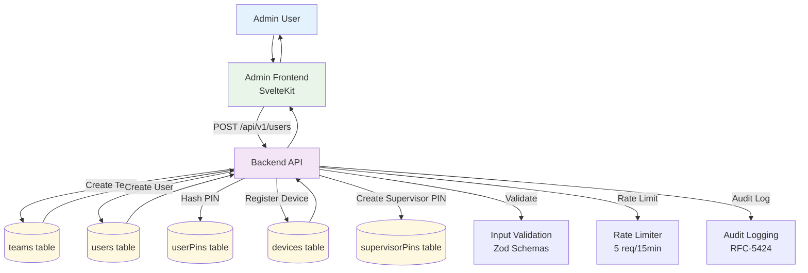

# User & Device Registration Workflow

## Overview
This workflow covers the complete process of setting up new users and devices in the SurveyLauncher system, including team creation, user registration, device binding, and PIN configuration.

## Workflow Diagram



## Detailed Process Steps

### 1. Admin Initiates Registration
1. **Access Control**: Admin logs into the SvelteKit frontend with valid credentials
2. **Navigation**: Navigate to User Management section
3. **Initiate Creation**: Click "Add New User" or "Register Device"

### 2. Team Setup
1. **Team Creation** (if new team):
   ```json
   POST /api/v1/teams
   {
     "name": "Field Team Alpha",
     "stateId": "KA01"
   }
   ```
2. **Team Validation**: Ensure team name uniqueness within state
3. **Database Storage**: Store in `teams` table with generated UUID

### 3. User Registration
1. **User Data Collection**:
   ```json
   POST /api/v1/users
   {
     "teamId": "team-uuid",
     "code": "u123",
     "displayName": "John Doe",
     "role": "TEAM_MEMBER",
     "pin": "123456"
   }
   ```
2. **Validation**:
   - User code uniqueness within team
   - PIN strength requirements (min 6 characters)
   - Role validation (TEAM_MEMBER, SUPERVISOR, ADMIN)
3. **PIN Hashing**: Scrypt hash with salt for secure storage
4. **Database Storage**:
   - User record in `users` table
   - PIN hash in `userPins` table

### 4. Device Registration
1. **Device Binding**:
   ```json
   POST /api/v1/devices
   {
     "androidId": "android-device-unique-id",
     "teamId": "team-uuid",
     "appVersion": "1.0.0"
   }
   ```
2. **Validation**:
   - Android ID uniqueness
   - Valid team association
   - Version compatibility check
3. **Database Storage**: Store in `devices` table with generated UUID

### 5. Supervisor PIN Setup
1. **Supervisor PIN Creation**:
   ```json
   POST /api/v1/supervisor/pins
   {
     "teamId": "team-uuid",
     "pin": "789012"
   }
   ```
2. **Security Validation**: PIN strength and uniqueness
3. **Database Storage**: Hashed PIN in `supervisorPins` table

## API Endpoints

### Team Management
- `POST /api/v1/teams` - Create new team
- `GET /api/v1/teams` - List all teams
- `PUT /api/v1/teams/:id` - Update team details

### User Management
- `POST /api/v1/users` - Register new user
- `GET /api/v1/users` - List users (with pagination)
- `PUT /api/v1/users/:id` - Update user details
- `DELETE /api/v1/users/:id` - Deactivate user

### Device Management
- `POST /api/v1/devices` - Register new device
- `GET /api/v1/devices` - List devices
- `PUT /api/v1/devices/:id` - Update device details
- `POST /api/v1/devices/:id/deactivate` - Deactivate device

### Supervisor PIN Management
- `POST /api/v1/supervisor/pins` - Create supervisor PIN
- `PUT /api/v1/supervisor/pins/:teamId` - Update supervisor PIN
- `POST /api/v1/supervisor/pins/:teamId/rotate` - Rotate supervisor PIN

## Database Schema Impact

### Tables Modified
- **teams**: New team records
- **users**: New user accounts with team association
- **userPins**: Secure PIN storage with cryptographic hashes
- **devices**: Device registration with team binding
- **supervisorPins**: Team-specific supervisor PINs

### Relationships
- `teams.id` → `users.teamId` (One-to-many)
- `teams.id` → `devices.teamId` (One-to-many)
- `users.id` → `userPins.userId` (One-to-one)
- `teams.id` → `supervisorPins.teamId` (One-to-many)

## Security Considerations

### Authentication & Authorization
- Admin role required for registration operations
- JWT token validation for all API calls
- Team-based access control (admins can only manage their teams)

### Data Protection
- All PINs hashed using Scrypt with per-user salts
- Input validation using Zod schemas
- SQL injection prevention via Drizzle ORM
- Rate limiting (5 requests per 15 minutes per IP)

### Audit Trail
- Complete logging of all registration actions
- Request ID tracking for debugging
- User action attribution for compliance

## Error Handling

### Common Error Scenarios
1. **Duplicate User Code**: Returns 409 with conflict details
2. **Invalid Team ID**: Returns 404 with team not found
3. **Weak PIN**: Returns 400 with strength requirements
4. **Duplicate Android ID**: Returns 409 with device conflict

### Error Response Format
```json
{
  "ok": false,
  "error": {
    "code": "user_code_exists",
    "message": "User code already exists in team",
    "request_id": "req-123456",
    "details": {
      "field": "code",
      "team_id": "team-uuid"
    }
  }
}
```

## Testing Scenarios

### Happy Path
1. Admin creates new team
2. Admin registers multiple users for the team
3. Admin registers devices for users
4. Supervisor PIN is configured
5. Users can successfully log in with their credentials

### Edge Cases
1. Attempt to register user with duplicate code
2. Register device for non-existent team
3. Create supervisor PIN for team that already has one
4. Register device with Android ID that already exists

### Performance Considerations
- PIN hashing adds computational overhead (~100ms per hash)
- Database transactions ensure data consistency
- Rate limiting prevents abuse
- Index optimization for lookup queries

## Monitoring & Observability

### Key Metrics
- Registration success/failure rates
- Time to complete registration workflow
- PIN generation and hashing performance
- Database query performance

### Alerting
- High registration failure rates
- Database connection issues
- Unusual registration patterns (potential abuse)

---

**Dependencies**:
- Database connection and migration status
- Email/SMS service for user notifications (if implemented)
- Authentication service for admin validation

**Prerequisites**:
- Admin must be authenticated with appropriate permissions
- Database schema must be up-to-date
- Rate limiting service must be operational