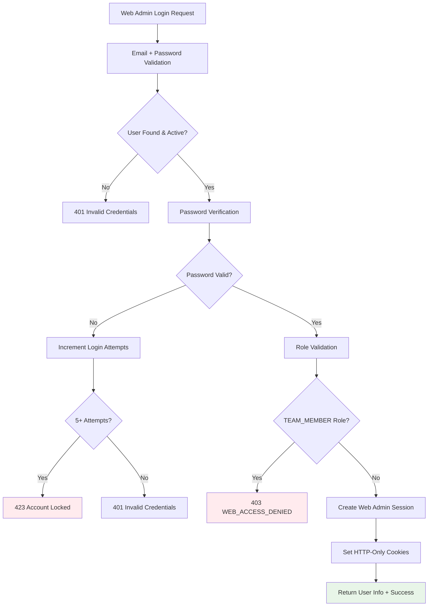
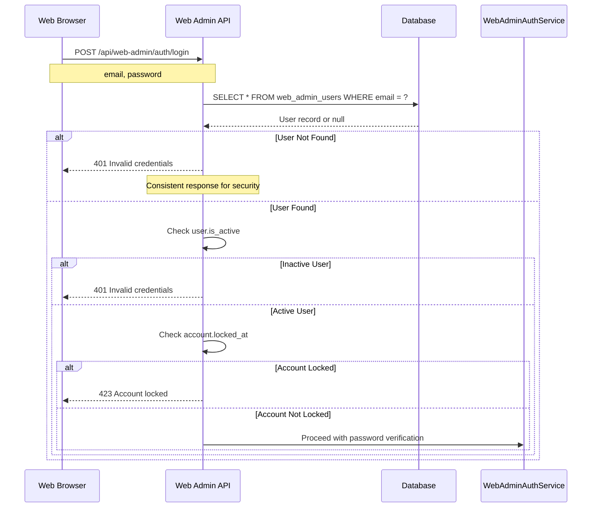
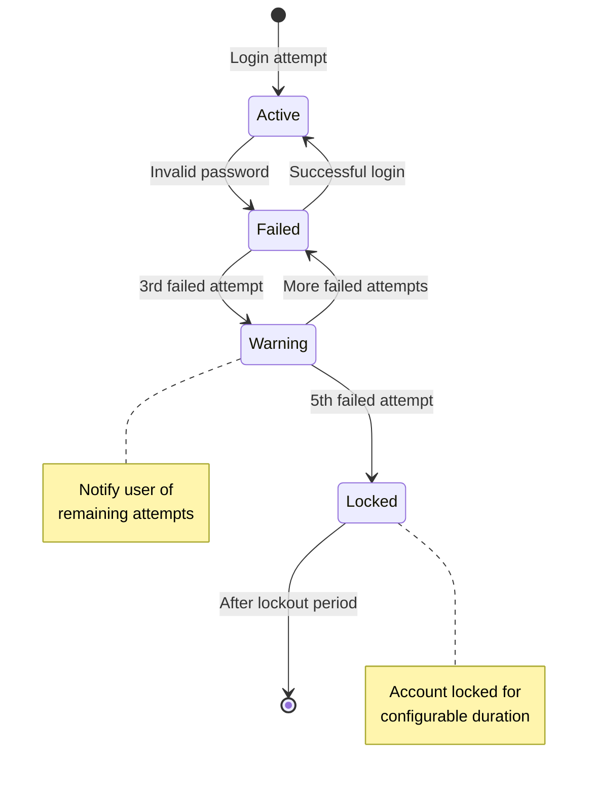

# Web Admin Authentication Workflow

**Purpose**: Secure email/password authentication for web admin interface with role-based access control enforcement.

Last updated: November 15, 2025

## Web Admin Authentication Overview



## Authentication Process Flow

### 1. Login Request Processing

**Endpoint**: `POST /api/web-admin/auth/login`

**Request Validation**:
```json
{
  "email": "admin@example.com",
  "password": "securePassword123"
}
```

**Validation Steps**:
1. **Required Fields**: Email and password must be present
2. **Email Format**: Valid email address format
3. **Password Length**: Minimum 8 characters enforced
4. **Input Sanitization**: Prevent injection attacks

### 2. User Lookup and Status Validation



### 3. Password Verification

**Security Implementation**:
```typescript
// WebAdminAuthService password verification
async verifyPassword(plainPassword: string, storedHash: string): Promise<boolean> {
  // Extract hash and salt from stored format (hash:salt)
  const [hash, salt] = storedHash.split(':');

  // Generate hash of input password with stored salt
  const inputHash = await argon2id.hash(plainPassword, {
    salt: Buffer.from(salt, 'hex'),
    type: argon2id.argon2id_type,
    memoryCost: 2 ** 16, // 64MB
    timeCost: 3,         // 3 iterations
    parallelism: 1       // 1 thread
  });

  // Timing-safe comparison to prevent timing attacks
  return crypto.timingSafeEqual(
    Buffer.from(inputHash, 'hex'),
    Buffer.from(hash, 'hex')
  );
}
```

**Password Storage Format**:
```
password_hash:password_salt
```

### 4. Failed Attempt Tracking

**Account Lockout Mechanism**:


**Lockout Implementation**:
```typescript
async handleFailedLogin(adminId: string): Promise<void> {
  // Increment login attempts counter
  const updatedUser = await db
    .update(webAdminUsers)
    .set({
      loginAttempts: sql`login_attempts + 1`,
      updatedAt: new Date()
    })
    .where(eq(webAdminUsers.id, adminId))
    .returning({ loginAttempts: webAdminUsers.loginAttempts });

  // Lock account after 5 failed attempts
  if (updatedUser[0].loginAttempts >= 5) {
    await db
      .update(webAdminUsers)
      .set({
        lockedAt: new Date(),
        updatedAt: new Date()
      })
      .where(eq(webAdminUsers.id, adminId));
  }
}
```

### 5. Role-Based Access Enforcement

**Role Validation Logic**:
```typescript
// Valid Web Admin Roles (excludes TEAM_MEMBER)
const VALID_WEB_ADMIN_ROLES = [
  'SYSTEM_ADMIN',
  'SUPPORT_AGENT',
  'AUDITOR',
  'DEVICE_MANAGER',
  'POLICY_ADMIN',
  'NATIONAL_SUPPORT_ADMIN',
  // Hybrid roles (can access both interfaces)
  'FIELD_SUPERVISOR',
  'REGIONAL_MANAGER'
];

// Role validation during login
if (adminUser.role === 'TEAM_MEMBER') {
  await this.logFailedLogin(email, 'WEB_ACCESS_DENIED');
  return {
    success: false,
    error: {
      code: 'WEB_ACCESS_DENIED',
      message: 'TEAM_MEMBER role cannot access web admin interface'
    }
  };
}
```

**Role Access Matrix**:
```typescript
interface RoleAccess {
  mobileApp: boolean;
  webAdmin: boolean;
  description: string;
}

const ROLE_ACCESS: Record<string, RoleAccess> = {
  'TEAM_MEMBER': {
    mobileApp: true,
    webAdmin: false,
    description: 'Field workers - mobile app only'
  },
  'FIELD_SUPERVISOR': {
    mobileApp: true,
    webAdmin: true,
    description: 'Field supervisors - hybrid access'
  },
  'REGIONAL_MANAGER': {
    mobileApp: true,
    webAdmin: true,
    description: 'Regional managers - hybrid access'
  },
  'SYSTEM_ADMIN': {
    mobileApp: false,
    webAdmin: true,
    description: 'System administrators - web admin only'
  },
  'SUPPORT_AGENT': {
    mobileApp: false,
    webAdmin: true,
    description: 'Customer support - web admin only'
  },
  'AUDITOR': {
    mobileApp: false,
    webAdmin: true,
    description: 'Compliance auditors - web admin only'
  },
  'DEVICE_MANAGER': {
    mobileApp: false,
    webAdmin: true,
    description: 'Device managers - web admin only'
  },
  'POLICY_ADMIN': {
    mobileApp: false,
    webAdmin: true,
    description: 'Policy administrators - web admin only'
  },
  'NATIONAL_SUPPORT_ADMIN': {
    mobileApp: false,
    webAdmin: true,
    description: 'National support - web admin only'
  }
};
```

### 6. Session Creation and Cookie Management

**Web Admin Session Creation**:
```typescript
async createWebAdminSession(adminUser: WebAdminUser): Promise<SessionResult> {
  // Generate web admin session ID
  const webAdminSessionId = uuidv4();
  const webAdminDeviceId = `web-admin-${adminUser.id}`;

  // Create JWT tokens for web admin
  const accessTokenResult = await JWTService.createToken({
    userId: adminUser.id,
    deviceId: webAdminDeviceId,
    sessionId: webAdminSessionId,
    type: 'web_admin'
  });

  const refreshTokenResult = await JWTService.createToken({
    userId: adminUser.id,
    deviceId: webAdminDeviceId,
    sessionId: webAdminSessionId,
    type: 'refresh'
  });

  // Update last login timestamp
  await db
    .update(webAdminUsers)
    .set({
      lastLoginAt: new Date(),
      updatedAt: new Date()
    })
    .where(eq(webAdminUsers.id, adminUser.id));

  return {
    sessionId: webAdminSessionId,
    accessToken: accessTokenResult.token,
    refreshToken: refreshTokenResult.token
  };
}
```

**HTTP-Only Cookie Configuration**:
```typescript
// Set secure HTTP-only cookies
res.cookie('access_token', accessToken, {
  httpOnly: true,                    // Prevent JavaScript access
  secure: process.env.NODE_ENV === 'production', // HTTPS only in production
  sameSite: 'strict',               // CSRF protection
  path: '/',
  maxAge: 20 * 60 * 1000           // 20 minutes
});

res.cookie('refresh_token', refreshToken, {
  httpOnly: true,
  secure: process.env.NODE_ENV === 'production',
  sameSite: 'strict',
  path: '/',
  maxAge: 12 * 60 * 60 * 1000      // 12 hours
});

res.cookie('auth_type', 'web_admin', {
  httpOnly: true,
  secure: process.env.NODE_ENV === 'production',
  sameSite: 'strict',
  path: '/',
  maxAge: 12 * 60 * 60 * 1000      // 12 hours
});
```

## Success Response

**Successful Login Response**:
```json
{
  "ok": true,
  "user": {
    "id": "uuid-1234-5678-9012",
    "email": "admin@example.com",
    "firstName": "John",
    "lastName": "Admin",
    "role": "SYSTEM_ADMIN",
    "fullName": "John Admin"
  },
  "message": "Login successful"
}
```

**Security Headers Set**:
- `Set-Cookie: access_token=...; HttpOnly; Secure; SameSite=Strict; Path=/; Max-Age=1200`
- `Set-Cookie: refresh_token=...; HttpOnly; Secure; SameSite=Strict; Path=/; Max-Age=43200`
- `Set-Cookie: auth_type=web_admin; HttpOnly; Secure; SameSite=Strict; Path=/; Max-Age=43200`

## Error Handling

### Authentication Error Responses

**Invalid Credentials**:
```json
{
  "ok": false,
  "error": {
    "code": "INVALID_CREDENTIALS",
    "message": "Invalid email or password"
  }
}
```

**Account Locked**:
```json
{
  "ok": false,
  "error": {
    "code": "ACCOUNT_LOCKED",
    "message": "Account is temporarily locked due to multiple failed login attempts"
  }
}
```

**WEB_ACCESS_DENIED**:
```json
{
  "ok": false,
  "error": {
    "code": "WEB_ACCESS_DENIED",
    "message": "TEAM_MEMBER role cannot access web admin interface"
  }
}
```

**Validation Error**:
```json
{
  "ok": false,
  "error": {
    "code": "VALIDATION_ERROR",
    "message": "Email and password are required"
  }
}
```

## Security Features

### 1. Password Security
- **Argon2id Hashing**: Memory-hard password hashing
- **Per-User Salts**: Unique salt for each user
- **Timing-Safe Comparison**: Prevent timing attacks

### 2. Account Security
- **Failed Attempt Tracking**: Database-tracked login attempts
- **Automatic Lockout**: Account locked after 5 failed attempts
- **Secure Reset**: Account unlock by administrator

### 3. Session Security
- **HTTP-Only Cookies**: Prevent JavaScript access to tokens
- **Secure Flag**: HTTPS-only in production
- **SameSite Protection**: CSRF attack prevention
- **Token Expiration**: Automatic session expiration

### 4. Role Enforcement
- **TEAM_MEMBER Blocking**: Automatic rejection from web interface
- **Role Validation**: Server-side role verification
- **Access Logging**: Complete audit trail of access attempts

## Monitoring and Auditing

### Security Events Logged

1. **Login Attempts**: All login attempts with context
2. **Account Lockouts**: Automatic lockout events
3. **Role Violations**: Blocked TEAM_MEMBER access attempts
4. **Successful Logins**: Valid authentication with metadata
5. **Password Changes**: Administrative password resets

### Audit Log Format
```typescript
{
  "timestamp": "2025-11-15T10:30:00Z",
  "event": "web_admin_login",
  "email": "admin@example.com",
  "adminId": "uuid-1234-5678-9012",
  "role": "SYSTEM_ADMIN",
  "ipAddress": "192.168.1.100",
  "userAgent": "Mozilla/5.0...",
  "result": "success",
  "sessionId": "session-uuid",
  "requestId": "req-uuid"
}
```

## Testing Coverage

### Unit Tests Implemented
```typescript
describe('WebAdminAuthService - Role Validation', () => {
  it('should reject TEAM_MEMBER role from web admin access')
  it('should allow creation of valid web admin roles')
  it('should allow creation of hybrid roles (FIELD_SUPERVISOR, REGIONAL_MANAGER)')
  it('should allow creation of all web-admin only roles')
  it('should reject invalid role names')
});
```

**Test Results**: 5/5 tests passing (100% success rate)

### Integration Tests
- **End-to-End Login Flow**: Complete authentication process
- **Role Validation**: TEAM_MEMBER blocking verification
- **Account Lockout**: Failed attempt tracking and lockout
- **Cookie Management**: Proper cookie setting and validation
- **Error Handling**: All error scenarios tested

## Performance Considerations

### Optimization Strategies
1. **Password Hashing**: Tuned Argon2id parameters for security vs performance
2. **Database Indexing**: Optimized email lookup with indexes
3. **Session Caching**: In-memory session data for frequently accessed users
4. **Rate Limiting**: Efficient tracking of login attempts

### Security vs Performance Balance
- **Memory Cost**: 64MB for Argon2id (recommended minimum)
- **Time Cost**: 3 iterations for reasonable security
- **Parallelism**: Single thread to prevent GPU attacks

## Configuration

### Environment Variables
```bash
# Web Admin Authentication Settings
WEB_ADMIN_SESSION_TIMEOUT=1200000    # 20 minutes in ms
WEB_ADMIN_LOCKOUT_DURATION=900000    # 15 minutes in ms
WEB_ADMIN_MAX_ATTEMPTS=5
ARGON2ID_MEMORY_COST=65536          # 64MB
ARGON2ID_TIME_COST=3
ARGON2ID_PARALLELISM=1
```

### Database Configuration
```sql
-- Indexes for performance
CREATE INDEX idx_web_admin_users_email ON web_admin_users(email);
CREATE INDEX idx_web_admin_users_locked_at ON web_admin_users(locked_at);
CREATE INDEX idx_web_admin_users_last_login ON web_admin_users(last_login_at);
```

## Future Enhancements

### Planned Features
1. **Multi-Factor Authentication**: Add 2FA support for admin roles
2. **Device Fingerprinting**: Additional security layer
3. **Adaptive Authentication**: Risk-based authentication requirements
4. **Single Sign-On**: Integration with enterprise SSO systems
5. **Session Analytics**: Detailed session monitoring and reporting

### Scalability Considerations
1. **Load Balancing**: Multiple web admin instances
2. **Session Storage**: Redis-based session sharing
3. **Database Sharding**: Horizontal scaling for large deployments
4. **Caching Layer**: Redis for frequently accessed data

---

**Related Documentation**:
- [Authentication Workflow](./authentication-workflow.md)
- [Role-Based Access Control](./role-based-access-control.md)
- [API Documentation](../backend/docs/api.md)
- [Role Differentiation Guide](../backend/docs/role-differentiation.md)